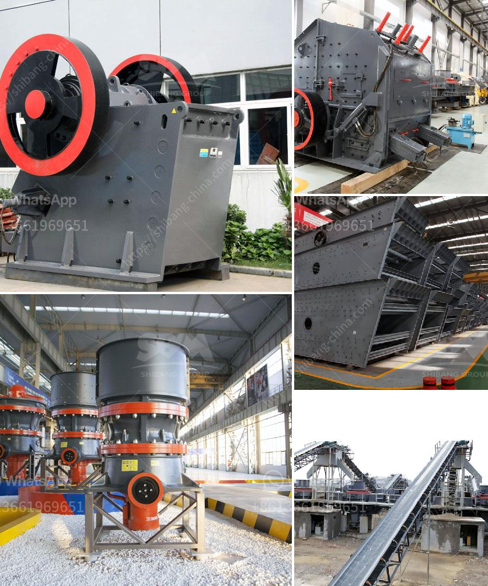

<h3>عملية سحق الكسارة</h3>
عملية سحق الكسارة هي العملية التي تتم لفك تجمع الصخور أو المواد الصلبة الأخرى إلى حجم أصغر. تستخدم الكسارات لتحويل المواد الخام إلى منتجات نهائية مستخدمة في البناء والصناعة وغيرها من التطبيقات.

تتكون الكسارة من وحدة أساسية تضم آلية سحق وقدرة على ضبط حجم الفتحة. تعمل الكسارة عن طريق ضرب المادة الموجودة بين لوحتين صلبتين بشكل مستمر، حيث يتم تحويل المادة إلى قطع صغيرة من الحجم المطلوب.

تشتمل الكسارات على محرك يعمل بالكهرباء أو بالديزل لتشغيل آلية السحق، وتعتمد سرعة وقوة المحرك على نوع الكسارة والمواد التي تحتاج إلى سحقها. تتوفر الكسارات بمختلف الأحجام والقدرات، بدءًا من الكسارات الصغيرة التي تستخدم في المواقع الضيقة وصولاً إلى الكسارات الكبيرة التي تتميز بإمكانية سحق الصخور الضخمة.

تحتوي الكسارات على آلية سحق تتألف عادةً من لوحتي تأثير صلبتين، حيث تتحرك إحداهما أو تتحرك كلتاهما للأعلى والأسفل لتطبيق قوة الضغط على الصخور. هذا الضغط المستمر يساعد على تحويل الصخرة إلى قطع أصغر وأكثر تناسباً للاستخدام المطلوب.

من الجوانب الأخرى التي يجب مراعاتها في عملية سحق الكسارة هي ضبط حجم الفتحة وفقًا لحجم المنتج النهائي المطلوب. يتم ضبط الفتحة بواسطة ميكانيكية معينة للحصول على حجم الجسيمات المطلوبة. يعتمد حجم الكسر على ضبط الفتحة وكذلك على قوة الضغط المطبقة على الصخور.

تعتبر عملية سحق الكسارة جزءًا أساسيًا من عمليات تحويل المواد الخام إلى منتجات نهائية. تلعب الكسارات دوراً هاماً في تلبية الطلب المتزايد على الموارد الطبيعية، حيث تسمح بإعادة استخدام المواد المستخرجة من الأرض بشكل فعال.

باختصار، يمكن القول أن عملية سحق الكسارة هي العملية التي تقوم بها الكسارات لتقليل الصخور أو المواد إلى حجم أصغر وتحويلها إلى منتجات نهائية قابلة للتسويق في مختلف الصناعات. تركز الكسارات على تحقيق أقصى استفادة من الموارد الطبيعية وتلبية احتياجات السوق بكفاءة.
<h3>Contact us</h3><ul><li><strong>Whatsapp:&nbsp;<a href="https://wa.me/8613661969651">+8613661969651</a></strong></li><li><a href="https://swt.shibang-china.com/?git&amp;zhl&amp;عملية سحق الكسارة"><strong>Online Service(chat now)</strong></a></li></ul><h3>Related</h3><ul><li><a href='سعر آلة تكسير الذهب في الولايات المتحدة.md'>سعر آلة تكسير الذهب في الولايات المتحدة</a></li><li><a href='آلات معالجة الأحجار الكريمة لإثيوبيا.md'>آلات معالجة الأحجار الكريمة لإثيوبيا</a></li><li><a href='مطحنة تكسير فائقة الدقة لخام الذهب.md'>مطحنة تكسير فائقة الدقة لخام الذهب</a></li><li><a href='مصنع طحن الجبس المصنع في الهند.md'>مصنع طحن الجبس المصنع في الهند</a></li><li><a href='جهات اتصال ووكلاء شاشات الرمل والغرابيل.md'>جهات اتصال ووكلاء شاشات الرمل والغرابيل</a></li></ul>