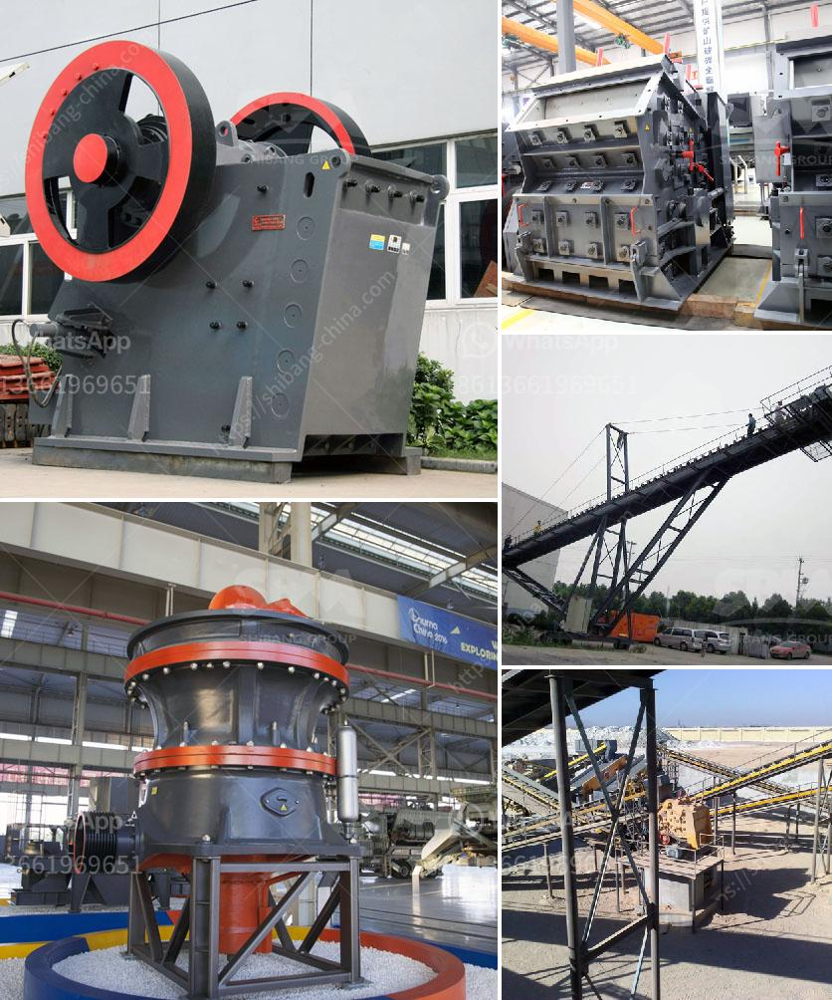

<h3>عملية صنع الإسمنت مع مطاحن الكرة</h3>
تُعتبر صناعة الإسمنت من أهم الصناعات في العالم، حيث يتم استخدامها في البناء والتشييد وصناعة المواد الإنشائية الأخرى. وتعد مطاحن الكرة أحد العناصر الرئيسية في عملية صنع الإسمنت.

يتم إنتاج الإسمنت من خلال عملية معقدة يتم فيها خلط المواد الخام وتحويلها إلى مواد خام مطحونة دقيقة تحتوي على العناصر الكيميائية اللازمة لصناعة الإسمنت. تعتبر مطاحن الكرة أحد المعدات الرئيسية في هذه العملية، حيث تستخدم لسحق المواد الخام وتحويلها إلى مسحوق ناعم يسمى "الكلنكر"، المادة الأساسية في صناعة الإسمنت.

تتكون مطاحن الكرة من أسطوانة طويلة تدور حول محورها الأفقي بسرعة معينة. تحتوي الأسطوانة على كرات فولاذية تستخدم لسحق المواد الخام، وعندما تدور الأسطوانة، تتحرك الكرات لتسحق المواد الخام وتحويلها إلى مسحوق دقيق.

تتميز مطاحن الكرة بقدرتها على سحق المواد الخام بطريقة فعالة وسريعة. وهذا يتطلب الحفاظ على سرعة دوران مطحنة الكرة المناسبة وضبط كمية الكرات في الأسطوانة، حيث يؤثر ذلك على حجم المسحوق المنتج وخصائصه. يضاف إلى ذلك، يتم التحكم في درجة الحرارة والضغط في مطاحن الكرة لضمان نتائج مثالية في العملية.

بعد سحق المواد الخام وتحويلها إلى مسحوق دقيق، يتم تحميص هذا المسحوق في أفران خاصة عند درجة حرارة عالية. وهذه العملية المعروفة باسم "الكلنكرة" تؤدي إلى تشكيل الكلنكرات التي تستخدم في صناعة الإسمنت. بعد ذلك، يتم طحن الكلنكرات في مطاحن الكرة مرة أخرى للحصول على الإسمنت النهائي.

في النهاية، يتم تعبئة الإسمنت المنتج في أكياس ضغط قابلة للإغلاق أو تخزينه في صهاريج كبيرة. كما يجب أن يتم فحص الإسمنت بدقة للتأكد من جودته وتطابقه للمواصفات والمعايير الصناعية.

باختصار، يعد صنع الإسمنت عملية معقدة يتطلب فيها استخدام مطاحن الكرة لسحق المواد الخام وتحويلها إلى مسحوق دقيق. تعتبر هذه العملية جزءًا أساسيًا من صناعة الإسمنت، وتلعب مطاحن الكرة دورًا حاسمًا في تحقيق نتائج مثلى وجودة عالية للمنتج النهائي.
<h3>Contact us</h3><ul><li><strong>Whatsapp:&nbsp;<a href="https://wa.me/8613661969651">+8613661969651</a></strong></li><li><a href="https://swt.shibang-china.com/?git&amp;zhl&amp;عملية صنع الإسمنت مع مطاحن الكرة"><strong>Online Service(chat now)</strong></a></li></ul><h3>Related</h3><ul><li><a href='مطحنة كرات للبيع في الهند.md'>مطحنة كرات للبيع في الهند</a></li><li><a href='مصنع كسارة البنتونيت.md'>مصنع كسارة البنتونيت</a></li><li><a href='مصانع غسل الفحم المحمولة.md'>مصانع غسل الفحم المحمولة</a></li><li><a href='مصنع سحق حجر كامل بسعة 300 طن.md'>مصنع سحق حجر كامل بسعة 300 طن</a></li><li><a href='مطحنة الكرة التجارية للمبيعات.md'>مطحنة الكرة التجارية للمبيعات</a></li></ul>