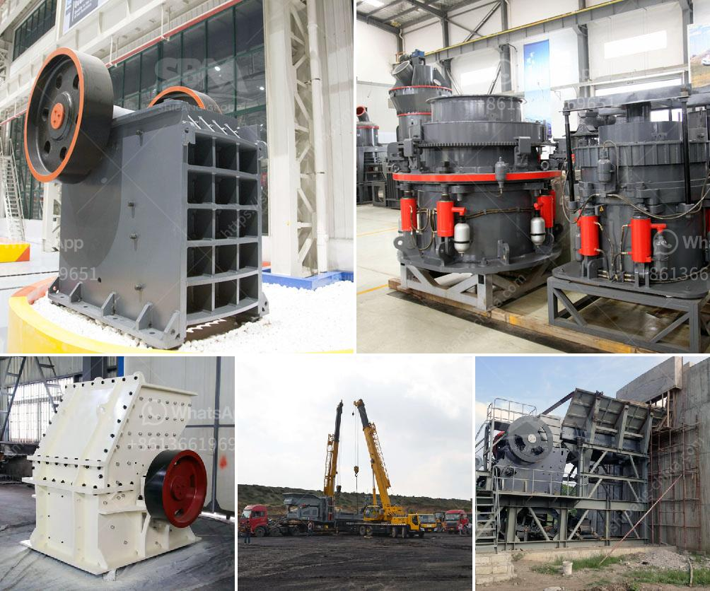

<h3>عملية صنع البنتونيت في الهند</h3>
تعتبر البنتونيت واحدة من المواد المعدنية المهمة التي توجد في الكثير من البلدان الحول العالم، وتستخدم في العديد من الصناعات المختلفة. تُعد الهند أحد أكبر المنتجين لهذه المادة، حيث تقوم بعملية صنعها بشكل واسع.

تتم عملية صنع البنتونيت في الهند بطرق تعتمد على الاستخراج والتكرير. تبدأ العملية بعملية التنقيب عن البنتونيت في مناطق تحتوي على ترسبات طبيعية كبيرة من المادة. يتم استخدام المعدات والآلات المحددة لهذا الغرض مثل الحفارات والآلات الثقيلة لاستخراج الخام.

بعد استخراج البنتونيت، يتم نقلها إلى ورش العمل ومن ثم إلى مصانع التكرير. يتضمن التكرير عدة خطوات تهدف إلى تحسين جودة المادة وتنقيتها. يتم طحن البنتونيت المستخرج لتحويله إلى مسحوق ناعم. يضاف للمسحوق مواد كيميائية معينة للتخلص من الشوائب وإزالة الجزيئات الغريبة.

تتم معالجة البنتونيت بواسطة خلطها مع الماء وخضوعها لعمليات التسخين والتجفيف. يتم التسخين عن طريق استخدام الأفران الخاصة لرفع درجة حرارتها، وذلك لتنشيط خصائصها وتحسين تركيبتها الميكانيكية والفيزيائية. بعد التجفيف، يتم طحن البنتونيت مرة أخرى للحصول على مسحوق نقي وجاهز للاستخدام.

تستخدم البنتونيت في مجموعة متنوعة من الصناعات، بما في ذلك الحفر، والصناعات الكيميائية، والطلاء، وصناعة الورق، وصناعة السيراميك وغيرها. يعتبر البنتونيت مادة معدنية قوية ومتعددة الاستخدامات، ولذلك فهو ضروري في العديد من الصناعات.

استخراج وتصنيع البنتونيت في الهند ليس فقط مهم للاقتصاد الهندي وتطويره، ولكنه أيضًا يلعب دورًا كبيرًا في تلبية الطلب العالمي على هذه المادة. تعمل الشركات المنتجة في الهند جاهدة لتوفير بنتونيت عالي الجودة ودقيق المواصفات لتلبية احتياجات العملاء في جميع أنحاء العالم.

بهذه الطريقة، تبان عملية صنع البنتونيت في الهند تبعًا للإجراءات القياسية المتبعة في صناعة تصنيع البنتونيت، حيث تتضمن عدة خطوات من الاستخراج وحتى التكرير والتجفيف. تسهم عملية تصنيع البنتونيت في تزويد الصناعات المختلفة بمادة عالية الجودة وذات قدرات متعددة لتلبية الطلب العالمي المتزايد على هذا المعدن.
<h3>Contact us</h3><ul><li><strong>Whatsapp:&nbsp;<a href="https://wa.me/8613661969651">+8613661969651</a></strong></li><li><a href="https://swt.shibang-china.com/?git&amp;zhl&amp;عملية صنع البنتونيت في الهند"><strong>Online Service(chat now)</strong></a></li></ul><h3>Related</h3><ul><li><a href='مصنع غسيل الذهب المستخدمة.md'>مصنع غسيل الذهب المستخدمة</a></li><li><a href='مصنع مسحوق لوح الجبس في إثيوبيا.md'>مصنع مسحوق لوح الجبس في إثيوبيا</a></li><li><a href='أفضل آلة سحق الكوارتز في الهند.md'>أفضل آلة سحق الكوارتز في الهند</a></li><li><a href='مصنع البنتونيت في الهند.md'>مصنع البنتونيت في الهند</a></li><li><a href='مطحنة الضغط العالي.md'>مطحنة الضغط العالي</a></li></ul>