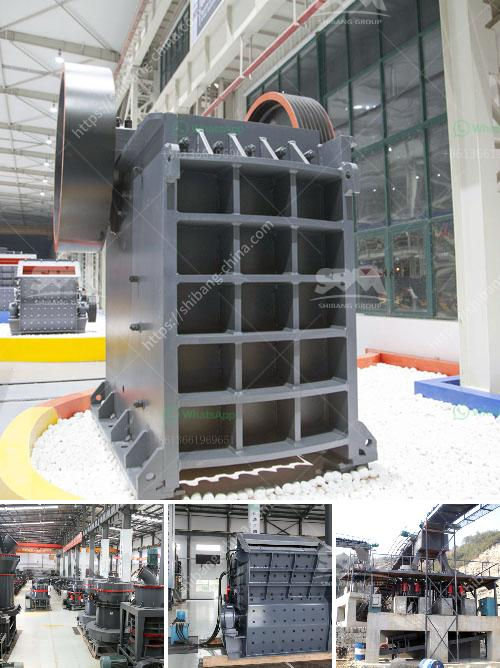

<h3>عملية صنع الكوارتز</h3>
يعتبر الكوارتز أحد المواد الطبيعية الفريدة والمفيدة بشكل كبير في صناعة العديد من المنتجات. يتم الحصول على الكوارتز من خلال عملية صنع متعددة الخطوات تستغرق وقتًا وجهدًا. سنقدم في هذه المقالة نظرة عامة حول عملية صناعة الكوارتز.

تبدأ عملية صنع الكوارتز بجمع مادة السيليكا من المحاجر أو بتعدينها من الصخور الصلبة. السيليكا هي المادة الرئيسية للكوارتز وتعد أحد أكبر المركبات الكيميائية في القشرة الأرضية. بعد جمع السيليكا، يتم تنقيتها لإزالة أي شوائب محتملة.

ثم يتم نقل السيليكا إلى مصانع المعالجة، حيث يتم وضعها في فرن عالي الحرارة. يتم تسخين السيليكا في درجة حرارة تصل إلى حوالي 2000 درجة مئوية. تتم هذه العملية باستخدام فرن كهربائي أو فرن غاز، وتكمن الهدف الرئيسي من هذه الخطوة في تليين السيليكا وتحويلها إلى ما يسمى "ركاز الكوارتز".

بعد التسخين، يتم تبريد ركاز الكوارتز للحصول على درجة حرارة 40-50 درجة مئوية، ويتم ذلك بواسطة رش الماء عليه. يجب أن يتم التعامل مع ركاز الكوارتز بحرص شديد، حيث يكون قابلاً للكسر بسهولة.

ثم يتم طحن ركاز الكوارتز البارد إلى حجم أصغر باستخدام آلات خاصة. ويهدف ذلك إلى الحصول على حجم حبيبات موحد ومتجانس لإنتاج مادة نهائية ذات جودة عالية.

في الخطوة التالية، يتم تنقية الكوارتز من خلال مرورها بمجموعة من العمليات الكيميائية والفيزيائية للتخلص من أي شوائب متبقية. تشمل هذه العمليات عادة استخدام المذيبات والترشيح والغسيل بالماء المقطر.

وأخيرًا، يتم تجفيف الكوارتز المنقى بدقة وتعبئته في الحاويات المناسبة للتخزين والنقل. من هنا يتم تسويق الكوارتز النهائي للصناعات المختلفة، مثل صناعة الزجاج والإلكترونيات والسيراميك والأدوات البصرية.

وبهذا، يكون قد تم شرح عملية صنع الكوارتز بشكل مختصر. على الرغم من أن العملية قد تتطلب وقتًا وجهدًا، إلا أن الكوارتز النهائي يكون له قيمة عالية ويعتبر مادة قيمة في العديد من التطبيقات المختلفة في الصناعة.
<h3>Contact us</h3><ul><li><strong>Whatsapp:&nbsp;<a href="https://wa.me/8613661969651">+8613661969651</a></strong></li><li><a href="https://swt.shibang-china.com/?git&amp;zhl&amp;عملية صنع الكوارتز"><strong>Online Service(chat now)</strong></a></li></ul><h3>Related</h3><ul><li><a href='ناقل البناء للبيع.md'>ناقل البناء للبيع</a></li><li><a href='كسارة الحجر في المغرب.md'>كسارة الحجر في المغرب</a></li><li><a href='معدات كسارة الفك للبيع في الفلبين.md'>معدات كسارة الفك للبيع في الفلبين</a></li><li><a href='تجهيز خام الحديد بي دي إف.md'>تجهيز خام الحديد بي دي إف</a></li><li><a href='معدات خط إنتاج كبريتات المغنيسيوم.md'>معدات خط إنتاج كبريتات المغنيسيوم</a></li></ul>