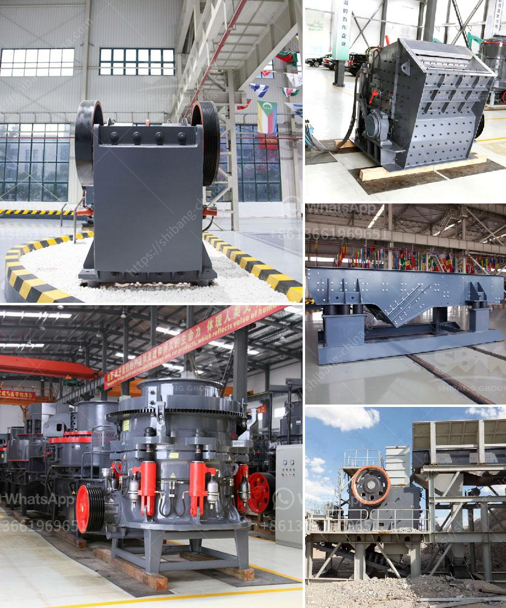

<h3>عملية صنع كسارة رخام الكوارتز</h3>
تصنع كسارة رخام الكوارتز عن طريق عملية متطورة ومعقدة تشمل عدة خطوات. يعتبر الرخام الكوارتز خامًا ثمينًا يتم استخدامه في صناعة الأسطح والأرضيات والحوائط والمطابخ والحمامات، حيث يمتاز بمظهر لامع وجميل ومتانة عالية.

الخطوة الأولى في عملية صنع كسارة رخام الكوارتز هي جمع الخامات وتحضيرها للإنتاج. تتمثل هذه الخامات في مسحوق الكوارتز بنسبة 93٪ وماء بنسبة 7٪ وبعض المواد الأخرى مثل اللون والراتنج. يتم تجهيز المسحوق ومزجه مع الماء والمواد الأخرى لتكوين خليط سائل.

من ثم تأخذ العملية خطوة التصنيع الثانية وهي صب الخليط السائل في قوالب مستطيلة ذات أحجام وأبعاد محددة. يتم استخدام ضغط عالي وحرارة عالية لتصلب القوالب وتجفيف الخليط. يستغرق هذا الإجراء بضع ساعات حتى يتم تصلب الخليط ويصبح قابلًا لقطع وتشكيل.

بعد التجفيف، يتم استخدام ماكينة القطع والتلميع لتقطيع القوالب إلى أحجام وأشكال مطلوبة. ثم يتم تشكيل القطع بواسطة الحواف المستديرة لجعل الكسارة جاهزة للاستخدام. وفي هذه المرحلة، يتم إجراء عملية التلميع لإعطاء الكسارة المظهر اللامع والجميل الذي تعرف به.

عند الانتهاء من عملية التلميع، ينتهي تصنيع كسارة رخام الكوارتز. يُركّب ويُعبأ المنتج بعناية لضمان سلامته خلال عملية النقل والتخزين. يتم تصديرها إلى الأسواق المحلية والدولية حيث ينتظرها العملاء بفارغ الصبر للاستمتاع بمظهرها الجميل وجودتها العالية.

في الختام، تعتبر عملية صنع كسارة رخام الكوارتز عملية متطورة ومعقدة تشمل عدة خطوات. النتيجة النهائية تكون كسارة رخامية متينة وجميلة تستخدم في مجموعة من التطبيقات المختلفة في صناعة البناء والتشطيب.
<h3>Contact us</h3><ul><li><strong>Whatsapp:&nbsp;<a href="https://wa.me/8613661969651">+8613661969651</a></strong></li><li><a href="https://swt.shibang-china.com/?git&amp;zhl&amp;عملية صنع كسارة رخام الكوارتز"><strong>Online Service(chat now)</strong></a></li></ul><h3>Related</h3><ul><li><a href='خط إنتاج رمل السيليكا.md'>خط إنتاج رمل السيليكا</a></li><li><a href='خط إنتاج مصنع كسارة الحجر في الهند.md'>خط إنتاج مصنع كسارة الحجر في الهند</a></li><li><a href='مواصفات مصنع سحق الحجر الجيري 450 طن في الساعة.md'>مواصفات مصنع سحق الحجر الجيري 450 طن في الساعة</a></li><li><a href='دراسة جدوى لمصنع تكسير بذور جوز النخيل.md'>دراسة جدوى لمصنع تكسير بذور جوز النخيل</a></li><li><a href='مشترين وبائعين لآلات مطحنة ريموند.md'>مشترين وبائعين لآلات مطحنة ريموند</a></li></ul>