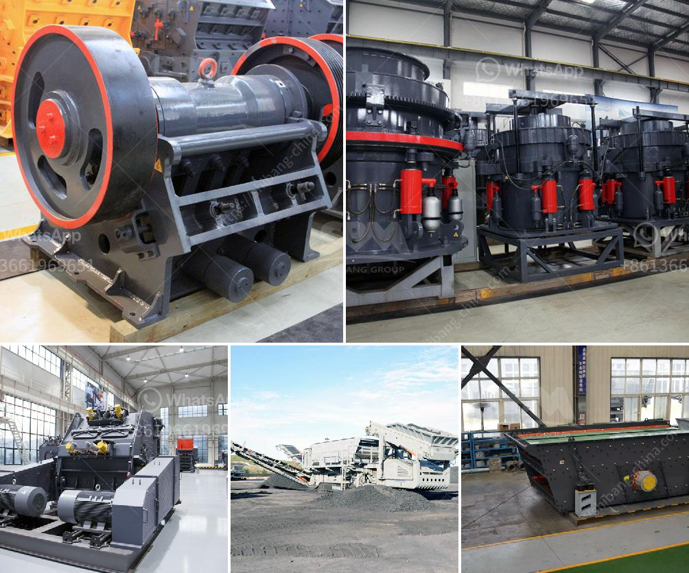

<h3>عملية غسيل الرمل</h3>
عملية غسيل الرمل هي إجراء يشمل تنظيف حبيبات الرمال من الشوائب والأوساخ المتراكمة عليها. يتم استخدام هذه العملية في العديد من الصناعات مثل صناعة البناء والصناعات الكيماوية ومعالجة المياه.

توجد عدة طرق لغسيل الرمل، وأحد الأساليب الشائعة هو غسيل الرمل بالماء. يتم غسيل الرمال عن طريق وضعها في غربال مائي يسمى "غربال الرمل"، حيث تمر المياه النظيفة عبر الغربال وتتخلص من الشوائب أثناء مرورها، في حين يتم الاحتفاظ بالرمل النظيف في الغربال.

يتألف غربال الرمل من عدة أجزاء، بما في ذلك الشاشة العلوية المثقبة لاستقبال الرمال ومرور المياه منها، والأشرطة الناقلة لنقل الرمال إلى قسم الغسيل، وحاوية التخزين لجمع الرمل النظيف بعد غسيله. قد يكون هناك أيضًا طبقة من الحصى الموجودة تحت الشاشة المثقبة لمساعدة في تنظيف الرمال.

يتم تشغيل غربال الرمل عادة بواسطة مضخة مياه. يتم ضخ الماء عبر غربال الرمل بضغط عالٍ، مما يؤدي إلى تفجير الأوساخ والشوائب عند انتقالها عبر الشاشة المثقبة. تنظف الماء الملوث يمر خلال فتحة صغيرة في الجزء السفلي من غربال الرمل حيث يتم إعادة استخدامه في العملية.

تقدم عملية غسيل الرمل العديد من الفوائد. تُزيل الشوائب والأوساخ المتراكمة على حبيبات الرمل مثل الأتربة والأملاح الملونة والمواد العضوية المتحللة. يُعزز الرمل النظيف من خواصه الترشيحية، مما يزيد من كفاءة الاستخدام في مجالات مثل معالجة المياه وتصنيع المواد الإنشائية.

بالإضافة إلى ذلك، تُعد عملية غسيل الرمال بيئية ومستدامة، حيث يمكن إعادة استخدام الماء المستخدم في المرة القادمة، مما يساهم في ترشيد استخدام المياه والحفاظ على الموارد الطبيعية.

لخلاصة، عملية غسيل الرمل هي إجراء هام في الصناعات المختلفة، وتساهم في تنظيف الرمال من الشوائب والأوساخ وزيادة كفاءتها الترشيحية. كما أنها تعتبر عملية صديقة للبيئة نظرًا لإمكانية إعادة استخدام الماء المستخدم في العملية.
<h3>Contact us</h3><ul><li><strong>Whatsapp:&nbsp;<a href="https://wa.me/8613661969651">+8613661969651</a></strong></li><li><a href="https://swt.shibang-china.com/?git&amp;zhl&amp;عملية غسيل الرمل"><strong>Online Service(chat now)</strong></a></li></ul><h3>Related</h3><ul><li><a href='بيع مطحنة في كاليفورنيا.md'>بيع مطحنة في كاليفورنيا</a></li><li><a href='كسارات الحجر في ماليزيا.md'>كسارات الحجر في ماليزيا</a></li><li><a href='سعة كسارة الحجر.md'>سعة كسارة الحجر</a></li><li><a href='آلات مطحنة في جنوب أفريقيا.md'>آلات مطحنة في جنوب أفريقيا</a></li><li><a href='مصنع إعادة تدوير الخرسانة للبيع.md'>مصنع إعادة تدوير الخرسانة للبيع</a></li></ul>