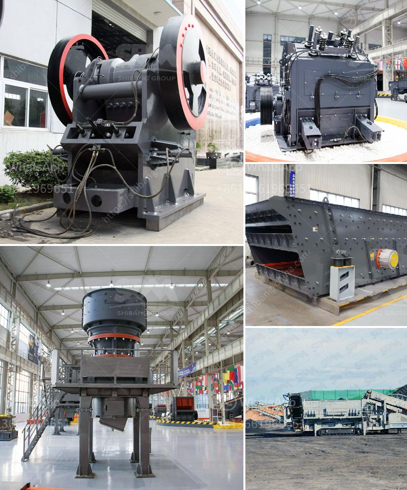

<h3>عملية كربونات الكالسيوم المترسبة</h3>
كربونات الكالسيوم التي تترسب في العديد من الأماكن حول العالم هي عملية طبيعية تحدث عندما يتفاعل ثنائي أكسيد الكربون الموجود في الهواء مع الماء الموجود في البيئة المحيطة.

تحدث عملية ترسيب كربونات الكالسيوم على نطاق واسع في البحار والبحيرات، وأحيانًا في الكهوف والمغارات. وتعود العوامل المؤثرة على هذه العملية إلى تركيبة الماء والعوامل المناخية والجغرافية المحيطة.

في الماء، يتفاعل ثنائي أكسيد الكربون مع أيون الكالسيوم وأيون الهيدروكسيد الموجودين في المحلول المائي ليكون كربونات الكالسيوم كمادة صلبة تترسب على الأسطح. ترتكب كربونات الكالسيوم من الكالسيوم والكربون والأكسجين، وهي مادة طبيعية قابلة للتفكك بواسطة الحموض.

وفي الكهوف والمغارات، تترسب كربونات الكالسيوم بسبب تأثر المياه الجوفية المحملة بالمواد الكيميائية الذائبة بالضوء والحرارة القادمة من مصادر أخرى في الجوف.

تلعب كربونات الكالسيوم دورًا مهمًا في النظام البيئي، حيث توفر ملاذًا آمنًا ومواد غذائية للعديد من الكائنات الحية في البحر، مثل الشعاب المرجانية. كما تساهم في تنقية المياه وتحافظ على التوازن الأيزوتوبي للعناصر الكيميائية.

تستخدم كربونات الكالسيوم أيضًا في العديد من الصناعات، بما في ذلك صناعة الزجاج والأسمدة والمواد البناء. وتستخدم أيضًا في العلاجات الطبية لعلاج بعض الأمراض، مثل تخفيف حموضة المعدة وعلاج بعض المشاكل الصحية المرتبطة بنقص الكالسيوم في الجسم.

بشكل عام، يمكن القول أن عملية ترسيب كربونات الكالسيوم هي عملية طبيعية مهمة ينبغي أن نفهمها ونقدرها، حيث أنها تؤثر على العديد من الجوانب في حياتنا اليومية، سواء كانت بيئية أو صناعية أو طبية.
<h3>Contact us</h3><ul><li><strong>Whatsapp:&nbsp;<a href="https://wa.me/8613661969651">+8613661969651</a></strong></li><li><a href="https://swt.shibang-china.com/?git&amp;zhl&amp;عملية كربونات الكالسيوم المترسبة"><strong>Online Service(chat now)</strong></a></li></ul><h3>Related</h3><ul><li><a href='مطحنة الكرة لطحن الفلسبار.md'>مطحنة الكرة لطحن الفلسبار</a></li><li><a href='دراسة جدوى لمصنع سحق الكروم الفير.md'>دراسة جدوى لمصنع سحق الكروم الفير</a></li><li><a href='عملية التئام الذاتي للحجر الجيري.md'>عملية التئام الذاتي للحجر الجيري</a></li><li><a href='شركة تصنيع معدات تعدين الذهب في الصين.md'>شركة تصنيع معدات تعدين الذهب في الصين</a></li><li><a href='كسارة الفك في كينيا مصنعة.md'>كسارة الفك في كينيا مصنعة</a></li></ul>