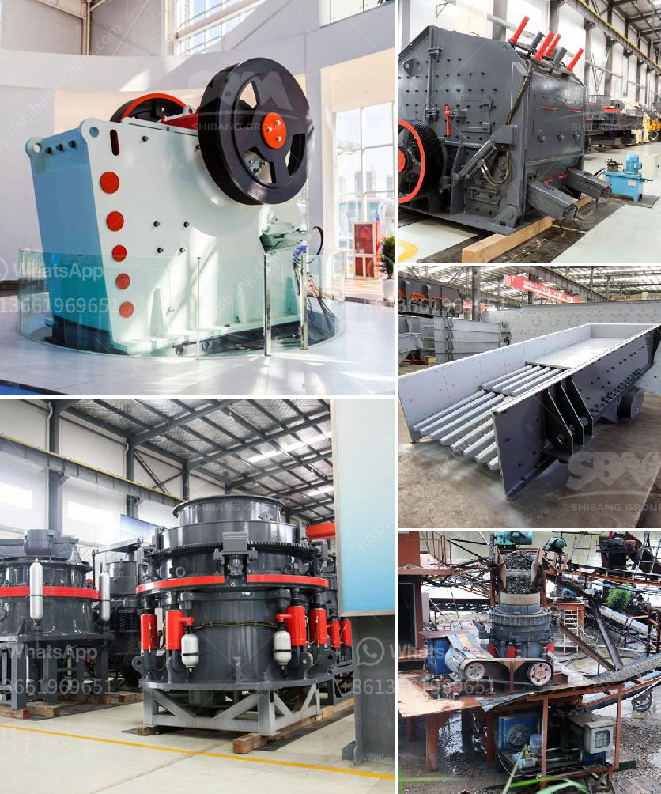

<h3>عملية كسارة الرمل والحصى في الفلبين</h3>
تعتبر عملية كسارة الرمل والحصى في الفلبين من عمليات الاستخراج الهامة التي تساهم في تلبية احتياجات البنية التحتية والصناعة في البلاد. تلعب الرمال والحصى دورًا حيويًا في العديد من الصناعات مثل صناعة الخرسانة والزجاج والأسمنت والبلاط، وكذلك في إنشاء الطرق والجسور والمباني.

يتم استخراج الرمال والحصى عن طريق عملية الكسارة، والتي تشمل مجموعة من الخطوات المتتالية. تبدأ العملية بالحفر والتنقيب في مناطق الرواسب الطبيعية التي تحتوي على الرمال والحصى. ثم يتم نقل المواد المكتشفة إلى موقع الكسارة باستخدام المعدات الثقيلة مثل الجرافات والشاحنات.

يتم تفتيت الصخور الكبيرة باستخدام كسارة الصخور الكبيرة بحيث تصبح صغيرة الحجم وتناسب الاستخدام. ثم يتم فصل الرمال والحصى عن العناصر الأخرى مثل الصخور الصغيرة والأتربة بواسطة أجهزة فصل ميكانيكية وهيدروليكية. تتمتع هذه العملية بفعالية عالية ودقة، حيث يتم اختيار المواد في مختلف الأحجام حسب الاحتياجات المحددة.

بعد فصل الرمل والحصى عن المواد الأخرى، يتم تخزينها وتعبئتها في حاويات أو شاحنات للتوزيع. يتم توزيع هذه المواد إلى العملاء الذين يحتاجون إليها لاستخدامها في مشاريع البناء الخاصة بهم. يتطلب تشغيل هذه العملية تشريعات صارمة لضمان الحفاظ على البيئة ومصادر المياه والمناظر الطبيعية.

تواجه عملية كسارة الرمل والحصى في الفلبين تحديات عديدة. أحدها هو تأثيرها البيئي، حيث قد يؤدي استخراج الرمال والحصى إلى تلوث المياه الجوفية وتغيير المناظر الطبيعية. ولذلك، من الضروري أن يلتزم المشغلون بتنفيذ إجراءات صارمة لإدارة النفايات وحماية البيئة.

علاوة على ذلك، يواجه هذا القطاع التحديات التقنية والتكنولوجية، حيث قد يكون من الصعب الحصول على الأجهزة والمعدات الحديثة التي تعزز الكفاءة وتقلل من التكاليف. قد ينتج عن ذلك تكلفة إنتاج أعلى وتأثيرها على أسعار السوق. لذلك، يجب على الحكومة والمشغلين العمل سويًا لتطوير الصناعة وتحسين الإنتاجية.

في الختام، تعد عملية كسارة الرمل والحصى في الفلبين من العمليات الحيوية لتلبية احتياجات البنية التحتية والصناعة في البلاد. يجب أن تتبع هذه العملية المعايير البيئية ونقل التكنولوجيا لتحسين الجودة والكفاءة. بالتالي، يمكن أن تكون هذه الصناعة محركًا للتنمية الاقتصادية وتعزيز البنية التحتية في الفلبين.
<h3>Contact us</h3><ul><li><strong>Whatsapp:&nbsp;<a href="https://wa.me/8613661969651">+8613661969651</a></strong></li><li><a href="https://swt.shibang-china.com/?git&amp;zhl&amp;عملية كسارة الرمل والحصى في الفلبين"><strong>Online Service(chat now)</strong></a></li></ul><h3>Related</h3><ul><li><a href='شركة تصنيع آلات كسارة الرخام.md'>شركة تصنيع آلات كسارة الرخام</a></li><li><a href='وحدة إنتاج مطحنة الرمل في كيرالا.md'>وحدة إنتاج مطحنة الرمل في كيرالا</a></li><li><a href='مصنع الحجر الجيري والآلات في تاميل نادو للبيع.md'>مصنع الحجر الجيري والآلات في تاميل نادو للبيع</a></li><li><a href='كسارات الحجر في المحجر.md'>كسارات الحجر في المحجر</a></li><li><a href='محطة سحق تينوفا.md'>محطة سحق تينوفا</a></li></ul>