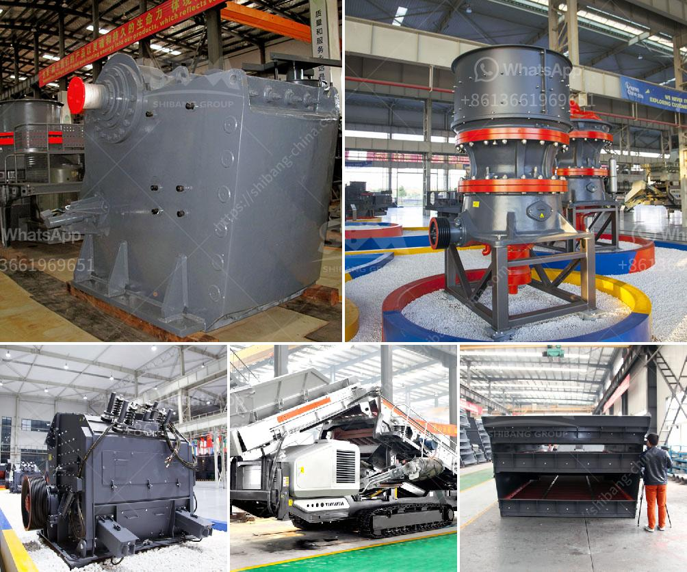

<h3>عملية كولمان للطحن</h3>
عملية كولمان للطحن: تعد عملية كولمان للطحن إحدى الطرق الهامة في مجال تصنيع المساحيق النانومترية. تهدف هذه العملية إلى تحويل المواد الصلبة إلى مسحوق ناعم عالية النقاء والنعومة.

تبدأ عملية كولمان للطحن بتحضير المواد الخام المراد طحنها. يجب أن تكون المواد قابلة للطحن، ويمكن أن تكون في شكل صلب أو سائل. يتم تحطيم المواد الصلبة إلى قطع صغيرة باستخدام مطحنة أو كسارة. بالنسبة للمواد السائلة، فإنها يتم تحضيرها في شكل مستحلب قبل الطحن.

من ثم، يتم وضع المواد الناعمة في وعاء الطحن، المعروف أيضا بالطاحونة، التي تحتوي على كرات طحن. الكرات الصلبة تهتز في الطاحونة وتصطدم بالمواد الخام الموجودة في الوعاء. عندما تحتك الكرات بالمواد، يحدث تكسير الجسيمات وتحويلها إلى شكل مسحوق.

يعتبر المفتاح الرئيسي في نجاح عملية كولمان للطحن هو اختيار نوعية الكرات الطحن المناسبة. يجب أن تكون الكرات ذات قوة ضغط عالية وقدرة على الاحتكاك الجيد. يجب أيضا أن تكون الكرات متساوية الحجم وخالية من العيوب لضمان تحقيق نتائج طحن ممتازة.

بعد الطحن، تتعرض الجسيمات لعملية التجانس والتشتت للتأكد من توزيع الجسيمات بشكل متساوٍ في المسحوق النهائي. يتم ذلك باستخدام وسائل مثل المواد الكيميائية المساعدة والتقنيات الميكانيكية الخاصة.

تمتاز عملية كولمان للطحن بالعديد من المزايا. فمنها أنها تتيح إنتاج مساحيق ناعمة بحجم جسيمات صغير، مما يزيد من سرعة الاذواب والتفاعل الكيميائي. بالإضافة إلى ذلك، فإن عملية الطحن تؤدي أيضًا إلى تجزئة المواد الصلبة وزيادة منطقة السطح الفعالة، ما يعزز تفاعلات الاسطح.

بشكل عام، تعتبر عملية كولمان للطحن تقنية مهمة في تصنيع المساحيق النانومترية، وتستخدم على نطاق واسع في مجالات متعددة مثل صناعة المواد الكيميائية، والإلكترونيات، والصناعات الدوائية.
<h3>Contact us</h3><ul><li><strong>Whatsapp:&nbsp;<a href="https://wa.me/8613661969651">+8613661969651</a></strong></li><li><a href="https://swt.shibang-china.com/?git&amp;zhl&amp;عملية كولمان للطحن"><strong>Online Service(chat now)</strong></a></li></ul><h3>Related</h3><ul><li><a href='كيفية صنع مطحنة الكرة pdf.md'>كيفية صنع مطحنة الكرة pdf</a></li><li><a href='كسارة مخروطية أساسية.md'>كسارة مخروطية أساسية</a></li><li><a href='سعر مطحنة الحجر في المغرب.md'>سعر مطحنة الحجر في المغرب</a></li><li><a href='مصنع معالجة الحجر الفلدسباري.md'>مصنع معالجة الحجر الفلدسباري</a></li><li><a href='مطحنة الكرة للبيع.md'>مطحنة الكرة للبيع</a></li></ul>