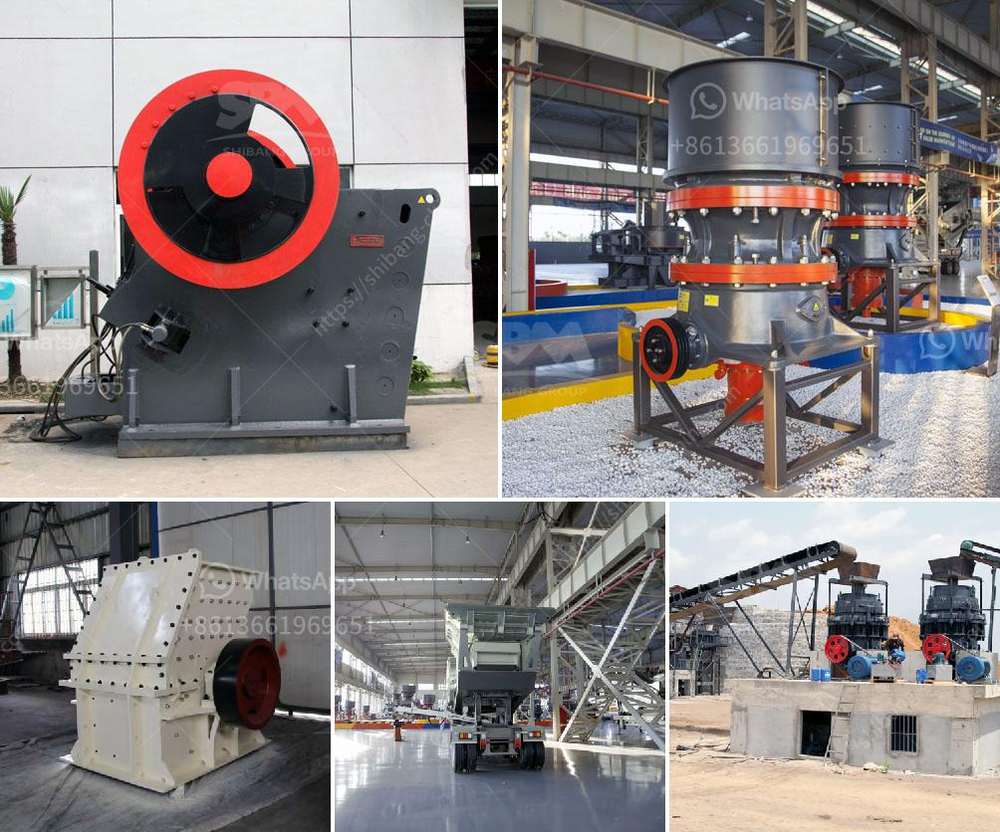

<h3>عملية مصنع الأحجار الكوارتز 30-80</h3>
مصنع الأحجار الكوارتز 30-80 يعد من أهم المصانع المتخصصة في إنتاج الأحجار الكوارتزية بمختلف الأحجام والتركيبات. يقوم هذا المصنع بمعالجة الكوارتز الخام وتحويله إلى منتج نهائي عالي الجودة يستخدم في مختلف الصناعات.

تبدأ عملية إنتاج الأحجار الكوارتز 30-80 بتجميع الكوارتز الخام من المناجم ومصانع التعدين. يتم تحميل الكوارتز في الشاحنات ونقله إلى المصنع للبدء في عملية التصنيع.

تبدأ العملية بتكسير الكوارتز الخام باستخدام كسارات خاصة. يتم تفتيت الصخور الكبيرة إلى أحجام أصغر وهذا يتطلب استخدام آلات قوية وفعالة. يتم تفتيت الكوارتز حتى يتم الحصول على حبيبات صغيرة منه بحجم 30-80.

بعد عملية التكسير، يتم تنظيف الكوارتز من الأوساخ والشوائب باستخدام أجهزة فرز وغسيل. يتم تنظيف الحبيبات بعناية للتأكد من إزالة أي ذرات غير مرغوب فيها والحصول على نتيجة نهائية نقية تمامًا.

بعد التنظيف، تبدأ عملية التجفيف الأولية حيث تمر الحبيبات المنظفة في فرن خاص لإزالة الرطوبة. يتم التحكم في درجة حرارة الفرن لضمان عدم تأثيرها على خصائص الحبيبات.

بعد عملية التجفيف، يتم نقل الحبيبات إلى مرحلة طحنها وتفتيتها. تستخدم آلات طحن عالية الدقة لتحويل الحبيبات إلى مسحوق ناعم. يتم دراسة الحجم المطلوب وتحديده وفقًا لاحتياجات العملاء.

بعد الطحن، تتم عملية التصنيف حسب الحجم والتركيبات. يتم تجهيز منتج الأحجار الكوارتز 30-80 ليكون جاهزًا للتعبئة والتغليف والشحن. يتم تعبئة المنتج في أكياس أو صناديق فردية وفقًا لمتطلبات العميل.

يتم استخدام الأحجار الكوارتز 30-80 في العديد من التطبيقات. قد يتم استخدامها في صناعة البناء لتزويد السيراميك والغرانيت باللون والتأثيرات المطلوبة. كما يمكن استخدامها في صناعة الزجاج لزيادة القوة والشفافية. بالإضافة إلى ذلك، يتم استخدامها في صناعة الإلكترونيات والمنتجات الصناعية الأخرى.

بهذه الطريقة، يقدم مصنع الأحجار الكوارتز 30-80 منتجًا فعالًا وعالي الجودة يمتاز بالنقاء والمتانة. يعتبر هذا المصنع مصدرًا موثوقًا للأحجار الكوارتزية ويساهم في تلبية احتياجات السوق المتزايدة لهذا المنتج القيم.
<h3>Contact us</h3><ul><li><strong>Whatsapp:&nbsp;<a href="https://wa.me/8613661969651">+8613661969651</a></strong></li><li><a href="https://swt.shibang-china.com/?git&amp;zhl&amp;عملية مصنع الأحجار الكوارتز 3080"><strong>Online Service(chat now)</strong></a></li></ul><h3>Related</h3><ul><li><a href='شركة معالجة الذهب في الصين.md'>شركة معالجة الذهب في الصين</a></li><li><a href='مواصفات خام الكروم.md'>مواصفات خام الكروم</a></li><li><a href='تصميم مصنع تكسير وتخطيطه.md'>تصميم مصنع تكسير وتخطيطه</a></li><li><a href='كسارة متنقلة لخام الحديد.md'>كسارة متنقلة لخام الحديد</a></li><li><a href='ريموند مطحنة في كولينز.md'>ريموند مطحنة في كولينز</a></li></ul>