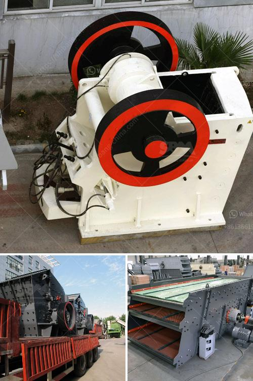

<h3>عمود المرفق لكسارة الفك</h3>
يعتبر عمود المرفق جزءًا أساسيًا في كسارة الفك. فهو المكون الذي يحول الحركة الخطية إلى حركة دورانية لفتح وغلق الفكين. يتكون عمود المرفق من قضيب معدني طويل يتم تثبيته في إطار الكسارة عن طريق التحمل والمحاور.

تعمل كسارة الفك بنظام المرفق على النحو التالي: يتم تطبيق قوة على فكي الكسارة لفتحها وإغلاقها. تتحرك واحدة من الفكين بحركة خطية عندما يتحرك العمود المرفق في اتجاه واحد، في حين يظل الفك الآخر ثابتًا. وعندما يتحرك العمود المرفق في الاتجاه المعاكس، يتم رفع الفك الذي تم تحريكه من الحجرة الفكية.

تتم هذه الحركة الدورانية من خلال توصيل العمود المرفق بآلية دورانية تسمى محرك أو مركز طاقة. هذا المحرك يستخدم إما محرك كهربائي أو محرك هيدروليكي ويعمل على تحويل الطاقة الكهربائية أو الهيدروليكية إلى حركة دورانية.

تصميم عمود المرفق يعتمد على العديد من العوامل الهامة مثل قوة الكسر المطلوبة، حجم المواد التي ستمر عبر الكسارة، ونوعية المواد. العمود المرفق يجب أن يكون قويًا بما يكفي لتحمل القوة المؤثرة عليه ومناسبًا للعمل في ظروف العمل المختلفة.

بالإضافة إلى ذلك، يجب أن يكون عمود المرفق مصممًا بعناية لتحقيق الأداء الأمثل لكسارة الفك. يجب أن يكون هناك تناسق بين عمود المرفق وباقي الأجزاء الميكانيكية في الكسارة. علاوة على ذلك، يجب أن يتم تشحيم عمود المرفق بشكل منتظم للحفاظ على أدائه الجيد وتجنب التآكل.

في النهاية، يمكن القول بأن عمود المرفق هو جزء أساسي في كسارة الفك. يسهم في تحويل الحركة الخطية إلى حركة دورانية لفتح وغلق الفكين. يجب أن يتم تصميمه بعناية ومرونة لتحقيق الأداء الأمثل للكسارة وضمان الاستخدام الطويل الأمد.
<h3>Contact us</h3><ul><li><strong>Whatsapp:&nbsp;<a href="https://wa.me/8613661969651">+8613661969651</a></strong></li><li><a href="https://swt.shibang-china.com/?git&amp;zhl&amp;عمود المرفق لكسارة الفك"><strong>Online Service(chat now)</strong></a></li></ul><h3>Related</h3><ul><li><a href='تصميم أحزمة الناقلين.md'>تصميم أحزمة الناقلين</a></li><li><a href='عمل كسارة الفك.md'>عمل كسارة الفك</a></li><li><a href='آلة تكبير الفحم الدقيقة في الهند.md'>آلة تكبير الفحم الدقيقة في الهند</a></li><li><a href='أكبر كسارة صخور.md'>أكبر كسارة صخور</a></li><li><a href='مورد معدات آلات تكسير الحجر في الصين.md'>مورد معدات آلات تكسير الحجر في الصين</a></li></ul>