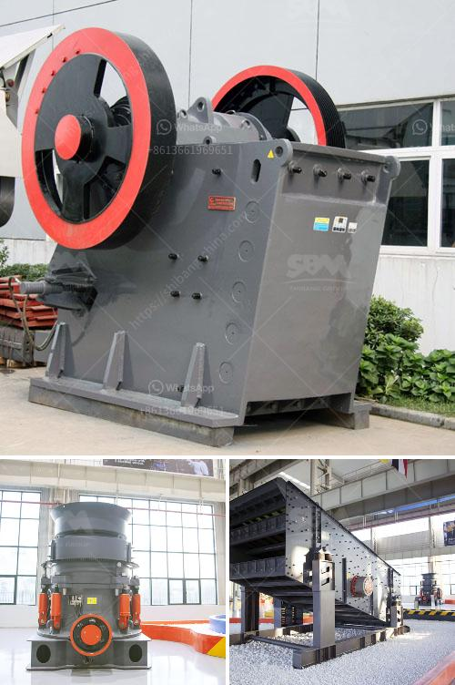

<h3>غرابيل للبيع في ساسكاتشوان</h3>
تعتبر ساسكاتشوان واحدة من المقاطعات الرائعة في كندا، حيث تضم مناظر طبيعية خلابة وبحيرات جميلة وسهول شاسعة. إذا كنت تبحث عن فرصة لامتلاك منزل في هذه المنطقة الجميلة، فقد ترغب في النظر في شراء غرابيل.

غرابيل هو تصميم معماري مميز وفريد يتميز بسقوفه الذائبة والمرتفعة والتي تعطي الشعور بالمساحة والأناقة في نفس الوقت. تتكون هذه الغرابيل من خشب الصنوبر الأصفر الطبيعي، وهو مواد بناء متينة ومتينة تضفي الهدوء والجمال على المساكن. يمكنك العثور على العديد من الغرابيل المعروضة للبيع في ساسكاتشوان بأحجام وتصاميم مختلفة لتناسب احتياجاتك وأذواقك.

تعتبر غرابيل الأماكن المثالية للعيش فيها في سنتهم الثالثة والعشرين، حيث توفر الراحة والراحة والأمان. تحتوي معظم هذه الغرابيل على طابقين مع أكثر من غرفة نوم وحمامين، بالإضافة إلى غرفة معيشة مريحة ومطبخ واسع. توفر الشرفات الفسيحة الموجودة في الغرابيل إطلالات خلابة على المناظر الطبيعية الخلابة في ساسكاتشوان.

بالإضافة إلى ذلك، تتميز الغرابيل في ساسكاتشوان بمرافقها الممتازة والمرافق البيئية. بالإضافة إلى إمكانية الوصول إلى الخدمات الضرورية مثل المدارس والمستشفيات والمتاجر، يمكنك أيضًا ممارسة الأنشطة الخارجية مثل رياضة المشي لمسافات طويلة وركوب الدراجات وصيد الأسماك والتجديف. لا يوجد شيء أفضل من الاستيقاظ في الصباح والاستمتاع بالهواء النقي وجمال الطبيعة من الغرابيل الخاصة بك في ساسكاتشوان.

بسبب التصميم الفريد للغرابيل وجمالها الطبيعي، فإنها غالبًا ما تكون في الطلب الكبير وأسعارها مرتفعة نسبيا. ومع ذلك، قد تتوفر فرص شراء غرابيل في ساسكاتشوان بأسعار تتراوح بين 200 إلى 400 ألف دولار حسب الموقع وحالة الغرابيل. لذلك، إذا كنت تحلم بالعيش في واحدة من الغرابيل المذهلة في ساسكاتشوان، فقد تتطلب الأمر بعض التخطيط المالي والبحث للعثور على أفضل صفقة بالنسبة لك.

بصفة عامة، إذا كنت ترغب في ممتلكاتك الخاصة في ساسكاتشوان وتحب الطبيعة والمساحات الواسعة، فإن شراء غرابيل ربما يكون الخيار المثالي لك. يمكنك الحصول على المساحة والأناقة التي تحلم بها مع إمكانية الاستمتاع بكل ما تقدمه ساسكاتشوان.
<h3>Contact us</h3><ul><li><strong>Whatsapp:&nbsp;<a href="https://wa.me/8613661969651">+8613661969651</a></strong></li><li><a href="https://swt.shibang-china.com/?git&amp;zhl&amp;غرابيل للبيع في ساسكاتشوان"><strong>Online Service(chat now)</strong></a></li></ul><h3>Related</h3><ul><li><a href='تبطين أنابيب مطحنة فحم الحجر.md'>تبطين أنابيب مطحنة فحم الحجر</a></li><li><a href='مشروع حجر الزلط في إثيوبيا.md'>مشروع حجر الزلط في إثيوبيا</a></li><li><a href='آلات كسارة المحجر.md'>آلات كسارة المحجر</a></li><li><a href='مصنع غسيل وفرز للتأجير في جنوب أفريقيا.md'>مصنع غسيل وفرز للتأجير في جنوب أفريقيا</a></li><li><a href='سعر كسارة الفك في جنوب أفريقيا.md'>سعر كسارة الفك في جنوب أفريقيا</a></li></ul>