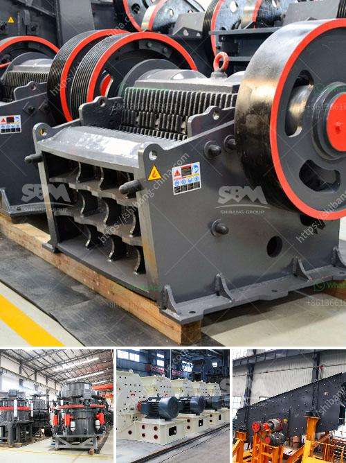

<h3>غربال الحصى للبيع كريغزليست</h3>
إذا كنت تبحث عن غربال حصى لاستخدامه في أعمال البناء أو الصناعية، فإن موقع كريغزليست هو مكان رائع للعثور على ما تحتاجه. يعتبر كريغزليست أحد أكبر المواقع الإلكترونية للإعلانات المبوبة في العالم، حيث يضم آلاف الإعلانات اليومية لمجموعة واسعة من المنتجات والخدمات.

عندما تبحث عن غربال حصى للبيع، يجب أن تأخذ بعض الأمور في الاعتبار للحصول على أفضل صفقة ممكنة. أحد العوامل الرئيسية التي يجب أن تنظر إليها هو نطاق الأسعار المناسب لك. في غالب الأحيان، تتراوح أسعار غرابيل الحصى التي تعرض على كريغزليست بين 200 و 400 دولار.

ومع ذلك، يجب ألا تستند القرارات النهائية فقط إلى السعر، بل يجب أيضا أن تنظر إلى دراسة جيدة للمنتج المعروض والتحقق من حالته. يمكنك التواصل مع البائع وطلب المزيد من المعلومات حول الغربال قبل اتخاذ أي قرار.

تتوفر أيضًا خيارات مختلفة على كريغزليست تناسب احتياجاتك وميزانيتك. يمكنك العثور على غرابيل حصى جديدة أو مستعملة للبيع. للعديد من الباعة، يتم عرض غرابيل الحصى المستعملة بأسعار أقل من الجديدة. قد يكون هذا الخيار مناسبًا لك إذا كنت تبحث عن خيار ميسور التكلفة.

عندما تبدأ في البحث عن غربال الحصى، يمكن استخدام ميزة البحث المتقدمة في كريغزليست لتضييق نتائج البحث بناءً على موقعك والمدى السعري وحالة الغربال. يمكنك أيضًا تحديد العلامات التجارية المفضلة لديك، إن وجدت.

بالتأكيد، يفضل للشخص الشراء من بائع موثوق ومعتمد. يجب أن تحسب الوقت اللازم للتعامل مع البائع والتحقق من سمعته/معرفته، بحيث يكون لديه تقييمات إيجابية من العملاء السابقين.

في النهاية، يعد كريغزليست مكاناً رائعًا لإيجاد غربال حصى للبيع. بفضل مجموعة واسعة من الإعلانات وخيارات البحث المتقدمة المتاحة، يمكنك العثور على المنتج المثالي الذي يلبي احتياجاتك وميزانيتك. لا تتردد في استكشاف الموقع والعثور على غربال الحصى المناسب لك.
<h3>Contact us</h3><ul><li><strong>Whatsapp:&nbsp;<a href="https://wa.me/8613661969651">+8613661969651</a></strong></li><li><a href="https://swt.shibang-china.com/?git&amp;zhl&amp;غربال الحصى للبيع كريغزليست"><strong>Online Service(chat now)</strong></a></li></ul><h3>Related</h3><ul><li><a href='أحجام كسارة الفك الحجر الجيري.md'>أحجام كسارة الفك الحجر الجيري</a></li><li><a href='الحجر الجيري المستخدم لصنع الزجاج.md'>الحجر الجيري المستخدم لصنع الزجاج</a></li><li><a href='المواصفات الفنية لمطحنة الكرة.md'>المواصفات الفنية لمطحنة الكرة</a></li><li><a href='كسارة فكية لتكسير الجرانيت.md'>كسارة فكية لتكسير الجرانيت</a></li><li><a href='موردين مطاحن الطحن في ججرانوالا.md'>موردين مطاحن الطحن في ججرانوالا</a></li></ul>