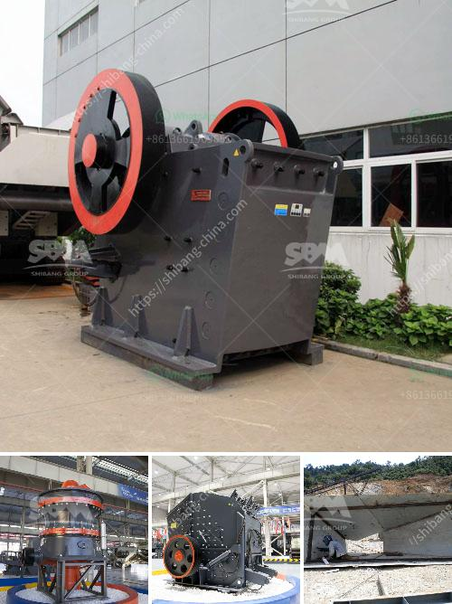

<h3>غربال وكسارة للبيع</h3>
تعد الغربال والكسارة من المعدات الهامة في صناعة التعدين والبناء والتشييد. تتميز هذه المعدات بأنها تستخدم لفصل وتكسير المواد الصلبة والصخور للحصول على مواد أصغر الحجم وأكثر ملاءمة للاستخدام في العديد من التطبيقات المختلفة.

يستخدم الغربال في عملية فصل المواد الصلبة والسائلة، حيث يتم تمرير المواد عبر سطح مثقب يسمح بمرور السوائل واحتجاز الشوائب والمواد الصلبة الكبيرة. يمكن استخدام الغربال للعديد من الغايات مثل تصفية الماء وفصل الرمال وتصفية المواد الغذائية.

أما الكسارة، فهي تستخدم لتكسير وسحق المواد الصلبة مثل الصخور والأحجار الكبيرة. بواسطة الكسارة، يمكن تحويل المواد الضخمة وغير المنتظمة إلى مواد أصغر الحجم وأكثر تناسباً للاستخدام. قد تكون الكسارة ثابتة أو متنقلة، حيث يتم نقلها بواسطة معدات خاصة.

تتوفر الغرابيل والكسارات للبيع بمختلف المواصفات والسعات. يعد الاختيار المناسب للغربال والكسارة أمرًا حاسمًا لتحقيق الأداء والكفاءة المثلى في عملية التكسير وفصل المواد.

علاوة على ذلك، يجب أيضًا النظر في تكلفة الغربال والكسارة المعروضة للبيع. يتوقف التكلفة على الحجم والقدرة والمواصفات الأخرى للمعدات. قد يؤثر أيضًا الحجم والعلامة التجارية ومدى استخدام المعدات على تكلفتها. بشكل عام، تتراوح أسعار الغرابيل والكسارات المتاحة في السوق بين 200 و 400 دولار.

في النهاية، يعد اقتناء الغربال والكسارة للبيع خطوة أساسية للشركات والمهندسين المعماريين الذين يعملون في صناعة التعدين والبناء والتشييد. توفر هذه المعدات فرصًا ممتازة لتحسين العمليات وزيادة الإنتاجية وتوفير الوقت والجهود والتكاليف. لذا، يجب اختيار الغربال والكسارة المناسبة والموثوق بها لضمان الأداء الأمثل.

باختصار، الغربال والكسارة للبيع هما معدات أساسية في صناعة التعدين والبناء والتشييد. تستخدم الغرابيل لفصل المواد الصلبة والسائلة، في حين تستخدم الكسارات لتكسير المواد الصلبة وتحويلها إلى أحجام أصغر وأكثر تناسبًا. يجب النظر في المواصفات والتكلفة لاختيار الغربال والكسارة المناسبة. في النهاية، يساهم استخدام هذه المعدات في تحسين العمليات وزيادة الإنتاجية.
<h3>Contact us</h3><ul><li><strong>Whatsapp:&nbsp;<a href="https://wa.me/8613661969651">+8613661969651</a></strong></li><li><a href="https://swt.shibang-china.com/?git&amp;zhl&amp;غربال وكسارة للبيع"><strong>Online Service(chat now)</strong></a></li></ul><h3>Related</h3><ul><li><a href='إنتاج الكاولين في إثيوبيا بتنسيق PDF.md'>إنتاج الكاولين في إثيوبيا بتنسيق PDF</a></li><li><a href='هل هناك طاحونة فائقة الدقة عمودية للأسطوانة.md'>هل هناك طاحونة فائقة الدقة عمودية للأسطوانة</a></li><li><a href='معدات كسارة المحجر المحمولة المستخدمة.md'>معدات كسارة المحجر المحمولة المستخدمة</a></li><li><a href='معدات في ماليزيا لسحق المحمولة.md'>معدات في ماليزيا لسحق المحمولة</a></li><li><a href='مطحنة كرات للبيع في الهند.md'>مطحنة كرات للبيع في الهند</a></li></ul>