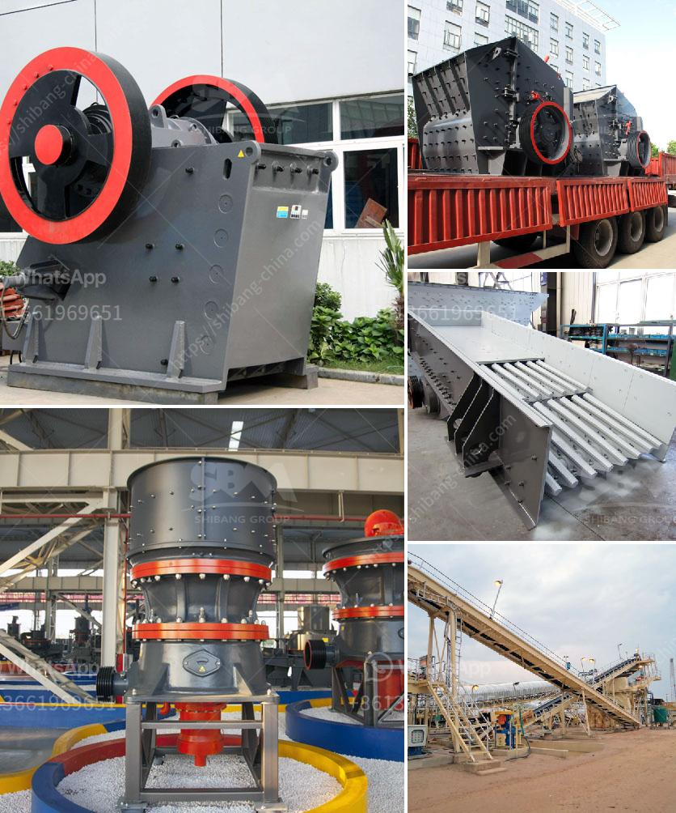

<h3>غسالة مواد خام جرايستون مستعملة</h3>
تعتبر غسالة مواد خام جرايستون المستعملة واحدة من أفضل الخيارات المتاحة في السوق. تتميز هذه الغسالة بمجموعة من الميزات التي تجعلها تبرز عن غيرها من الغسالات المتاحة في السوق.

أولاً، تتميز غسالة المواد الخام جرايستون المستعملة بسعة تحميل كبيرة تصل إلى 8 كيلوجرامات. هذا يعني أنها قادرة على غسل كمية كبيرة من الملابس في دورة واحدة، مما يوفر الكثير من الوقت والجهد. بالإضافة إلى ذلك، تتميز الغسالة بتصميم فعال يضمن توزيع متساوٍ للملابس داخل الغسالة، مما يضمن غسل نظيف وفعال للجميع دون أي تجاعيد أو تشابك.

ثانيًا، تعتبر غسالة المواد الخام جرايستون المستعملة ذكية وعالية الأداء. تحتوي على فريق من الأجهزة المتطورة مثل الاستشعارات الذكية والتحكم الآلي في درجة الحرارة والرطوبة. هذه الأجهزة تعمل سويًا لضمان غسل فعال واقتصادي للملابس. على سبيل المثال، تعترف الغسالة بنوع الملابس ومستوى التجاعيد ومدة الغسيل المطلوبة. ثم تقوم بتعديل درجة حرارة الماء وكمية المنظف المستخدمة وفقًا لذلك. هذا يعني أنها لا تهدر الماء أو الكهرباء، مما يساهم في الاستدامة البيئية وتوفير تكاليف الطاقة.

وأخيرًا، تتميز غسالة المواد الخام جرايستون المستعملة بواجهة سهلة الاستخدام. توفر شاشة LCD وأزرار واضحة ومبينات متعددة اللغات تجربة مستخدم سهلة ومريحة. يمكنك اختيار البرنامج وضبط الإعدادات المطلوبة بسهولة، وستتعامل الغسالة بالباقي. كما أنها تحتوي على مؤقت ذكي يمكنك من ضبط وقت انتهاء الغسيل واستلام الملابس في الوقت المناسب بالنسبة لك.

باختصار، غسالة المواد الخام جرايستون المستعملة تعتبر اختيارًا ممتازًا للأفراد والعائلات التي تبحث عن غسالة فعالة واقتصادية وسهلة الاستخدام. بالإضافة إلى ذلك، فإنها تحتوي على قدرة كبيرة وتقنيات ذكية تضمن غسل نظيف وفعال للملابس. قد يكون سعرها مرتفعًا نوعًا ما، ولكنه يستاهل كل ذلك بالنظر إلى الفوائد الكبيرة التي توفرها. إذا كنت تبحث عن غسالة عالية الجودة وموثوقة، فإن غسالة المواد الخام جرايستون المستعملة هي الخيار المثالي لك.
<h3>Contact us</h3><ul><li><strong>Whatsapp:&nbsp;<a href="https://wa.me/8613661969651">+8613661969651</a></strong></li><li><a href="https://swt.shibang-china.com/?git&amp;zhl&amp;غسالة مواد خام جرايستون مستعملة"><strong>Online Service(chat now)</strong></a></li></ul><h3>Related</h3><ul><li><a href='رسم تخطيطي لعملية إنتاج الأسمنت.md'>رسم تخطيطي لعملية إنتاج الأسمنت</a></li><li><a href='تعدين البازلت.md'>تعدين البازلت</a></li><li><a href='مصنع الإسمنت الصغير المصنوع في الصين.md'>مصنع الإسمنت الصغير المصنوع في الصين</a></li><li><a href='كسارة مخروطية قياسية دليل الإصلاح.md'>كسارة مخروطية قياسية دليل الإصلاح</a></li><li><a href='الميزة الرئيسية لكسارة الصدم أو الفك.md'>الميزة الرئيسية لكسارة الصدم أو الفك</a></li></ul>