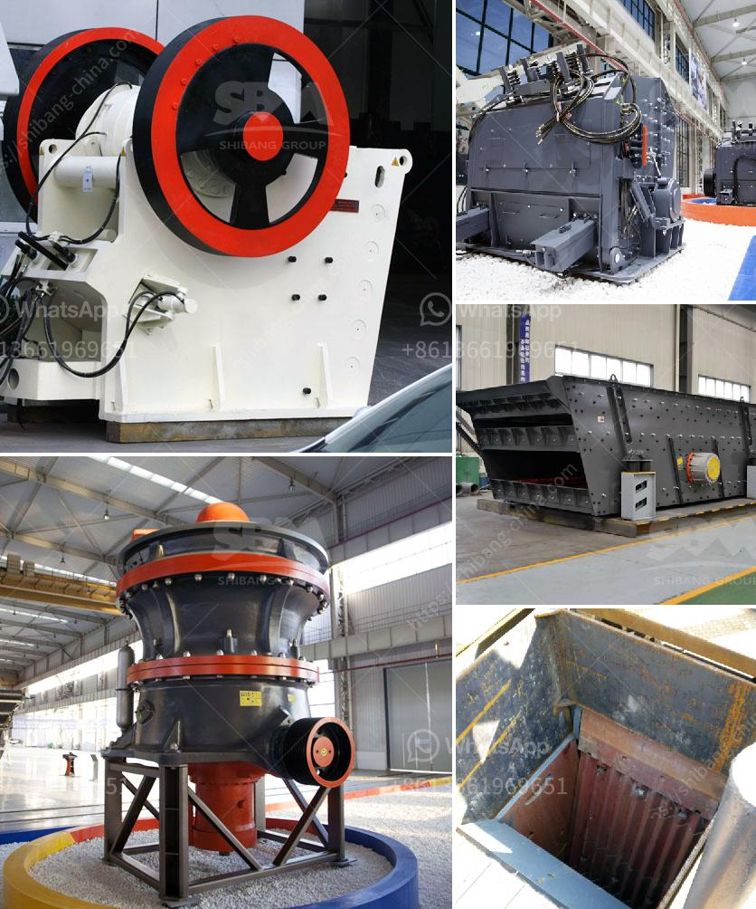

<h3>غسيل الذهب وآلة الألماس</h3>
غسيل الذهب وآلة الألماس هما اثنين من عمليات التنقيب عن المعادن الثمينة التي تستخدم تقنيات متقدمة لفصل الذهب والألماس عن الرمال والأتربة. يعتبر الذهب والألماس من أثمن المعادن في العالم، ويستخدمان في مجموعة متنوعة من الصناعات مثل المجوهرات والإلكترونيات.

تستخدم آلة غسيل الذهب في التنقيب عن الذهب، وتعتمد على قابلية الذهب للترسيب في الأماكن التي يسقط فيها المياه. تعمل الآلة من خلال تيارات الماء التي تضخها إلى مجرى المياه الطبيعي، وبعد ذلك يتم تسخين الماء وإجراء تدويره في الآلة. يتم استخدام أدوات متخصصة لفصل الرمال والأتربة عن الذهب، في حين يظل الذهب الخام في أسفل الآلة.

بعد جمع الذهب، يمكن أن يتم تطهيره باستخدام المواد الكيميائية المناسبة وعملية التنقية بحيث يصبح جاهزًا للاستخدام في الصناعات المختلفة.

أما آلة الألماس، فتعتبر أداة حديثة تعتمد على تقنية الفصل الضوئي. تعمل الآلة عن طريق تسليط الضوء على الأحجار الكريمة مثل الألماس، ومن ثم تقوم بتحليل الضوء المنعكس من الألماس لتحديد مدى جودة الحجر. فعلى سبيل المثال، يمكن للآلة تحديد قيمة الألماس من خلال تحليل تأثير الضوء على سطحه وقوة التأثير.

تعتبر آلة الألماس أداة مهمة لصناعة المجوهرات والتعدين، حيث يمكنها توفير قيمة الألماس بشكل دقيق وسهل. كما أنها تساعد في تجنب شراء أحجار مزيفة أو منخفضة الجودة.

في النهاية، يمكن القول بأن غسيل الذهب وآلة الألماس هما عمليتان تقنيتان حديثتان تساهمان في تحسين عمليات التنقيب والتصنيع للمعادن الثمينة. يتطلب كل منهما معرفة وخبرة متقدمة لتحقيق نتائج دقيقة وموثوقة. إن استخدام هذه التقنيات يساعد في إنتاج منتجات عالية الجودة وتعزيز صناعة المجوهرات والتعدين بشكل عام.
<h3>Contact us</h3><ul><li><strong>Whatsapp:&nbsp;<a href="https://wa.me/8613661969651">+8613661969651</a></strong></li><li><a href="https://swt.shibang-china.com/?git&amp;zhl&amp;غسيل الذهب وآلة الألماس"><strong>Online Service(chat now)</strong></a></li></ul><h3>Related</h3><ul><li><a href='تكلفة كسارة المعدات في ماليزيا.md'>تكلفة كسارة المعدات في ماليزيا</a></li><li><a href='كيفية بناء مصنع استفادة من المنغنيز.md'>كيفية بناء مصنع استفادة من المنغنيز</a></li><li><a href='مصنعي مطاحن الرايموند في الهند.md'>مصنعي مطاحن الرايموند في الهند</a></li><li><a href='شركة معدات البناء.md'>شركة معدات البناء</a></li><li><a href='مصنع آلات مطحنة الكرة.md'>مصنع آلات مطحنة الكرة</a></li></ul>