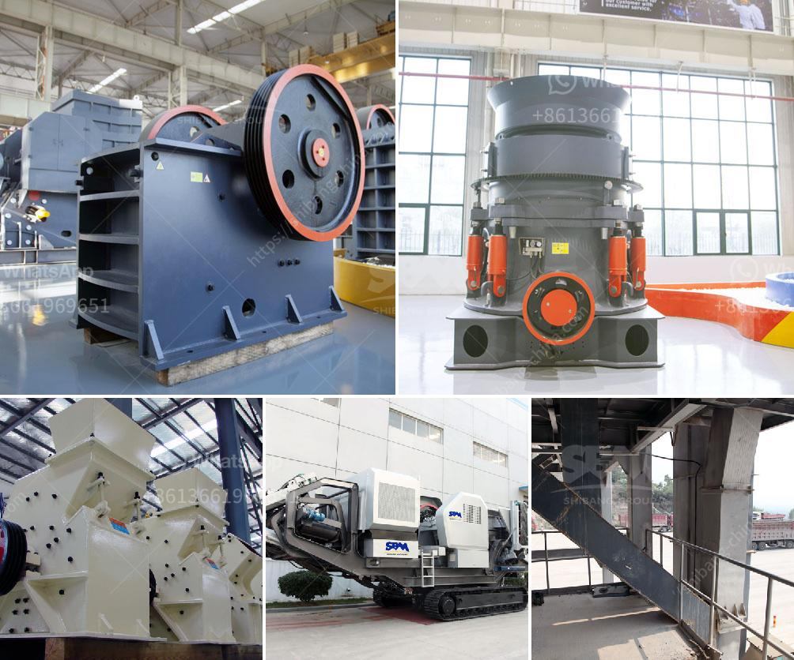

<h3>غسيل الرمال الصغيرة</h3>
غسيل الرمال الصغيرة هو عملية يتم فيها فصل الشوائب والأوساخ عن الرمال الصغيرة لتحسين جودتها وملاءمتها للاستخدام المختلف. يُعد غسيل الرمال الصغيرة عملية هامة في مجال البناء وصناعة الأسمنت والزجاج والخرسانة والسيراميك، حيث يتطلب استخدام رمال ذات نوعية عالية.

تتم عملية غسيل الرمال الصغيرة عادةً في مصانع خاصة لتنظيف وفرز الرمال المستخدمة. يبدأ العمل بتحميل الرمال الصغيرة في جهاز الغسيل حيث تقوم الآلات بتكسير التكتلات وفصل الشوائب والأوساخ عن الرمال. يتم استخدام العديد من التقنيات والمعدات المتطورة في عملية غسيل الرمال الصغيرة، بما في ذلك الغرابيل والشاشات الاهتزازية والفاصل المغناطيسي وغيرها.

يتم اختيار الفاصل المناسب والشاشات الحجمية الصحيحة وفقًا للتطبيق المحدد والمواصفات المطلوبة للرمال. تعتبر عملية الغسيل ضرورية لإزالة الأوساخ والشوائب التي قد تؤثر على خصائص الرمال وتوفرها من كتل وتكتلات غير مرغوب بها.

تعتبر الرمال المغسولة مناسبة للاستخدام في العديد من التطبيقات المختلفة. يمكن استخدامها في صناعة الخرسانة لتحسين قوة الربط ومتانتها. كما يمكن استخدامها في صناعة الزجاج للحصول على زجاج واضح وخالٍ من الشوائب. بالإضافة إلى ذلك، يعتبر غسيل الرمال الصغيرة أحد الخطوات الرئيسية في صناعة السيراميك للحصول على منتج نهائي عالي الجودة.

يعتبر غسيل الرمال الصغيرة من أهم عمليات تحسين الجودة التي يمكن أن يتم إجراؤها على الرمال الطبيعية. تساهم عملية الغسيل في تعزيز الكفاءة العامة لعمليات الإنتاج وتحسين جودة المنتج النهائي. بفضل تطور التكنولوجيا، أصبحت عملية غسيل الرمال الصغيرة أكثر فاعلية واقتصادية وتكلفة أقل مقارنة بالطرق التقليدية.

باختصار، يعد غسيل الرمال الصغيرة عملية أساسية لفصل الشوائب والأوساخ عن الرمال. يتم استخدامها في العديد من الصناعات لتحسين جودة المنتجات النهائية. تلعب عملية غسيل الرمال الصغيرة دورًا حاسمًا في تطوير البنية التحتية ورفع مستوى الجودة في الصناعات المختلفة.
<h3>Contact us</h3><ul><li><strong>Whatsapp:&nbsp;<a href="https://wa.me/8613661969651">+8613661969651</a></strong></li><li><a href="https://swt.shibang-china.com/?git&amp;zhl&amp;غسيل الرمال الصغيرة"><strong>Online Service(chat now)</strong></a></li></ul><h3>Related</h3><ul><li><a href='تأجير معدات التعدين في إندونيسيا.md'>تأجير معدات التعدين في إندونيسيا</a></li><li><a href='مطرقة فولاذية.md'>مطرقة فولاذية</a></li><li><a href='مورد آلة كسارة الأسطوانة.md'>مورد آلة كسارة الأسطوانة</a></li><li><a href='مطحنة هامر لطحن البولي إيثيلين منخفض الكثافة.md'>مطحنة هامر لطحن البولي إيثيلين منخفض الكثافة</a></li><li><a href='مطحنة المطرقة في نيجيريا.md'>مطحنة المطرقة في نيجيريا</a></li></ul>