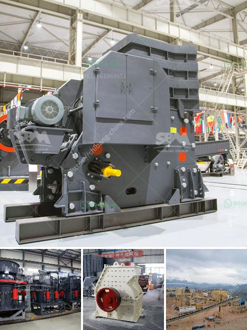

<h3>فاصل رمل وحجر لغسيل الشمندر</h3>
يعتبر فاصل الرمل والحجر لغسيل الشمندر من الأدوات الهامة في عمليات تنقية المياه وفصل الشوائب الصلبة عنها. يستخدم هذا الفاصل في معامل المياه، وفي العديد من الصناعات مثل النفط والغاز والمناجم والمصانع الكيماوية.

يعمل فاصل الرمل والحجر عن طريق تدفق المياه الملوثة عبر طبقات من الرمل والحصى المختلفة. يحدث ذلك بفضل تأثير الجاذبية حيث يرتفع الماء النقي بينما يترسب الرمل والحجر في الأسفل. يتم تجهيز هذا الفاصل بصمام خاص يسمح بتصريف الشوائب والرواسب المتراكمة على مدار فترات زمنية منتظمة.

إن استخدام فاصل الرمل والحجر ضروري لأن المياه الملوثة بالرواسب قد تتسبب في تلوث المنظومات الأخرى كالأنابيب والمعدات والمحطات الهيدروليكية. وبالتالي، فإن استخدام هذا الفاصل يساعد في تجنب التكلفة العالية الناجمة عن إصلاح وصيانة هذه الأجهزة والأنظمة.

علاوة على ذلك، يؤثر استخدام فاصل الرمل والحجر في تحسين جودة المياه بشكل عام. فهذا الجهاز يعمل على فصل الشوائب الرملية والحجرية من المياه الملوثة، وبالتالي يقلل من محتوى الشوائب الصلبة فيها. وكلما قلت هذه الشوائب الصلبة، زادت جودة المياه وصالحيتها للإستخدام بشكل فوري أو في الأغراض الصناعية.

وبعلاوة عن ذلك، فإن فاصل الرمل والحجر لغسيل الشمندر يعد أيضًا من أدوات الحماية البيئية الهامة. إذ أن فصل الشوائب الصلبة يؤدي إلى تقليل التلوث البيئي، حيث تتمثل الشوائب في المواد العضوية والمواد الكيميائية الضارة والمعادن الثقيلة. وبذلك يقلل من تأثير هذه المواد الضارة على النظام البيئي بشكل عام وعلى المخلوقات الحية المتواجدة في المياه المصنفة.

في الختام، فإن فاصل الرمل والحجر لغسيل الشمندر يعد أداة فعالة لتنقية المياه وفصل الشوائب الصلبة عنها. يساعد في تحسين جودة المياه والحفاظ على أنظمة المعالجة والصناعة خالية من الرواسب والشوائب. كما يلعب دورا هاما في حماية البيئة من التلوث ومنع انتشار المواد الضارة.
<h3>Contact us</h3><ul><li><strong>Whatsapp:&nbsp;<a href="https://wa.me/8613661969651">+8613661969651</a></strong></li><li><a href="https://swt.shibang-china.com/?git&amp;zhl&amp;فاصل رمل وحجر لغسيل الشمندر"><strong>Online Service(chat now)</strong></a></li></ul><h3>Related</h3><ul><li><a href='آلات صنع الألواح الجبسية من تركيا.md'>آلات صنع الألواح الجبسية من تركيا</a></li><li><a href='سيور ناقلة للخرسانة.md'>سيور ناقلة للخرسانة</a></li><li><a href='معدات الطحن بالكرات ووسائط الطحن.md'>معدات الطحن بالكرات ووسائط الطحن</a></li><li><a href='آلة كسارة الحجر للبيع في نيوزيلندا.md'>آلة كسارة الحجر للبيع في نيوزيلندا</a></li><li><a href='نموذج 2D لمطحنة الكرة.md'>نموذج 2D لمطحنة الكرة</a></li></ul>