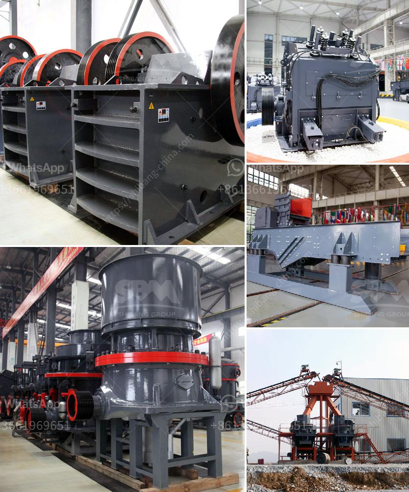

<h3>فاصل عالي التدرج في زينغتشو</h3>
زينغتشو هو نوع من الفواصل العالية التدرج التي تستخدم في العديد من التطبيقات الصناعية والتقنية. تتميز هذه الفواصل بأنها تحتوي على مستويات عالية من التدرج في جودة الألوان، وهي مفضلة لإنتاج الصور والأفلام عالية الدقة.

تستخدم الفواصل العالية التدرج في العديد من الأجهزة الإلكترونية مثل شاشات الكمبيوتر والتلفزيونات عالية الدقة. إنها تسمح بعرض الألوان بدقة ووضوح فائقين، وتعزز تجربة المشاهدة بشكل كبير.

واحدة من أهم الاستخدامات الأخرى للفواصل عالية التدرج هو في صناعة الطباعة الفوتوغرافية. عند طباعة الصور واللوحات الفنية، يكون الهدف هو انتقال أكبر قدر ممكن من تدرجات الألوان وتفاصيلها الدقيقة. هنا يأتي دور الفواصل عالية التدرج في تحقيق هذا الهدف، حيث تساعد في تناسق الألوان وظلالها وتجعل الصور تبدو أكثر واقعية وجمالية.

إضافة إلى ذلك، تستخدم الفواصل عالية التدرج في صناعة التصوير السينمائي. يتطلب إنتاج الأفلام عالية الجودة استخدام تقنيات تعزز الوضوح والدقة في الصورة. باستخدام الفواصل عالية التدرج، يمكن الحصول على مستويات عالية من الدقة والتفاصيل في الأفلام مما يعطي تجربة مشاهدة مذهلة وواقعية.

لا يقتصر استخدام الفواصل عالية التدرج على الصناعات الترفيهية فحسب، بل يمتد إلى مجالات أخرى مثل التصوير الفوتوغرافي العلمي والطبي. في هذه المجالات، يكون التركيز على تفاصيل معينة ودقة الوان محددة في الصور. تحقق الفواصل عالية الدقة هذا المطلب بشكل مثالي وتساعد على تحسين التشخيص والتحليل في هذه المجالات.

باختصار، الفواصل عالية التدرج في زينغتشو هي الخيار المفضل للعديد من التطبيقات التقنية والصناعية التي تتطلب دقة عالية في عرض الألوان وتفاصيلها. إنها تعزز تجربة المشاهدة وتوفر صور وأفلام ذات وضوح وجودة مثالية، مما يجعل الفواصل عالية التدرج أداة لا غنى عنها في العديد من الصناعات المتعلقة بالتصوير والطباعة والتصوير السينمائي والتطبيقات العلمية والطبية.
<h3>Contact us</h3><ul><li><strong>Whatsapp:&nbsp;<a href="https://wa.me/8613661969651">+8613661969651</a></strong></li><li><a href="https://swt.shibang-china.com/?git&amp;zhl&amp;فاصل عالي التدرج في زينغتشو"><strong>Online Service(chat now)</strong></a></li></ul><h3>Related</h3><ul><li><a href='بدء عمل كسارة الجرانيت.md'>بدء عمل كسارة الجرانيت</a></li><li><a href='حساب تكلفة سحق الركام.md'>حساب تكلفة سحق الركام</a></li><li><a href='مطحنة أسطوانية لمرادآباد.md'>مطحنة أسطوانية لمرادآباد</a></li><li><a href='كسارات محمولة في محجر جنوب أفريقيا.md'>كسارات محمولة في محجر جنوب أفريقيا</a></li><li><a href='مطاحن الرمل للتصنيع.md'>مطاحن الرمل للتصنيع</a></li></ul>