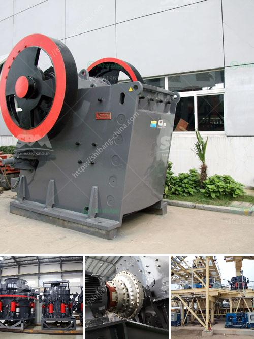

<h3>فحص الشاشة التحجيم</h3>
في عالم التكنولوجيا الحديثة، أصبحت الشاشات تلعب دورًا مهمًا وحيويًا في حياتنا. فعلى سبيل المثال، تستخدم الشاشات في الهواتف الذكية والأجهزة اللوحية والحواسيب الشخصية والأجهزة الإلكترونية الأخرى. ومن أجل ضمان أداء الشاشة بشكل مثالي، يتعين علينا أن نجري فحصًا دوريًا للتحقق من تحجيمها بشكل صحيح.

فحص الشاشة التحجيم هو عملية للتحقق من تكوين وإعدادات الشاشة بحيث تعرض الصورة بالحجم الصحيح وتتوافق مع المعايير المطلوبة. وتعتبر جودة العرض والتحكم في حجم الشاشة أمورًا حاسمة للمستخدم. فإذا كانت الشاشة محجومة أو غير محجومة بشكل صحيح، فقد يتعذر على المستخدم قراءة النصوص بوضوح أو استخدام واجهة التطبيق بشكل سلس. لهذا السبب، فإن فحص الشاشة التحجيم أمر ضروري لكل مستخدم.

يوفر معظم الأجهزة الحديثة أدوات بسيطة لضبط الشاشة وتعديل التحجيم ووضوح الصورة. يمكن الوصول إلى هذه الأدوات من خلال قائمة الإعدادات أو قائمة الشاشة على الجهاز. من المهم التأكد من أن الشاشة مضبوطة على الحجم الصحيح وفقًا لاحتياجات المستخدم.

تشمل خطوات فحص الشاشة التحجيم قياس القياسات الأفقية والرأسية لشاشة العرض، وضبط النسبة بين الطول والعرض، وضبط السطوع والتباين للحصول على صورة واضحة ومشرقة. يجب أيضًا التأكد من أن التحجيم موحد على كل جوانب الشاشة.

في حالة وجود خلل في الشاشة كانت بسيطة أو خطيرة، ينبغي أخد الشاشة إلى مركز خدمة معتمد للفحص والإصلاح. وفي بعض الأحيان قد يكون استبدال الشاشة المعيبة أمرًا ضروريًا.

باختصار، فحص الشاشة التحجيم أمر ضروري للتأكد من أن الشاشة تعمل بشكل صحيح وتعرض الصورة بالحجم الصحيح وفقًا للمعايير المطلوبة. يجب على المستخدمين أن يتعلموا كيفية استخدام أدوات التعديل المتاحة على الأجهزة الخاصة بهم والاستعانة بخبراء الصيانة إذا لزم الأمر. التأكد من تحجيم الشاشة بشكل صحيح سيساهم في تجربة المستخدم الجيدة وضمان أداء الشاشة بأفضل طريقة ممكنة.
<h3>Contact us</h3><ul><li><strong>Whatsapp:&nbsp;<a href="https://wa.me/8613661969651">+8613661969651</a></strong></li><li><a href="https://swt.shibang-china.com/?git&amp;zhl&amp;فحص الشاشة التحجيم"><strong>Online Service(chat now)</strong></a></li></ul><h3>Related</h3><ul><li><a href='كسارة الحجر ساياجي.md'>كسارة الحجر ساياجي</a></li><li><a href='سعر آلة الطحن في ماليزيا.md'>سعر آلة الطحن في ماليزيا</a></li><li><a href='تكلفة إنشاء مصنع خام الحديد.md'>تكلفة إنشاء مصنع خام الحديد</a></li><li><a href='مطحنة الأسطوانة الرأسية.md'>مطحنة الأسطوانة الرأسية</a></li><li><a href='تقرير مشروع تصنيع الطوب الرملي.md'>تقرير مشروع تصنيع الطوب الرملي</a></li></ul>