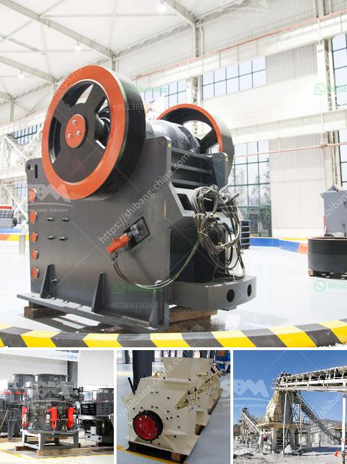

<h3>فرضية عامة لكسارة الفك</h3>
لعب فرضية عامة لكسارة الفك دورًا حاسمًا في تقدم علم الجيولوجيا وفهم العالم القديم. يعتبر كسارة الفك من الأدوات الحديثة في المجال الجيولوجي، حيث تتميز بقدرتها على تمزيق الصخور بطريقة دقيقة وفعالة. تستخدم كسارة الفك لتفتيت الصخور الصلبة في عينات الصخور المأخوذة من المواقع الجيولوجية المختلفة.

تستند فرضية الكسارة الفك على عدة أسس رئيسية، وتعزز فهمنا للعمليات الجيولوجية التي حدثت على مر العصور. أحد هذه الأسس هو فهم المعادن وتركيبها الكيميائي، حيث يقوم العلماء بتحليل الصخور المكسورة بواسطة كسارة الفك لاستخلاص المعلومات الكيميائية والمعدنية. يساعد هذا في تحديد المعادن الموجودة في مناطق محددة والبحث عن الرواسب المعدنية المحتملة.

ثمة أسس أخرى تتطلب التحليل المفصل للصخور المكسورة باستخدام الكسارة الفك. فعلى سبيل المثال، يتم تحليل الصخور لاستخراج الأحافير والمؤشرات الأحيائية الموجودة فيها. تعتبر الأحافير أدلة هامة تساهم في فهم الحقب الزمنية المعينة وتطور الكائنات الحية على مر العصور. بالاستفادة من الكسارة الفك، يستطيع العلماء الوصول إلى تواريخ أكثر دقة وفهم أفضل للنشوء وتطور الحياة على كوكب الأرض.

بالإضافة إلى ذلك، يسهم الاستخدام المستمر لكسارة الفك في فهم تضاريس الأرض وتكوينها. يتم استخدام الكسارة الفك لتحليل الصخور المكسورة وتعيين محتواها النسبي من العناصر والمعادن المختلفة. هذا المعلومات تساهم في تطوير نماذج ثلاثية الأبعاد للتضاريس وفهم أعمق لعمليات تشكيل الأرض وتطورها.

في الختام، فإن فرضية الكسارة الفك لديها تأثير هائل على فهم علم الجيولوجيا. يسهم استخدامها في فهم العمليات الجيولوجية والتحولات التي طرأت على الأرض على مر العصور. توفر الكسارة الفك أداة فعالة ودقيقة لتحليل الصخور واستخلاص المعلومات الكيميائية والمعدنية وفهم العوالم القديمة وتطور الحياة وتضاريس الأرض.
<h3>Contact us</h3><ul><li><strong>Whatsapp:&nbsp;<a href="https://wa.me/8613661969651">+8613661969651</a></strong></li><li><a href="https://swt.shibang-china.com/?git&amp;zhl&amp;فرضية عامة لكسارة الفك"><strong>Online Service(chat now)</strong></a></li></ul><h3>Related</h3><ul><li><a href='مطحنة الطحن.md'>مطحنة الطحن</a></li><li><a href='معدات التعويم للتعدين للبيع في جنوب أفريقيا.md'>معدات التعويم للتعدين للبيع في جنوب أفريقيا</a></li><li><a href='كيفية اختيار كسارة مخروطية.md'>كيفية اختيار كسارة مخروطية</a></li><li><a href='أفضل كسارة طين في الهند.md'>أفضل كسارة طين في الهند</a></li><li><a href='خطة عمل لكربونات الكالسيوم.md'>خطة عمل لكربونات الكالسيوم</a></li></ul>