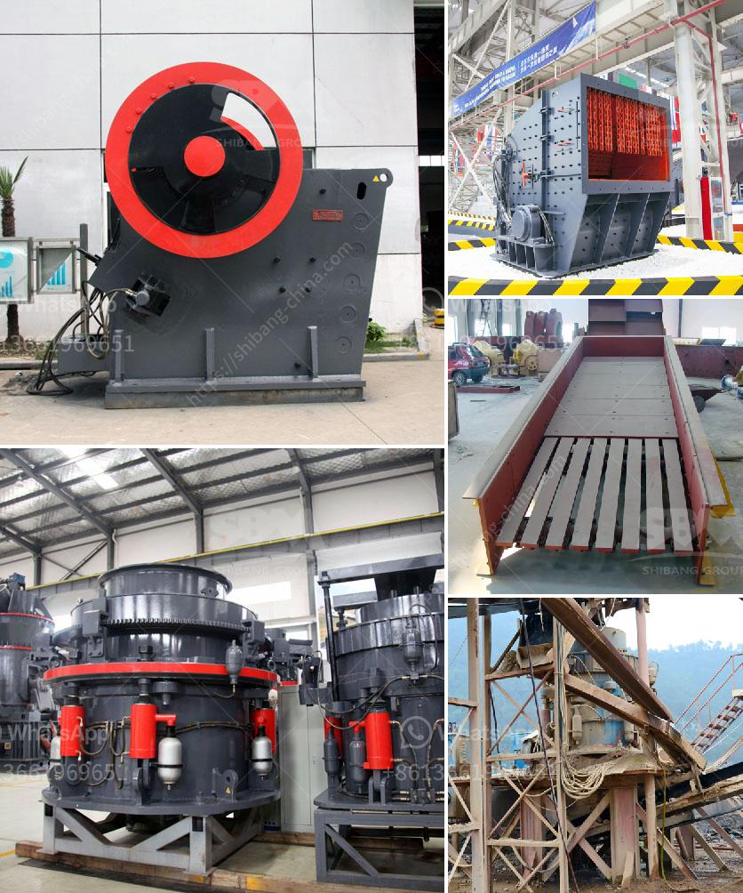

<h3>فرق بين مطحنة ريموند وضغط عالي</h3>
تتناول هذه المقالة فرق بين مطحنة ريموند وضغط عالي. عندما يتعلق الأمر بصناعة الطحن والتجهيز، تلعب المطاحن دورًا حاسمًا في تحويل المواد الخام إلى منتجات نهائية قابلة للاستخدام. واحدة من أنواع المطاحن التي تستخدم على نطاق واسع في عمليات الطحن هي مطحنة ريموند ومطحنة ضغط عالي. يود هذا المقال تسليط الضوء على الفروق بين المطحنة ريموند ومطحنة ضغط عالي.

تعتبر مطحنة ريموند واحدة من أنواع المطاحن التقليدية، والتي تستخدم عادةً لطحن المواد الخام غير القابلة للاشتعال وغير المتفجرة. وتتميز بمبدأ الطحن "التأثير - التكثيف"، حيث يتم طحن المواد بين الأسطوانة والحلقة المركزية. وتتميز بالتالي بتدفق الهواء المنتظم داخل النظام للتبريد والتصفية، مما يمنع زيادة الحرارة ويزيد من كفاءة الطحن.

من ناحية أخرى، تعتبر مطاحن الضغط العالي من التقنيات المتطورة التي تستخدم عادةً في طحن المواد الصلبة محتوية على نسب عالية من الماء، والألياف، والمعادن الناعمة. وتتميز بقدرتها على طحن المواد بضغط عالي يصل إلى عدة آلاف من الطن في المتر المربع. كما توفر هذه المطاحن تدفق هواء متفوق وتوزيعًا مثاليًا للجسيمات ونسبة طحن عالية الدقة.

يمكن اعتبار المطاحن ريموند مناسبة للطحن العام والبسيط، بينما يُفضل استخدام مطاحن الضغط العالي للمواد التي تحتاج إلى طحن دقيق وعالي النقاوة. كما يحتوي تصميم المطحنة ريموند على أجزاء كبيرة وثقيلة، مما يتطلب تثبيتًا وصيانة دورية، بينما تعتبر مطاحن الضغط العالي أكثر فعالية من حيث الطاقة ومنخفضة الصوت والاهتزاز.

بشكل عام، يتعلق اختيار المطحنة المناسبة بنوع المواد التي يتم طحنها والاحتياجات الدقيقة للعملية. فإذا كنت بحاجة إلى طحن سريع وعام، فإن مطحنة ريموند يمكن أن تكون الخيار المثالي. ومع ذلك، إذا كنت بحاجة إلى طحن دقيق وعالي النقاوة، فإن مطاحن الضغط العالي تعتبر الخيار الأمثل. آمل أن يكون هذا المقال قد رسم صورة واضحة للفروق بين مطاحن ريموند ومطاحن الضغط العالي في عمليات الطحن والتجهيز.
<h3>Contact us</h3><ul><li><strong>Whatsapp:&nbsp;<a href="https://wa.me/8613661969651">+8613661969651</a></strong></li><li><a href="https://swt.shibang-china.com/?git&amp;zhl&amp;فرق بين مطحنة ريموند وضغط عالي"><strong>Online Service(chat now)</strong></a></li></ul><h3>Related</h3><ul><li><a href='مطحنة هامر 7 في 8 للذهب والكوارتز.md'>مطحنة هامر 7 في 8 للذهب والكوارتز</a></li><li><a href='تكلفة مصنع الإسمنت الصغير بسعة 2000 طن يوميًا.md'>تكلفة مصنع الإسمنت الصغير بسعة 2000 طن يوميًا</a></li><li><a href='عملية التئام الذاتي للحجر الجيري.md'>عملية التئام الذاتي للحجر الجيري</a></li><li><a href='خطة عمل لكربونات الكالسيوم.md'>خطة عمل لكربونات الكالسيوم</a></li><li><a href='مصنع كسارة للتأجير في عمان.md'>مصنع كسارة للتأجير في عمان</a></li></ul>