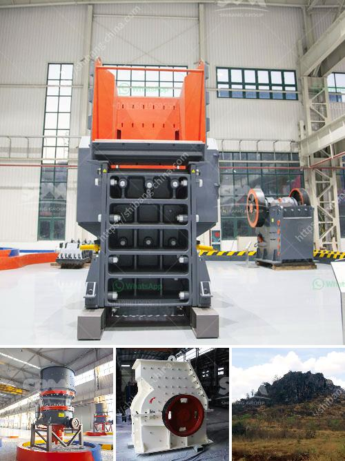

<h3>قائمة أسعار آلة سحق البنتونيت</h3>
آلة سحق البنتونيت هي آلة تستخدم لسحق وطحن البنتونيت، وهو نوع من المعادن الناعمة واللينة تستخدم في مجموعة واسعة من التطبيقات الصناعية والزراعية. تقدم الشركات المصنعة العديد من أنواع آلات سحق البنتونيت بأسعار مختلفة وفقًا لمتطلبات العملاء.

تتفاوت قائمة أسعار آلة سحق البنتونيت حسب العديد من العوامل مثل الحجم والقوة والسعة والجودة والميزات التكنولوجية المطلوبة. عادةً ما تتراوح أسعار الآلات الأكثر تقدمًا وأعلى جودة بين 15,000 إلى 50,000 دولارًا أمريكيًا، بينما تتراوح أسعار الآلات ذات الجودة المتوسطة بين 5,000 إلى 15,000 دولارًا أمريكيًا، وتكون أسعار الآلات ذات الجودة الأدنى أقل من ذلك.

تتوفر العديد من الشركات المصنعة لآلات سحق البنتونيت حول العالم، مما يوفر مجموعة واسعة من المنتجات للاختيار من بينها. بعض الشركات تستخدم تكنولوجيا متقدمة ومواد ذات جودة عالية في إنتاج آلاتها، مما يزيد من تكلفتها. بينما توفر الشركات الأخرى آلات بأسعار منخفضة بجودة متوسطة.

عند البحث عن آلة سحق البنتونيت، يجب على المشترين أخذ العديد من العوامل في الاعتبار، مثل سعر الجهاز، الجودة، السمعة وخدمة العملاء. يجب أيضًا على المشترين أن يكونوا على دراية بمتطلباتهم الخاصة والقدرة التشغيلية المطلوبة للجهاز.

يجب أن نلاحظ أن آلة سحق البنتونيت ليست بالضرورة العامل الوحيد في الإنتاج الناجح للبنتونيت المرغوب. عملية السحق والطحن هي جزء فقط من العملية الشاملة لاستخلاص البنتونيت، وبالتالي يجب مراعاة عوامل أخرى مثل عملية الفصل والتجفيف والتعبئة والتغليف ونقل المواد الخام.

باختصار، تتوفر قائمة واسعة من آلات سحق البنتونيت بأسعار مختلفة. يجب على المشترين أن ينظروا في العديد من العوامل ، بما في ذلك السعر والجودة والميزات المطلوبة ، قبل اتخاذ قرار نهائي بشأن المشتريات. من المهم أيضًا التأكد من أن الجهاز يلبي المتطلبات الفنية والعملية لعملية إنتاج البنتونيت المطلوبة.
<h3>Contact us</h3><ul><li><strong>Whatsapp:&nbsp;<a href="https://wa.me/8613661969651">+8613661969651</a></strong></li><li><a href="https://swt.shibang-china.com/?git&amp;zhl&amp;قائمة أسعار آلة سحق البنتونيت"><strong>Online Service(chat now)</strong></a></li></ul><h3>Related</h3><ul><li><a href='قائمة أسعار كسارة الحجر بسعة 300 طن في الساعة.md'>قائمة أسعار كسارة الحجر بسعة 300 طن في الساعة</a></li><li><a href='كسارة حجر في تروخيلو، بوليفيا.md'>كسارة حجر في تروخيلو، بوليفيا</a></li><li><a href='معلمات كسارة الهامر المقدمة بالتفصيل.md'>معلمات كسارة الهامر المقدمة بالتفصيل</a></li><li><a href='علامات مصنع كسارة المحجر مطحنة الكرة.md'>علامات مصنع كسارة المحجر مطحنة الكرة</a></li><li><a href='كسارات مستعملة للبيع في نيجيريا.md'>كسارات مستعملة للبيع في نيجيريا</a></li></ul>