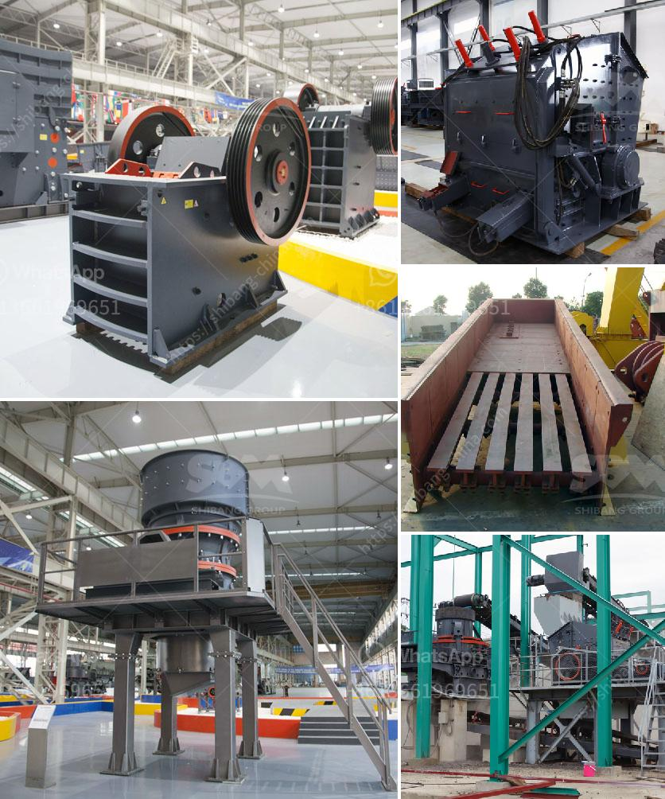

<h3>قائمة أسعار إعادة تدوير زجاج كونسول للطن</h3>
تعتبر إعادة تدوير الزجاج من العمليات البيئية الهامة التي تساهم في حماية البيئة والحد من التلوث. يتم تجميع الزجاج المستعمل من الأماكن المختلفة مثل المنازل والشركات والمحلات التجارية من قبل شركات إعادة التدوير، ومن ثم يخضع لعملية فرز وتصنيف حسب نوعه.

تختلف أسعار إعادة تدوير زجاج الكونسول حسب عدة عوامل، بينها نوع الزجاج، حجم الكمية المراد إعادة تدويرها، ومنطقة تواجد شركات الإعادة التدوير. اعتمادًا على هذه العوامل، يمكن أن تتراوح أسعار إعادة تدوير الزجاج للطن بين 200 و 400 دولار.

يجب أن يتم جمع الزجاج بعناية وفقًا للمواصفات المحددة من قبل شركات إعادة التدوير، حيث يجب أن يتم فرزه وتصنيفه حسب لونه (مثل الزجاج الأبيض والأخضر والبني) وحجمه (مثل الزجاج الكبير والصغير). يتم ذلك بهدف الحصول على جودة عالية من مادة الزجاج المعاد تدويرها.

تعتبر صناعة إعادة تدوير الزجاج صناعة متقدمة ومتطورة، حيث تقوم بعملية فرز الزجاج وتنقيته وتقطيعه إلى قطع صغيرة. ثم يتم ذوبانه في فرن خاص لإنتاج الزجاج الجديد. يتم حينها تصنيع المنتجات الزجاجية المختلفة مثل الزجاج المسطح، والعبوات الزجاجية للشرب والتعبئة والتغليف.

إعادة تدوير الزجاج لها فوائد عديدة، فإضافةً إلى حماية البيئة وتقليل استغلال الموارد الطبيعية، فإنها تساهم في توفير الطاقة أيضًا. فعملية إعادة تدوير الزجاج تعتبر أقل استهلاكًا للطاقة مقارنةً بعملية إنتاج الزجاج الجديد من الخامات الأولية كالرمل والصودا.

بشكل عام، يمكن القول إن إعادة تدوير الزجاج تمثل صناعة هامة ومجدية وذات فوائد بيئية واقتصادية كبيرة. بالإضافة إلى ذلك، فإن الاسعار المحددة لإعادة تدوير زجاج الكونسول تعتمد على عدة عوامل مثل نوع الزجاج وكميته وموقع شركة الإعادة التدوير.
<h3>Contact us</h3><ul><li><strong>Whatsapp:&nbsp;<a href="https://wa.me/8613661969651">+8613661969651</a></strong></li><li><a href="https://swt.shibang-china.com/?git&amp;zhl&amp;قائمة أسعار إعادة تدوير زجاج كونسول للطن"><strong>Online Service(chat now)</strong></a></li></ul><h3>Related</h3><ul><li><a href='مواصفات خام الكروم.md'>مواصفات خام الكروم</a></li><li><a href='بيع كسارة مخروط قديمة.md'>بيع كسارة مخروط قديمة</a></li><li><a href='آلة تكبير الفحم الدقيقة في الهند.md'>آلة تكبير الفحم الدقيقة في الهند</a></li><li><a href='كسارة الحجر الجيري في مصنع الأسمنت.md'>كسارة الحجر الجيري في مصنع الأسمنت</a></li><li><a href='كسارات الثانية الفلبين.md'>كسارات الثانية الفلبين</a></li></ul>