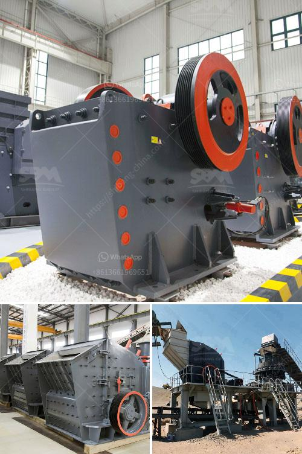

<h3>قائمة أسعار الشاشات الاهتزازية</h3>
تعتبر الشاشات الاهتزازية من الأجهزة التكنولوجية الحديثة التي أصبحت شائعة الاستخدام في العديد من المجالات. تستخدم الشاشات الاهتزازية لعرض المحتوى الرقمي بطريقة مبتكرة وممتعة، حيث تنتج اهتزازات صغيرة في الشاشة لإعطاء تأثير ثلاثي الأبعاد واقعي. قد تكون الشاشات الاهتزازية مفيدة في العديد من المجالات مثل الألعاب الرقمية وتجربة الواقع الافتراضي وكذلك في الإعلانات والعروض التقديمية.

تتوفر الشاشات الاهتزازية بمجموعة متنوعة من الأحجام والأشكال والمواصفات، مما يعني أن هناك قائمة واسعة من الأسعار التي يمكن للمستخدمين اختيار من بينها بناءً على متطلباتهم الشخصية. تتراوح أسعار الشاشات الاهتزازية من 200 إلى 400 دولار.

في الفئة الأدنى من هذه الأسعار، يمكن العثور على الكثير من الشاشات الاهتزازية بأحجام مختلفة. عادةً ما تكون هذه الشاشات مؤهلة تقنياً ولديها دقة عالية مع تصميم عصري. إنها توفر تجربة مميزة للمستخدم من خلال تأثيرات الاهتزاز التي تعزز تفاعل المستخدم مع المحتوى.

بالنسبة للفئة الثانية من الأسعار، يمكن العثور على شاشات اهتزازية أكثر تقدماً. تتميز هذه الشاشات بميزات إضافية مثل إمكانية التحكم في قوة الاهتزاز وسرعتها ونمط الاهتزاز. كما تحتوي على مزايا إضافية مثل تقنية الردود اللمسية ودقة الصورة العالية. يمكن استخدام هذه الشاشات في الألعاب الرقمية المتطورة وفي تجربة الواقع الافتراضي لتعزيز الاثارة والواقعية.

يجب على العملاء البحث بعناية قبل شراء الشاشة الاهتزازية المثلى  لتلبية احتياجاتهم وميزانيتهم. يجب أن يأخذوا في الاعتبار المواصفات الفنية والسمعة العامة للعلامة التجارية ومستوى الدعم المقدم. قد يكون من المفيد قراءة المراجعات عبر الإنترنت والاطلاع على تجارب المستخدمين الآخرين قبل الشراء.

باختصار، فإن الشاشات الاهتزازية هي تكنولوجيا مدهشة توفر تجربة رائعة للمستخدمين. قائمة أسعار الشاشات الاهتزازية تغطي مجموعة متنوعة من الأحجام والأشكال والميزات التي يمكن للمشترين اختيار من بينها وفقًا لاحتياجاتهم وميزانياتهم. بالرغم من أن بعض الأشكال والأحجام قد يكون بأسعار أعلى إلى حد ما، إلا أن التكنولوجيا المتقدمة وتجربة الاهتزاز الفريدة التي توفرها هذه الشاشات تستحق الاستثمار.
<h3>Contact us</h3><ul><li><strong>Whatsapp:&nbsp;<a href="https://wa.me/8613661969651">+8613661969651</a></strong></li><li><a href="https://swt.shibang-china.com/?git&amp;zhl&amp;قائمة أسعار الشاشات الاهتزازية"><strong>Online Service(chat now)</strong></a></li></ul><h3>Related</h3><ul><li><a href='مصنع أسمنت صغير بسعة 100 طن في اليوم.md'>مصنع أسمنت صغير بسعة 100 طن في اليوم</a></li><li><a href='كيفية حساب تكلفة الطحن.md'>كيفية حساب تكلفة الطحن</a></li><li><a href='شاشات وكسارات الركام.md'>شاشات وكسارات الركام</a></li><li><a href='كسارة الحجر بسعة 200 طن في الساعة.md'>كسارة الحجر بسعة 200 طن في الساعة</a></li><li><a href='كيفية بدء عمل في مجال صناعة الكتل الخرسانية.md'>كيفية بدء عمل في مجال صناعة الكتل الخرسانية</a></li></ul>