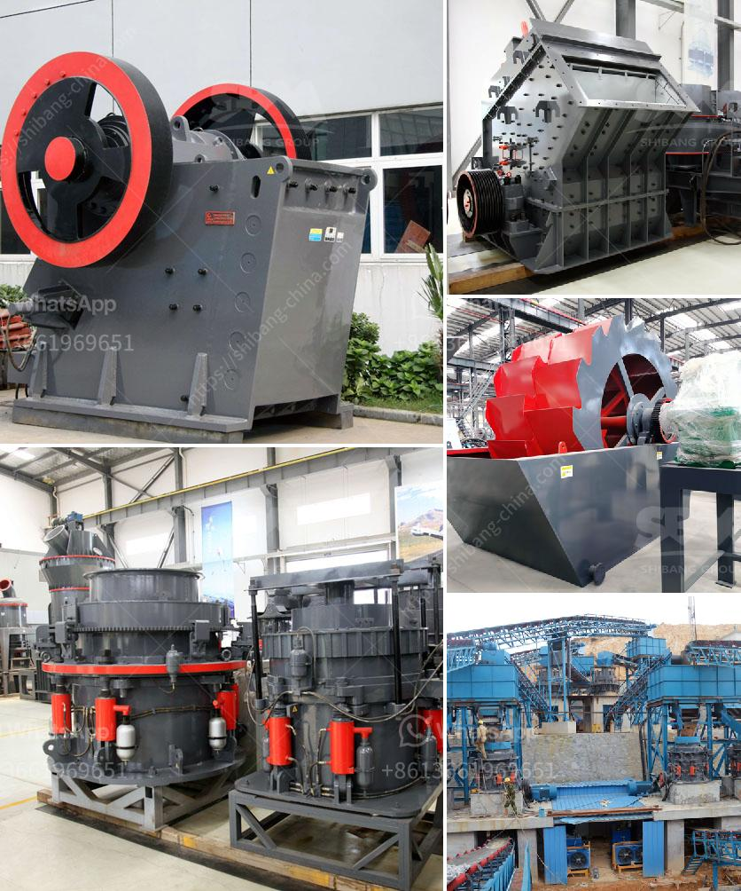

<h3>قائمة أسعار كسارات الفك</h3>
تعد كسارات الفك من الأدوات الأساسية المستخدمة في صناعة التعدين والبناء والبناء. تستخدم لسحق المواد الخام وتقسيمها إلى قطع صغيرة تسهل عملية المعالجة في المراحل اللاحقة. تختلف أسعار كسارات الفك بناءً على مجموعة من العوامل بما في ذلك العلامة التجارية والموديل والقدرة والمواصفات.

تتوفر العديد من العلامات التجارية المشهورة التي تقدم كسارات الفك بمختلف الأحجام والقدرات والتكوينات. تتراوح أسعار الكسارات الفك من حوالي 10000 دولار إلى أكثر من 100000 دولار، هذا يعتمد على القدرة الإنتاجية والجودة والملحقات المرفقة. عندما تزيد القدرة أو تزيد المواصفات، يزيد السعر بشكل طبيعي.

عوامل أخرى تؤثر في تحديد سعر كسارة الفك تشمل مصدرها والمواد المستخدمة في البناء. هناك مجموعة من المصانع التي تقدم كسارات الفك بجودة عالية وبأسعار تنافسية. بعض الشركات تقدم ضمانات لمدة معينة مع الكسارات الفك، والتي يمكن أن تلعب دورًا في تحديد السعر.

عند شراء كسارة فك، يجب أيضًا أخذ في الاعتبار تكلفة تشغيلها وصيانتها. يمكن أن تكون تكاليف الطاقة وإصلاح الأجزاء المكلفة عوامل تؤثر في تكلفة الكسارة العمومية.

قبل الشروع في البحث عن كسارة الفك المناسبة، ينبغي أن يكون هناك تحليل للاحتياجات بناءً على المشروع والمواد التي يتعين سحقها. هذا التحليل يساعد في اختيار النوع الأمثل من كسارة الفك وتجنب الاستثمار الغير مناسب.

يتعين على المشترين المحتملين مراجعة الكتالوجات ومقارنة الماركات المختلفة والتشاور مع الخبراء قبل أخذ قرار الشراء. من المهم الحصول على الرأي المهني لضمان الحصول على الجهاز الأمثل حسب الاحتياجات والمتطلبات.

في النهاية، قائمة أسعار كسارات الفك تتغير باستمرار ولا يمكن تحديد سعر ثابت لنوع معين من الكسارات. ينبغي على المشترين إجراء بحث جيد واختيار الكسارة التي تلبي احتياجاتهم بأفضل قدر ممكن من الأداء والجودة والسعر المناسب.
<h3>Contact us</h3><ul><li><strong>Whatsapp:&nbsp;<a href="https://wa.me/8613661969651">+8613661969651</a></strong></li><li><a href="https://swt.shibang-china.com/?git&amp;zhl&amp;قائمة أسعار كسارات الفك"><strong>Online Service(chat now)</strong></a></li></ul><h3>Related</h3><ul><li><a href='مطاحن صناعية للفحم.md'>مطاحن صناعية للفحم</a></li><li><a href='كسارة محمولة للبيع.md'>كسارة محمولة للبيع</a></li><li><a href='فرضية عامة لكسارة الفك.md'>فرضية عامة لكسارة الفك</a></li><li><a href='مطحنة الكرة للبيع في جنوب أفريقيا.md'>مطحنة الكرة للبيع في جنوب أفريقيا</a></li><li><a href='عملية تصنيع لوحات الجبس.md'>عملية تصنيع لوحات الجبس</a></li></ul>