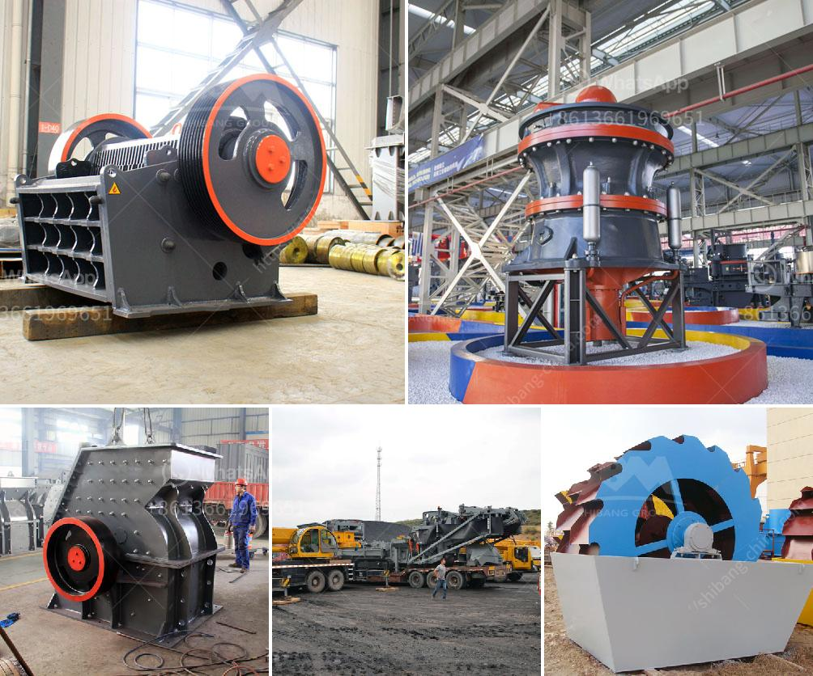

<h3>قائمة أسعار كسارة الجرانيت</h3>
يعتبر الجرانيت أحد أكثر الأحجار شيوعًا وتجاريًا في العالم، حيث يتم استخدامه في صناعة العديد من المنتجات مثل الأرضيات والأسطح والتماثيل والمدافئ والمطابخ وغيرها. وتعد كسارة الجرانيت أداة أساسية في عملية إنتاج القطع الخام التي تستخدم في صناعة هذه المنتجات.

يتفاوت سعر كسارة الجرانيت تبعًا للعديد من العوامل المختلفة، مثل الحجم والطاقة الإنتاجية والمواصفات الفنية الأخرى. وفي هذه القائمة، سأذكر بعض الأسعار التقريبية التي قد تساعدك عند البحث عن كسارة الجرانيت.

- كسارة الجرانيت بقدرة 200 طن في الساعة: يمكن العثور على موديلات بأسعار تتراوح بين 100,000 إلى 150,000 دولار أمريكي. هذه الآلات تستخدم عادة في المشاريع الكبيرة وتحتاج إلى مساحة كبيرة للتشغيل.

- كسارة الجرانيت بقدرة 100 طن في الساعة: يمكن العثور على موديلات بأسعار تتراوح بين 50,000 إلى 80,000 دولار أمريكي. تعمل هذه الآلات على تلبية احتياجات الشركات الصغيرة والمتوسطة وتعتبر أكثر اقتصادية من الآلات الأكبر حجمًا.

- كسارة الجرانيت بقدرة 50 طن في الساعة: يمكن العثور على موديلات بأسعار تتراوح بين 30,000 إلى 50,000 دولار أمريكي. هذه الآلات تعتبر مناسبة للمشاريع الصغيرة والاستخدام الشخصي.

ومن المهم أيضًا مراعاة تكاليف الشحن والتركيب والصيانة عند شراء كسارة الجرانيت. بالإضافة إلى ذلك، قد تتغير الأسعار من بائع لآخر ومن واحدة لأخرى بناءً على الخصائص الفريدة لكل آلة.

في النهاية، يجب على المتسوقين القيام ببحث جيد والتشاور مع الخبراء قبل شراء كسارة الجرانيت. يجب أن تكون الآلة ذات جودة عالية وتتوافق مع الاحتياجات الفعلية والميزانية المتاحة. من خلال الاهتمام بالعوامل المذكورة والتوجه إلى مصادر موثوقة، يمكن للمشتري العثور على كسارة الجرانيت المثالية وبأسعار تناسبه.
<h3>Contact us</h3><ul><li><strong>Whatsapp:&nbsp;<a href="https://wa.me/8613661969651">+8613661969651</a></strong></li><li><a href="https://swt.shibang-china.com/?git&amp;zhl&amp;قائمة أسعار كسارة الجرانيت"><strong>Online Service(chat now)</strong></a></li></ul><h3>Related</h3><ul><li><a href='آلة صنع مسحوق قشر الجوز في الهند.md'>آلة صنع مسحوق قشر الجوز في الهند</a></li><li><a href='كسارة محمولة من Propel.md'>كسارة محمولة من Propel</a></li><li><a href='خط إنتاج مسحوق الحجر الجيري في الهند.md'>خط إنتاج مسحوق الحجر الجيري في الهند</a></li><li><a href='مطحنة الضغط العالي.md'>مطحنة الضغط العالي</a></li><li><a href='كسارة تأثير الحجر الجيري.md'>كسارة تأثير الحجر الجيري</a></li></ul>