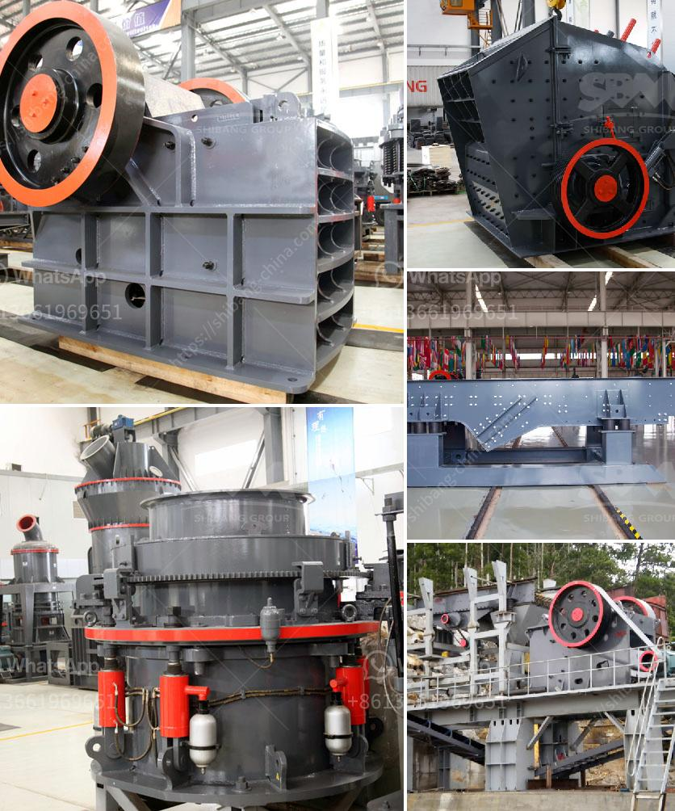

<h3>قائمة أسعار كسارة الحجر بسعة 300 طن في الساعة</h3>
تعتبر كسارات الحجر أدوات هامة في صناعة البناء والتشييد، حيث تستخدم لتكسير الصخور الكبيرة إلى قطع صغيرة ومناسبة للاستخدام في مشاريع البناء. تتوفر العديد من أنواع الكسارات على السوق، وكل نوع يختلف في سعة التكسير والأداء. واحدة من هذه الأنواع هي كسارة الحجر بسعة 300 طن في الساعة.

توفر كسارة الحجر بسعة 300 طن في الساعة عملية تكسير سريعة وفعالة للحجارة الكبيرة. تتميز هذه الكسارة بقدرتها على تحمل تدفق المواد على نطاق واسع، مما يسهم في زيادة إنتاجية العمل وتحسين كفاءة الأداء. بالإضافة إلى ذلك، فإن سعة التكسير الكبيرة تعني أنه يمكن تفريغ كميات كبيرة من الحجارة في فترة زمنية قصيرة مما يؤدي إلى زيادة الإنتاج وتقليل التكاليف العملية.

وتتوفر كسارة الحجر بسعة 300 طن في الساعة بأسعار تتراوح بين العلامات التجارية والموردين المختلفين. تتأثر أسعار الكسارة بعوامل عديدة بما في ذلك الجودة والعلامة التجارية والموصفات الفنية وسمعة الشركة المصنعة والخدمات المرافقة مثل خدمة ما بعد البيع والصيانة.

انتشار التكنولوجيا والمنافسة في سوق كسارات الحجر قد أدى إلى تنوع العروض وتنافس الأسعار. ونتيجة لذلك، يمكن للعملاء أن يتوقعوا مجموعة واسعة من الأسعار المتاحة لكسارة الحجر بسعة 300 طن في الساعة. تتراوح الأسعار عادةً بين عدة ملايين إلى عشرات الملايين من الدولارات حسب المواصفات والعلامة التجارية.

عند شراء كسارة الحجر بسعة 300 طن في الساعة، يجب على العملاء أن يأخذوا في الاعتبار عدة عوامل بالإضافة إلى السعر. من بين هذه العوامل، التأكد من جودة الكسارة ومدى توافر قطع الغيار والصيانة اللازمة. علاوة على ذلك، يجب أيضًا توجيه الاهتمام إلى سمعة الشركة المصنعة وقدرتها على تقديم خدمة ما بعد البيع الممتازة والدعم الفني.

في النهاية، يمكن القول إن استثمار كسارة الحجر بسعة 300 طن في الساعة هو قرار مهم يجب على الشركات والعملاء أن يأخذوا في الاعتبار عوامل متعددة قبل اتخاذه. يجب أن يكون السعر ملائمًا لميزات الكسارة ومواصفاتها، كما يجب أن تتوفر الخدمات اللازمة للحفاظ على أداء مستدام للكسارة.
<h3>Contact us</h3><ul><li><strong>Whatsapp:&nbsp;<a href="https://wa.me/8613661969651">+8613661969651</a></strong></li><li><a href="https://swt.shibang-china.com/?git&amp;zhl&amp;قائمة أسعار كسارة الحجر بسعة 300 طن في الساعة"><strong>Online Service(chat now)</strong></a></li></ul><h3>Related</h3><ul><li><a href='سحق متنقل في دبي.md'>سحق متنقل في دبي</a></li><li><a href='شركة تصنيع كسارة الفك الدورانية في الهند.md'>شركة تصنيع كسارة الفك الدورانية في الهند</a></li><li><a href='كسارة الحجر في ليما.md'>كسارة الحجر في ليما</a></li><li><a href='مطحنة الطحن.md'>مطحنة الطحن</a></li><li><a href='أسعار كسارة الحجر في إندونيسيا.md'>أسعار كسارة الحجر في إندونيسيا</a></li></ul>