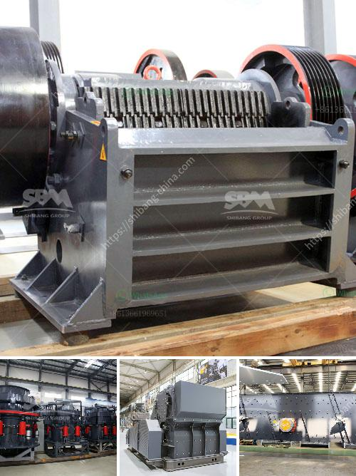

<h3>قائمة أسعار كسارة الفك</h3>
تعتبر كسارة الفك أحد أبرز المعدات المستخدمة في عمليات التكسير والتكسير الأولي في صناعة التعدين والبناء. تتميز هذه الكسارة بقدرتها على تحطيم المواد الخام إلى جسيمات صغيرة بفضل تحريك فكيها الثابت والمتحرك. إن إنتاجية الكسارات الفكية تعتمد على الحجم والقوة والقدرة التكسيرية للكسارة.

قائمة أسعار كسارة الفك تختلف اعتمادًا على عدة عوامل، بما في ذلك السعة التكسيرية والمواد المراد تكسيرها والمتطلبات الفنية الخاصة. بشكل عام، يتراوح سعر كسارة الفك من حوالي 5000 دولار إلى 500000 دولار، ويمكن أن يكون أعلى أو أقل بقليل حسب المواصفات والشروط المحددة بواسطة المشتري.

بالنسبة لكسارة الفك ذات الأسعار المنخفضة، يمكن العثور على الكثير منها بسعر 5000-20000 دولار. وعادة ما تأتي هذه الكسارات ذات الأسعار المنخفضة مع سعات تكسيرية صغيرة وأقل قدرة تكسيرية. تعتبر هذه الكسارات مناسبة للاستخدام في الأعمال الصغيرة والمشاريع البسيطة حيث لا تتطلب إنتاجية عالية.

أما بالنسبة للكسارات ذات الأسعار الأعلى من 20000 دولار، فهي تأتي بسعات تكسيرية أكبر وقوة تحطيم أعلى. تحتوي هذه الكسارات على مواد أعلى الجودة وتتميز بأداء ممتاز. يمكن استخدام هذه الكسارات في تكسير المعادن الصلبة والصخور الكبيرة وفصل المواد، وتستخدم عادة في الأعمال الكبيرة والمشاريع الكبرى في صناعة التعدين والبناء.

وبصفة عامة، يجب أخذ العديد من العوامل في الاعتبار عند شراء كسارة الفك. يجب التأكد من أن الكسارة ستلبي المتطلبات المحددة لكمية التكسير والمواد المراد تكسيرها. أيضًا، يجب التحقق من سعر الكسارة وضمان العملية السلسة والاعتمادية.

بالاستناد إلى الاعتبارات المذكورة أعلاه، يمكن للمشترين العثور على مجموعة متنوعة من كسارات الفك بأسعار مختلفة تتناسب مع احتياجاتهم ومتطلباتهم. إن البحث والمقارنة بين الشركات المصنعة ودراسة المواصفات الفنية وتقييم الأسعار سيساعد في اختيار الكسارة المثلى المناسبة للمشروع أو الاستخدام المطلوب.
<h3>Contact us</h3><ul><li><strong>Whatsapp:&nbsp;<a href="https://wa.me/8613661969651">+8613661969651</a></strong></li><li><a href="https://swt.shibang-china.com/?git&amp;zhl&amp;قائمة أسعار كسارة الفك"><strong>Online Service(chat now)</strong></a></li></ul><h3>Related</h3><ul><li><a href='كيفية إعداد شركة محجر حجر.md'>كيفية إعداد شركة محجر حجر</a></li><li><a href='مصنع لطحن الحجر الجيري والجبس للإسمنت.md'>مصنع لطحن الحجر الجيري والجبس للإسمنت</a></li><li><a href='محطة كسارة محمولة من الهند.md'>محطة كسارة محمولة من الهند</a></li><li><a href='مصنع كرة الاسمنت المواد والطاقة.md'>مصنع كرة الاسمنت المواد والطاقة</a></li><li><a href='مصنع تكسير الخرسانة في تركيا.md'>مصنع تكسير الخرسانة في تركيا</a></li></ul>