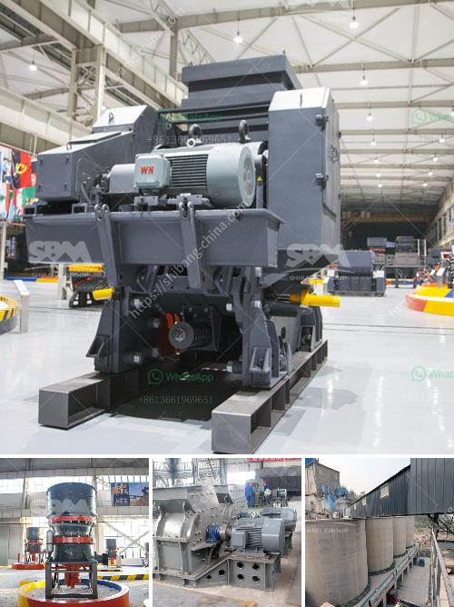

<h3>قائمة أسعار مصنع كسارة الحجر</h3>
مصنع كسارة الحجر هو مكان يتم فيه تصنيع أجزاء مختلفة من الحجر، وهو جزء أساسي في صناعة البناء والتشييد. يوجد العديد من المصانع التي تنتج كسارات الحجر حول العالم، وتقدم قائمة أسعار متنوعة تتناسب مع احتياجات العملاء.

أسعار مصانع كسارات الحجر تختلف بناءً على العديد من العوامل، مثل سعة الإنتاج، وحجم وصلابة الحجر المطلوب تكسيره، والتكنولوجيا المستخدمة في عملية الإنتاج. يمكن العثور على قوائم أسعار هذه المصانع على مواقع الإنترنت المختصة في صناعة البناء، أو يمكن الاتصال بالشركات المصنعة مباشرة للحصول على معلومات أكثر تفصيلاً.

عند النظر في قائمة الأسعار، من المهم أن يتم التركيز على الجودة والموثوقية بالإضافة إلى التكلفة. فالمصنع الذي يقدم جودة عالية وأجزاء متينة سيوفر للعملاء قيمة طويلة الأمد، حيث لن يحتاجوا إلى استبدال الأجزاء بشكل متكرر. لذلك، قد يكون من الأفضل أن تدفع القليل أكثر من أجل الحصول على كسارة حجرية ذات جودة عالية بدلاً من البحث عن العروض الرخيصة التي قد لا تكون عملية أو دائمة.

يجب أن يتضمن سعر الكسارة الحجرية العديد من العوامل، مثل التسليم والتركيب. بعد شراء الكسارة، يجب تسليمها إلى موقع البناء، وهذا يتطلب توفير وسائل النقل المناسبة والتعامل السليم لجعل عملية التركيب سهلة وفعالة. لذا، يجب أن يتأكد العميل من ضمان توفير هذه الخدمات قبل الشراء.

بالإضافة إلى ذلك، يجب التحقق من سياسة الضمان المقدمة من قبل المصنع. يجب أن يتضمن الضمان تغطية الأعطال أو الأضرار غير المقصودة التي يمكن أن تحدث خلال فترة زمنية محددة. هذا يعتبر مؤشرًا إلى الثقة التي يضعها المصنع في منتجاته.

في النهاية، يجب أن يتم اختيار قائمة أسعار مصنع كسارة الحجر بعناية، ومعرفة الاحتياجات الخاصة بك وتحديد المواصفات اللازمة قبل الشراء. الاستثمار في مصنع كسارة الحجر ذي جودة عالية قد يكون مقدمة لعملية بناء ناجحة وفعالة.
<h3>Contact us</h3><ul><li><strong>Whatsapp:&nbsp;<a href="https://wa.me/8613661969651">+8613661969651</a></strong></li><li><a href="https://swt.shibang-china.com/?git&amp;zhl&amp;قائمة أسعار مصنع كسارة الحجر"><strong>Online Service(chat now)</strong></a></li></ul><h3>Related</h3><ul><li><a href='كسارة أولية للدولوميت.md'>كسارة أولية للدولوميت</a></li><li><a href='حساب دورة في الدقيقة التشغيلية لمطحنة الكرة.md'>حساب دورة في الدقيقة التشغيلية لمطحنة الكرة</a></li><li><a href='آلة صنع المسحوق في جنوب أفريقيا.md'>آلة صنع المسحوق في جنوب أفريقيا</a></li><li><a href='آلة صنع الدولوميت.md'>آلة صنع الدولوميت</a></li><li><a href='كسارة الفك 100 طن في الساعة للبيع.md'>كسارة الفك 100 طن في الساعة للبيع</a></li></ul>