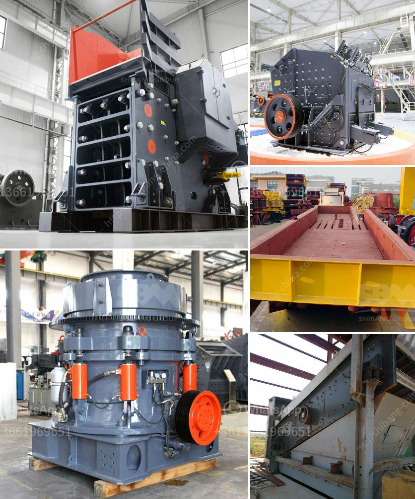

<h3>قائمة أسعار معدات كسارة الحجر الثقيلة</h3>
تعد كسارة الحجر الثقيلة من أهم المعدات المستخدمة في صناعة البناء والتشييد، حيث تستخدم في كسر الصخور والحجارة الكبيرة لتحويلها إلى قطع أصغر تستخدم في مختلف التطبيقات البنائية. وتعتبر المعدات التي تستخدم في هذا المجال من الأجهزة الثقيلة، وبذلك فإن أسعارها تكون عالية نسبياً.

تتنوع أسعار معدات كسارة الحجر الثقيلة بناءً على عدة عوامل. من أهم هذه العوامل حجم الكسارة وقدرتها على تحمل الصخور الكبيرة، ومدى تقنية الكسارة وقدرتها على العمل بكفاءة عالية، وقدرة الكسارة على تحقيق الإنتاجية المرغوبة.

تعتبر الكسارات الصغيرة ذات الأسعار الأقل من أكثر شيوعاً وتتراوح أسعارها ما بين 200-400 ألف دولار. يمكن للكسارات الصغيرة المحمولة أن تطحن وتكسر الحجارة والأحجار الكبيرة بكفاءة، وتستخدم عادة في البناء المؤقت مثل الطرق ومواقع البناء الصغيرة.

بالمقابل، تتسع المجالات المستخدمة للكسارات الثقيلة وأجهزة الكسارة الحجر الثقيلة التي تتعرض لأحجار أكبر وكتل أثقل، وتستخدم لتكسير أحجار الجبال والكتل الصخرية الكبيرة. تتنوع أسعار هذه المعدات بين 500-1000 ألف دولار وفقاً للقدرات المبخرة والتقنية المتخصصة فيها.

على العموم، يمكن القول أن أسعار معدات كسارة الحجر الثقيلة تتنوع وفقاً لاحتياجات المشروع المحدد وميزانية المستثمر. لا بد أن تتضمن الأسعار أيضاً تكاليف الصيانة المستقبلية للمعدات وتكاليف استبدال الأجزاء وصيانتها الدورية.

في النهاية، يجب على المستثمر والمهندسين الاهتمام بدراسة واختيار المعدات المناسبة لمشروعهم وتحديد احتياجاتهم وميزانيتهم المتاحة قبل شراء كسارة الحجر الثقيلة، كما ينبغي على الشركات المصنعة أن تقدم المعلومات اللازمة والتوجيه الفني للمستثمرين للمساعدة في اتخاذ القرارات الصحيحة وضمان الاستخدام الأمثل للمعدات.
<h3>Contact us</h3><ul><li><strong>Whatsapp:&nbsp;<a href="https://wa.me/8613661969651">+8613661969651</a></strong></li><li><a href="https://swt.shibang-china.com/?git&amp;zhl&amp;قائمة أسعار معدات كسارة الحجر الثقيلة"><strong>Online Service(chat now)</strong></a></li></ul><h3>Related</h3><ul><li><a href='مصنع إعادة تدوير الخرسانة للبيع.md'>مصنع إعادة تدوير الخرسانة للبيع</a></li><li><a href='معدات الطحن والفرز للرمل والحصى.md'>معدات الطحن والفرز للرمل والحصى</a></li><li><a href='كسارة الفك PE 150x250.md'>كسارة الفك PE 150x250</a></li><li><a href='معدات معالجة مسحوق الجرافيت.md'>معدات معالجة مسحوق الجرافيت</a></li><li><a href='سعر كسارة الرول.md'>سعر كسارة الرول</a></li></ul>