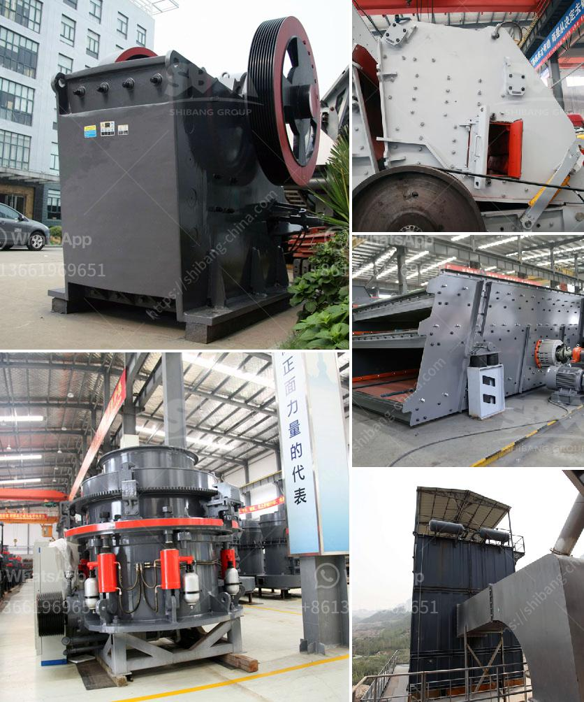

<h3>قائمة الآليات لمصانع تجهيز الرخام</h3>
تعتبر صناعة تجهيز الرخام من الصناعات الهامة والمتقدمة التي تلبي الطلب المتزايد على الرخام في مختلف أنحاء العالم. ولتحقيق جودة عالية وزيادة الإنتاجية، يعتمد مصانع تجهيز الرخام على العديد من الآليات المتخصصة.

أولاً، تشمل قائمة الآليات في مصانع تجهيز الرخام آلة القطع الهيدروليكية. هذه الآلة تقوم بقطع الرخام إلى قطع صغيرة ومناسبة للإنتاج. يتم التحكم في آلة القطع بواسطة نظام هيدروليكي يضمن القطع النظيف والدقيق دون أي تلف أو تشوه في الرخام.

ثانياً، تحتوي مصانع تجهيز الرخام على آلة تلميع الرخام. تستخدم هذه الآلة تقنيات تلميع متقدمة لإعطاء الرخام لمعانًا رائعًا وتنعيم السطح. يتم استخدام مواد تلميع خاصة مع هذه الآلة للوصول إلى نتائج مثالية.

ثالثاً، تتضمن قائمة الآليات أيضًا آلة الثقب الهوائية. يتم استخدام هذه الآلة لثقب الرخام وإعداده لعمليات التثبيت والتركيب. تعمل هذه الآلة بقوة الهواء المضغوط وتتميز بالكفاءة والسرعة في العمل.

رابعاً، توجد آلة القص الذهبية. تستخدم هذه الآلة لقص الرخام بأشكال مختلفة وتشكيلات معقدة ودقيقة. يتحكم المشغل في هذه الآلة بواسطة حاسوب لضمان القص الدقيق والمنتجات النهائية ذات الجودة العالية.

أخيراً، تشتمل قائمة الآليات اللازمة لمصانع تجهيز الرخام على آلة الرخام الأوتوماتيكية. هذه الآلة تعتمد على تقنيات الكمبيوتر والروبوتات لتجهيز وتشكيل الرخام بشكل تلقائي. تتحكم هذه الآلة في العديد من العمليات مثل القطع، التلميع، الثقب والقص، وتوفر إنتاجية عالية وجودة ممتازة.

باختصار، تحتوي قائمة الآليات اللازمة لمصانع تجهيز الرخام على العديد من الآلات المتخصصة، مثل آلة القطع الهيدروليكية، آلة تلميع الرخام، آلة الثقب الهوائية، آلة القص الذهبية، وآلة الرخام الأوتوماتيكية. تلك الآليات تساهم في زيادة الإنتاجية وتحسين جودة الرخام المنتج، وتلبي احتياجات السوق المتزايدة على الرخام المصقول والمشكل بشكل جميل وجاذبية عالية.
<h3>Contact us</h3><ul><li><strong>Whatsapp:&nbsp;<a href="https://wa.me/8613661969651">+8613661969651</a></strong></li><li><a href="https://swt.shibang-china.com/?git&amp;zhl&amp;قائمة الآليات لمصانع تجهيز الرخام"><strong>Online Service(chat now)</strong></a></li></ul><h3>Related</h3><ul><li><a href='كسارة صخور محمولة صغيرة للسحق.md'>كسارة صخور محمولة صغيرة للسحق</a></li><li><a href='شاشات وكسارات الركام.md'>شاشات وكسارات الركام</a></li><li><a href='التكلفة المتوسطة لمصنع تعدين الجرافيت.md'>التكلفة المتوسطة لمصنع تعدين الجرافيت</a></li><li><a href='المواصفات الفنية لمطحنة الكرة.md'>المواصفات الفنية لمطحنة الكرة</a></li><li><a href='كسارات تأثير ثانوية.md'>كسارات تأثير ثانوية</a></li></ul>