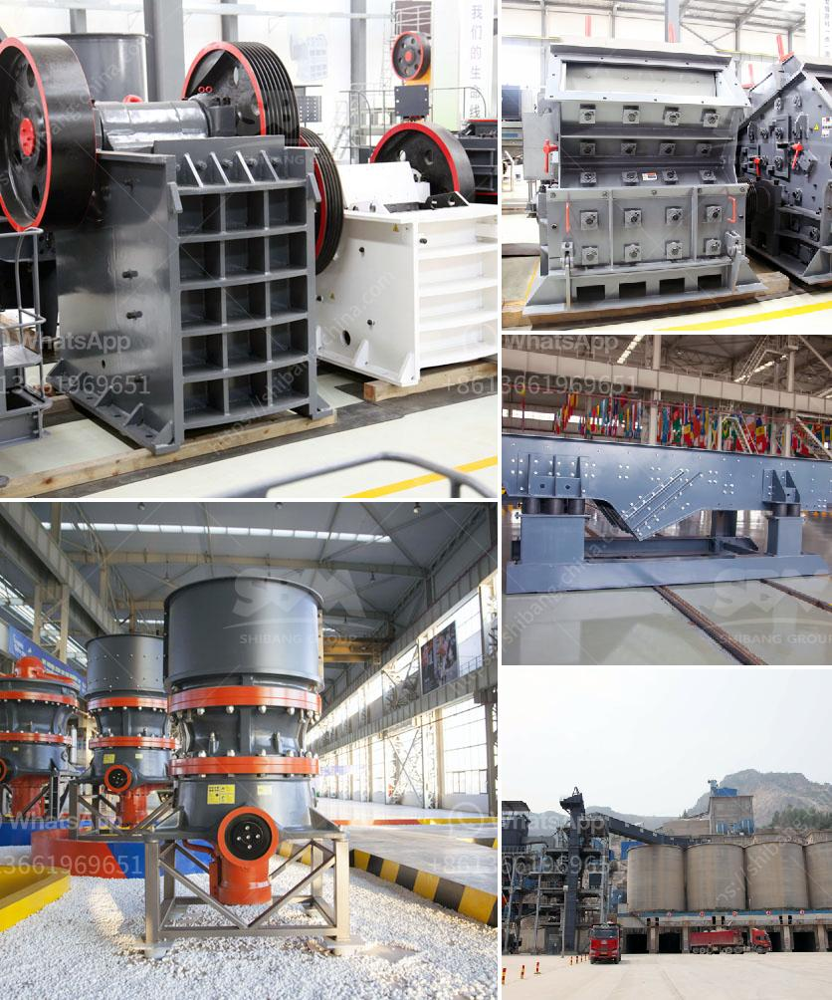

<h3>قائمة الأسعار في زيمبابوي لمطاحن الكرة</h3>
تعد زيمبابوي واحدة من البلدان الأفريقية التي تعاني من تضخم اقتصادي واضطرابات مالية خطيرة. وقد تأثر العديد من القطاعات في البلاد بما في ذلك صناعة الغذاء. واحدة من الصناعات المتأثرة هي صناعة المطاحن الكروية.

تعتبر مطاحن الكرة أحد أهم مصادر إنتاج الدقيق في زيمبابوي. قامت العديد من المطاحن بتجهيز القمح والذرة والشعير لإنتاج الدقيق المستخدم في صناعة الخبز والمعجنات والمنتجات الغذائية الأخرى. ولكن بسبب التضخم الهائل وتدهور الاقتصاد، فإن قائمة الأسعار في هذه المطاحن تتغير بشكل دوري وغير متناسب بشكل كبير مع قيمة العملة المحلية.

تتراوح أسعار الدقيق في زيمبابوي بين 200-400 دولار زيمبابوي للطن الواحد، وهذا المبلغ قد يبدو معقولًا، ولكن عند مقارنته بالأجور المنخفضة وارتفاع التضخم، فإنه يصبح مبلغًا باهظًا. بالإضافة إلى ذلك، يتم تطبيق ضرائب عالية ورسوم إضافية على القمح والحبوب المستوردة، مما يؤدي إلى ارتفاع أسعار المطاحن الكروية.

علاوة على ذلك، تواجه مطاحن الكرة في زيمبابوي صعوبات كبيرة في تأمين المواد الخام. ومن المعروف أنه في العديد من الحالات، يتعين على المطاحن الاعتماد على المنتجات المستوردة، ولكن بسبب نقص العملة الصعبة وارتفاع تكاليف الشحن والجمارك، يتعين على المطاحن دفع مبالغ إضافية باهظة لاستيراد المنتجات اللازمة للإنتاج.

تشير تقارير إلى أن العديد من مطاحن الكرة في زيمبابوي يجدون صعوبة في البقاء في الأعمال التجارية بسبب تكاليف الإنتاج المرتفعة، وتدني الطلب في السوق، والتضخم الهائل. وقد تم إغلاق بعض المطاحن وفقدان العديد من الوظائف في هذا القطاع.

لحل هذه المشكلة، تحتاج زيمبابوي إلى استقرار الاقتصاد وإجراءات اقتصادية فعالة. يجب على الحكومة العمل على تعزيز الاستثمارات الوطنية والأجنبية في قطاع الزراعة والصناعة الغذائية، بالإضافة إلى تحسين البنى التحتية وتوفير الدعم للمزارعين والمطاحن الكروية الصغيرة والمتوسطة.
<h3>Contact us</h3><ul><li><strong>Whatsapp:&nbsp;<a href="https://wa.me/8613661969651">+8613661969651</a></strong></li><li><a href="https://swt.shibang-china.com/?git&amp;zhl&amp;قائمة الأسعار في زيمبابوي لمطاحن الكرة"><strong>Online Service(chat now)</strong></a></li></ul><h3>Related</h3><ul><li><a href='كسارة للبيع في نيبال.md'>كسارة للبيع في نيبال</a></li><li><a href='كسارة مخروطية بوزولانا 100 طن في الساعة.md'>كسارة مخروطية بوزولانا 100 طن في الساعة</a></li><li><a href='كسارة الفلدسبار بتأثير.md'>كسارة الفلدسبار بتأثير</a></li><li><a href='آلة مطحنة الكرة في الصين.md'>آلة مطحنة الكرة في الصين</a></li><li><a href='دليل مطحنة الكرة الرطبة بتنسيق PDF.md'>دليل مطحنة الكرة الرطبة بتنسيق PDF</a></li></ul>