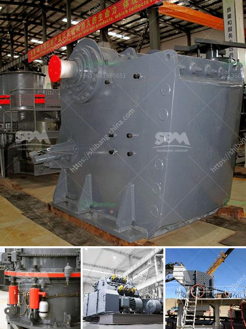

<h3>قائمة الشركات المحاجر في نيجيريا</h3>
يعتبر قطاع المحاجر من القطاعات الهامة في نيجيريا، حيث توجد العديد من الشركات المحاجر التي تعمل في هذا المجال بالبلاد. تجدر الإشارة إلى أن نيجيريا تحظى بموارد طبيعية غنية من الصخور والمعادن مثل الجرانيت والرخام والحجر الجيري والجبس والبناء والحجر الجيري والزئبق والفلسبار والصدفة والمطاط. ولتعزيز هذا القطاع ، تعمل الحكومة النيجيرية على سهولة إجراءات الترخيص وتقديم المزيد من الفرص للشركات المحلية والأجنبية للاستثمار في مشاريع المحاجر في البلاد.

تعتبر شركة Dangote Group من أبرز الشركات المحاجر في نيجيريا. تأسست الشركة في عام 1981 ومنذ ذلك الحين نمت لتكون واحدة من أكبر شركات التصنيع والتوزيع في القارة الأفريقية. تدير الشركة العديد من المحاجر في البلاد وتقوم بإنتاج الرخام والجرانيت والحجر الجيري.

تعمل شركة Royal Dutch Shell أيضًا في قطاع المحاجر في نيجيريا. تعتبر الشركة واحدة من أكبر شركات النفط والغاز في العالم ولديها فروع في جميع أنحاء العالم. تقوم الشركة بالعديد من مشاريع المحاجر في نيجيريا بمناطق مثل ريفرز وجور في ولاية ريفرز وإدو واسابا في ولاية أويو. تعمل الشركة على تطوير الصناعة المحلية من خلال توفير فرص عمل ودعم الاقتصاد المحلي.

بالإضافة إلى ذلك، تقوم شركة Lafarge Africa بعمليات التعدين والانتاج في قطاع المحاجر في نيجيريا. تأسست الشركة في عام 1959 وتعتبر الآن واحدة من أبرز شركات البناء والمواد المعدنية في البلاد. تدير الشركة عدة مواقع محاجر في نيجيريا بما في ذلك موقعين في إبيسا وغوا. تنتج الشركة العديد من المنتجات مثل الأسمنت والجبس والحجر الجيري وتعمل على تلبية احتياجات السوق المحلية والعالمية.

من الواضح أن قائمة الشركات المحاجر في نيجيريا طويلة وتتكون من الشركات الكبيرة والصغيرة. تعزز هذه الشركات الاقتصاد المحلي وتوفر فرص عمل للمواطنين. مع استدامة هذا القطاع ، يمكن لنيجيريا أن تستغل مواردها الطبيعية وتنمي اقتصادها وتحقق التنمية المستدامة في المستقبل.
<h3>Contact us</h3><ul><li><strong>Whatsapp:&nbsp;<a href="https://wa.me/8613661969651">+8613661969651</a></strong></li><li><a href="https://swt.shibang-china.com/?git&amp;zhl&amp;قائمة الشركات المحاجر في نيجيريا"><strong>Online Service(chat now)</strong></a></li></ul><h3>Related</h3><ul><li><a href='تكلفة مصنع سحق bmw 200tph stage.md'>تكلفة مصنع سحق bmw 200tph stage</a></li><li><a href='مصنعي آلات سحق النحاس في الصين.md'>مصنعي آلات سحق النحاس في الصين</a></li><li><a href='مورد كسارة الرخام.md'>مورد كسارة الرخام</a></li><li><a href='مصنعين محطم في جنوب أفريقيا.md'>مصنعين محطم في جنوب أفريقيا</a></li><li><a href='تقدير تكلفة مصنع تعدين النحاس.md'>تقدير تكلفة مصنع تعدين النحاس</a></li></ul>