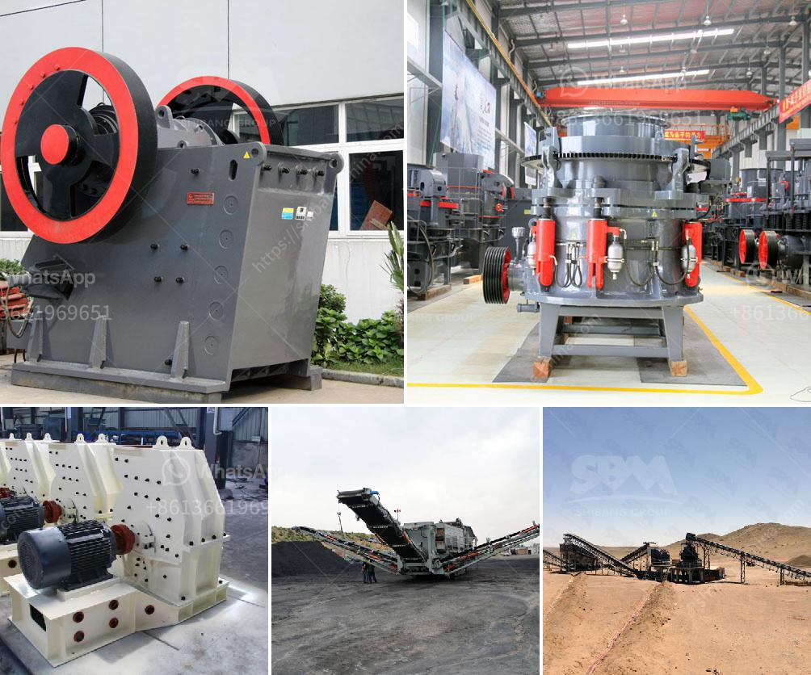

<h3>قائمة الشركات المستخرجة في الفلبين</h3>
تعتبر الفلبين واحدة من الدول الناشئة الهامة في جنوب شرق آسيا، حيث تمتلك اقتصادًا قويًا ومتنوعًا. هناك العديد من الشركات المستخرجة المشهورة في الفلبين التي تساهم في نمو الاقتصاد المحلي وتعزز التنمية الاقتصادية في البلاد.

واحدة من أبرز الشركات المستخرجة في الفلبين هي شركة "SM Investments Corporation". تأسست هذه الشركة في عام 1856 وهي واحدة من أكبر مجموعات الأعمال في الفلبين. تعمل الشركة في مجموعة متنوعة من القطاعات، بما في ذلك التجزئة والعقارات والتصنيع والتمويل. تحتل "SM Investments Corporation" موقعًا هامًا في قائمة أغنى الأشخاص في العالم، وتسهم بشكل كبير في الاقتصاد الفلبيني.

بالإضافة إلى ذلك، تعتبر شركة "San Miguel Corporation" واحدة من أكبر الشركات المستخرجة في الفلبين. تأسست في عام 1890 وتعمل في قطاع الأغذية والمشروبات والتعدين والنفط والغاز والسيارات والبناء. تعتبر "San Miguel Corporation" أيضًا واحدة من أكبر أصحاب المشاريع في البلاد وتسهم في توفير فرص العمل للعديد من الفلبينيين.

أيضًا، تلعب شركة "Ayala Corporation" دورًا هامًا في الاقتصاد الفلبيني. تأسست في عام 1834 وتختص في العقارات والبنوك والاتصالات والتجزئة والبناء والتصنيع. تعتبر "Ayala Corporation" شركة رائدة في مجال التنمية العقارية في الفلبين، وقدمت العديد من المشاريع الضخمة والحديثة في مجال العقارات.

وفي النهاية، يجب أن نذكر أيضًا "Globe Telecom" و "Manila Electric Company" و "JG Summit Holdings" و "PLDT" و "Aboitiz Equity Ventures" و "Megaworld Corporation" و "Energy Development Corporation" و "Semirara Mining and Power Corporation" التي تعتبر شركات مستخرجة رائدة في الفلبين.

من خلال هذه الشركات المستخرجة، يعزز الاقتصاد الفلبيني ويساهم في النمو المستدام للبلاد. كما أن وجود شركات مستخرجة قوية يعزز الثقة في الاستثمار ويجذب المزيد من الاستثمارات الأجنبية المباشرة إلى الفلبين.
<h3>Contact us</h3><ul><li><strong>Whatsapp:&nbsp;<a href="https://wa.me/8613661969651">+8613661969651</a></strong></li><li><a href="https://swt.shibang-china.com/?git&amp;zhl&amp;قائمة الشركات المستخرجة في الفلبين"><strong>Online Service(chat now)</strong></a></li></ul><h3>Related</h3><ul><li><a href='مورد آلة طحن الكرة في إندونيسيا.md'>مورد آلة طحن الكرة في إندونيسيا</a></li><li><a href='معدات صنع مسحوق كربونات الكالسيوم في ألمانيا.md'>معدات صنع مسحوق كربونات الكالسيوم في ألمانيا</a></li><li><a href='سعر كسارة المختبر المستخدمة.md'>سعر كسارة المختبر المستخدمة</a></li><li><a href='مطاحن الكرة المتواصلة أو الانقطاعية.md'>مطاحن الكرة المتواصلة أو الانقطاعية</a></li><li><a href='تقرير المشروع على كسارة الخرسانة pdf.md'>تقرير المشروع على كسارة الخرسانة pdf</a></li></ul>