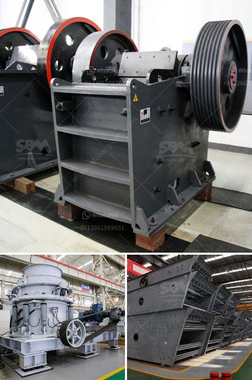

<h3>قائمة المعدات التي تستخدم في مناجم الجرانيت</h3>
مناجم الجرانيت هي مصادر ثمينة للصخور الطبيعية. يتم استخدام الجرانيت في العديد من التطبيقات مثل البناء والديكور الداخلي وصناعة الأثاث. ولكن لتعدين الجرانيت ، يتطلب الأمر استخدام مجموعة من المعدات الخاصة والمتقدمة.

أحد المعدات الرئيسية المستخدمة في تعدين الجرانيت هو حفارة الجرانيت. هذه الحفارات ذات الصلة تستخدم لحفر الثقوب والأنفاق في الجبال للوصول إلى الجرانيت. يتم تجهيز هذه الحفارات بأحدث التكنولوجيا لتسهيل عملية الحفر وتحسين الإنتاجية.

بعد استخراج من الجرانيت ، يتم استخدام الآليات المختلفة لنقلها إلى الموقع الذي ستتم فيه المعالجة. يتم استخدام الشاحنات الثقيلة وآليات الرافعات لنقل الجرانيت ، وذلك بفضل قوتها وتحملها العالي.

ثم يتم تحميل الجرانيت على المعدات الأخرى مثل العربات والقوارب لنقلها إلى المصانع للمعالجة النهائية. يستخدم الجرافات والرافعات المخصصة للسفن لتحميل الجرانيت بكفاءة وسرعة.

بمجرد أن تصل الجرانيت إلى المصنع ، يتم استخدام مجموعة متنوعة من المعدات لمعالجتها وتشكيلها. هذه المعدات تشمل المناشير الماسية وأجهزة الخراطة وآلات تنقيب الكواكب والألات المستخدمة في العمليات الأخرى مثل الطحن والتلميع.

بالإضافة إلى ذلك ، تستخدم معدات أخرى لضمان سلامة العمال وفعالية العملية. تتضمن هذه المعدات أقنعة الغاز والقفازات والسترات الواقية. يتم استخدام هذه المعدات لحماية العمال من المخاطر المحتملة في منجم الجرانيت.

في الختام ، قائمة المعدات التي تستخدم في مناجم الجرانيت تشمل حفارات الجرانيت والشاحنات الثقيلة وآليات النقل والمناشير الماسية وغيرها من المعدات الخاصة بمعالجة الجرانيت. بفضل هذه المعدات المتقدمة ، تتم عملية استخراج ومعالجة الجرانيت بكفاءة وفعالية.
<h3>Contact us</h3><ul><li><strong>Whatsapp:&nbsp;<a href="https://wa.me/8613661969651">+8613661969651</a></strong></li><li><a href="https://swt.shibang-china.com/?git&amp;zhl&amp;قائمة المعدات التي تستخدم في مناجم الجرانيت"><strong>Online Service(chat now)</strong></a></li></ul><h3>Related</h3><ul><li><a href='آلة صنع الحجر الخرساني في جنوب أفريقيا.md'>آلة صنع الحجر الخرساني في جنوب أفريقيا</a></li><li><a href='كسارة المحجر في الفلبين للبيع.md'>كسارة المحجر في الفلبين للبيع</a></li><li><a href='سعر آلة سحق الحجر في باكستان.md'>سعر آلة سحق الحجر في باكستان</a></li><li><a href='معدات كسارة المحجر المحمولة المستخدمة.md'>معدات كسارة المحجر المحمولة المستخدمة</a></li><li><a href='تكلفة كسارة الفك 24x36.md'>تكلفة كسارة الفك 24x36</a></li></ul>