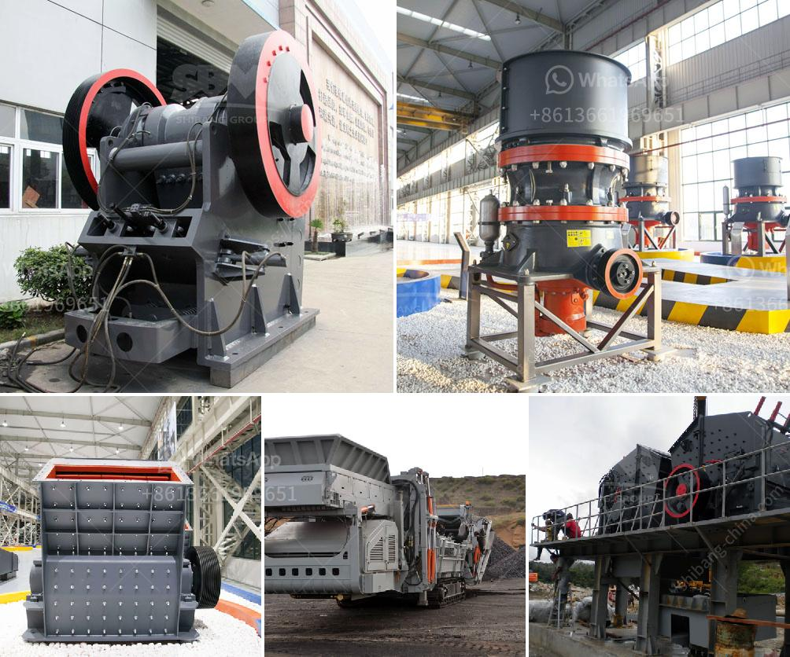

<h3>قائمة جهات الاتصال لشركات التعدين في ألمانيا</h3>
تعتبر ألمانيا واحدة من أبرز الدول التي لها صناعة تعدين قوية. يتواجد في البلاد العديد من الشركات التعدينية الكبيرة والصغيرة التي تعمل على استخراج وتصنيع المعادن والمواد الخام.

من بين الشركات التعدينية الرائدة في ألمانيا تذكر شركة RWE AG وهي واحدة من أكبر شركات التعدين والطاقة في أوروبا. تنشط الشركة في استخراج الفحم واليورانيوم والنحاس والفوسفات والمعادن الأخرى. يمكن الاتصال بشركة RWE AG عبر الهاتف على الرقم 0049519540.

كما تعتبر شركة K+S AG أيضًا من الشركات الرائدة في قطاع التعدين في ألمانيا. تركز K+S AG على استخراج الملح والأملاح المعدنية الأخرى. يمكن الوصول إلى شركة K+S AG عن طريق الهاتف على الرقم 0049561900.

بالإضافة إلى ذلك، تعمل شركة Aurubis AG في استخراج وتصنيع النحاس والمعادن الأخرى. تتميز Aurubis AG بتوفير منتجات ذات جودة عالية وتجارة عالمية. يمكن الاتصال بشركة Aurubis AG عبر الهاتف على الرقم 00494078830.

وبالإضافة إلى هذه الشركات الكبيرة، يوجد العديد من الشركات التعدينية الأخرى التي تعمل بنجاح في ألمانيا وتقدم خدمات استخراج وتصنيع المواد الخام. للحصول على قائمة كاملة لهذه الشركات، يمكن الاستعانة بمواقع البحث عبر الإنترنت أو الاتصال بغرفة التجارة في المدينة المحلية.

باختصار، يعد قطاع التعدين في ألمانيا من القطاعات الحيوية والرائدة في الاقتصاد الألماني. توفر الشركات التعدينية العديد من فرص العمل وتساهم في تنمية الاقتصاد المحلي والعالمي.
<h3>Contact us</h3><ul><li><strong>Whatsapp:&nbsp;<a href="https://wa.me/8613661969651">+8613661969651</a></strong></li><li><a href="https://swt.shibang-china.com/?git&amp;zhl&amp;قائمة جهات الاتصال لشركات التعدين في ألمانيا"><strong>Online Service(chat now)</strong></a></li></ul><h3>Related</h3><ul><li><a href='سعر مطحنة المطرقة للطين.md'>سعر مطحنة المطرقة للطين</a></li><li><a href='جول محطم الحجر.md'>جول محطم الحجر</a></li><li><a href='عملية تعدين الدولوميت.md'>عملية تعدين الدولوميت</a></li><li><a href='سعر كسارة الخرسانة في بنجلاديش.md'>سعر كسارة الخرسانة في بنجلاديش</a></li><li><a href='مطحنة طحن الذرة في جنوب أفريقيا.md'>مطحنة طحن الذرة في جنوب أفريقيا</a></li></ul>