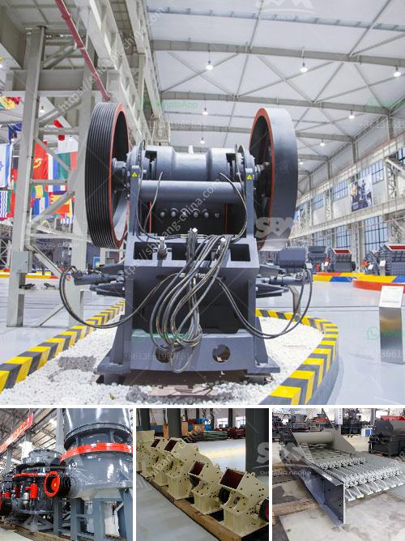

<h3>قائمة شركات التعدين على الحجر الجيري في الصين</h3>
تعتبر الصين واحدة من أكبر دول العالم المنتجة للحجر الجيري، حيث تمتلك العديد من شركات التعدين الكبيرة والمرموقة في هذا المجال. وتعد الحجر الجيري أحد الموارد الطبيعية القيمة التي تستخدم في العديد من الصناعات، مثل صناعة الأسمنت والحجر والزجاج والجير المستخدم في معالجة المياه وغيرها من الاستخدامات.

تتميز شركات التعدين على الحجر الجيري في الصين بتكنولوجيا متقدمة ومعدات حديثة، مما يساهم في زيادة كفاءة الإنتاج وجودة المنتجات. كما تسعى هذه الشركات إلى تبني أفضل الممارسات في مجال الاستدامة البيئية والمحافظة على الموارد الطبيعية.

من بين أبرز شركات التعدين على الحجر الجيري في الصين، تشتهر شركة "China National Building Materials (CNBM)" بكونها واحدة من أكبر الشركات المنتجة للحجر الجيري. تأسست الشركة في عام 1984، وتعمل في مختلف قطاعات البناء والتشييد. تستخدم CNBM تكنولوجيا حديثة وتضم فريقًا من الخبراء في مجال التعدين والإنتاج. تعمل الشركة على توفير المنتجات ذات الجودة العالية وتلبية احتياجات السوق المحلية والعالمية.

وبجانب CNBM، هناك شركة "China Resources Cement (CRC)" والتي تعد أيضًا واحدة من أكبر شركات التعدين على الحجر الجيري في الصين. تأسست الشركة في عام 2003، وتعمل على تصنيع الأسمنت والحجر الجيري ومنتجات البناء الأخرى. تتمتع CRC بقدرة إنتاجية كبيرة وشبكة توزيع واسعة، وتعمل على تعزيز الابتكار وتطوير التكنولوجيا لتلبية متطلبات السوق.

تظهر هذه الشركات وغيرها العديد من الشركات الأخرى في الصين تفوق واضح في مجال التعدين على الحجر الجيري. والجميع يسعى إلى تلبية الطلب المتزايد على الموارد الطبيعية وتحقيق النمو الاقتصادي بشكل مستدام وفعال. إن هذه الشركات الصينية تمثل مثالًا جيدًا للتزام الصناعة بضمان جودة المنتجات والحفاظ على المحيط واستدامته.
<h3>Contact us</h3><ul><li><strong>Whatsapp:&nbsp;<a href="https://wa.me/8613661969651">+8613661969651</a></strong></li><li><a href="https://swt.shibang-china.com/?git&amp;zhl&amp;قائمة شركات التعدين على الحجر الجيري في الصين"><strong>Online Service(chat now)</strong></a></li></ul><h3>Related</h3><ul><li><a href='مصنع مسحوق التلك.md'>مصنع مسحوق التلك</a></li><li><a href='مطحنة مسحوق الحجر الجيري.md'>مطحنة مسحوق الحجر الجيري</a></li><li><a href='شركات تصنيع آلات الطحن في تايلاند.md'>شركات تصنيع آلات الطحن في تايلاند</a></li><li><a href='آلات تكسير الحجر في المملكة المتحدة.md'>آلات تكسير الحجر في المملكة المتحدة</a></li><li><a href='تخطيط منشأة تعدين الماس.md'>تخطيط منشأة تعدين الماس</a></li></ul>