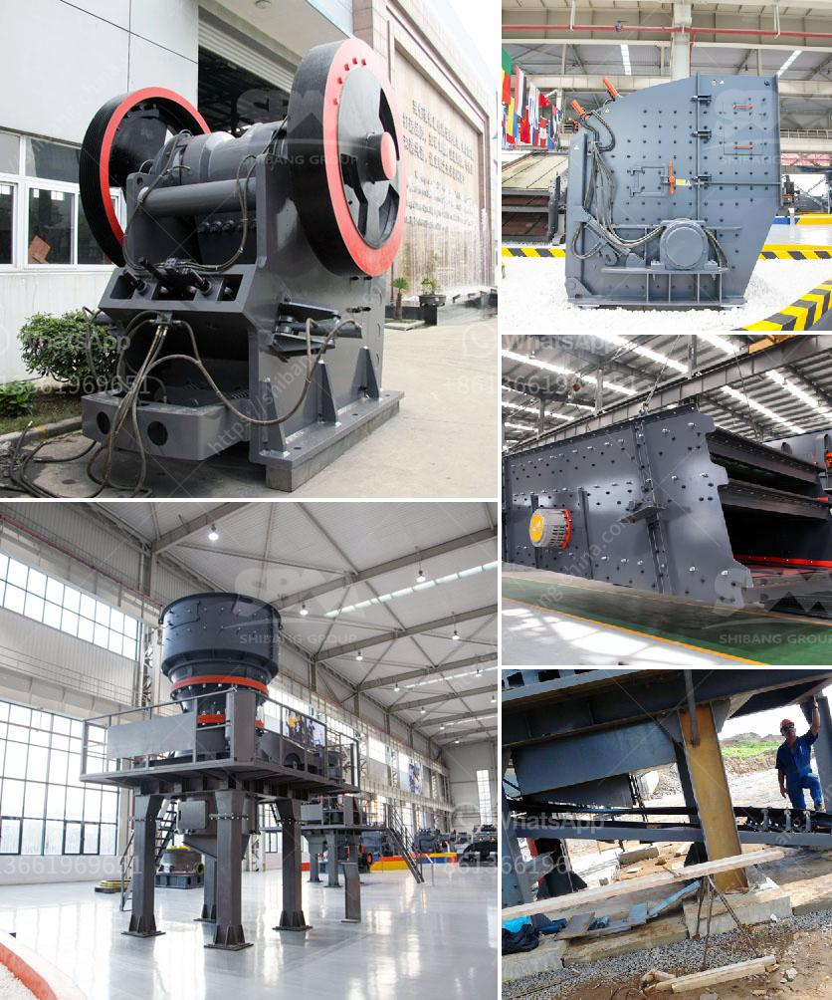

<h3>قائمة شركات تعدين رمل الزركون في كندا</h3>
تعد تعدين رمل الزركون أحد الصناعات الرئيسية في كندا. يتم استخراج الزركون من رمال الشواطئ والأنهار في عدة مناطق بكندا، وتعد نسبة الزركون القابل للاستخراج في هذه المواقع من بين أعلى النسب في العالم.

تضم قائمة شركات تعدين رمل الزركون في كندا عدة شركات رائدة. بداية، تعتبر شركة قولدنارك تكنولوجيز ونوتيلايت شركة رائدة في تعدين الزركون وتكريره. تتخصص الشركة في استخراج الزركون وتحويله إلى منتجات نهائية عالية الجودة للاستخدام في الفضاء والطاقة النووية والصناعات العسكرية.

ثم، تأتي شركة إندوستريال مينرال كوربوريشن، وهي شركة معروفة عالميًا في قطاع تعدين الرمال الثقيلة، وتقع أقاليم تعدينها في مناطق مختلفة من البلاد. تقوم الشركة بتصنيع المنتجات النهائية من الزركون، وتوريد الخامات للعديد من الشركات العالمية.

بالإضافة إلى ذلك، تعد شركة توباس كوورب من الشركات الرائدة في تعدين الزركون في كندا. تمتلك الشركة منجمًا يقع في منطقة نيوفاوندلاند ولابرادور، وتهتم بتطوير تقنيات استخراج الزركون الحديثة وتصنيع منتجات ذات قيمة مضافة.

وفي الختام، يجب أن نشير إلى شركة ريتشمونت دراجون ماينرالز وهي شركة رائدة في تعدين رمل الزركون في البلاد. تقوم الشركة بتنقية وتكرير الزركون من موقع التعدين، وتوفير المنتجات النهائية للعديد من الصناعات والشركات حول العالم.

باختصار، تعد قائمة شركات تعدين رمل الزركون في كندا متنوعة ومتخصصة في تنقية وتصنيع المنتجات النهائية للاستخدام في العديد من الصناعات المختلفة. يعكس التفوق العالمي لشركات تعدين رمل الزركون في كندا إمكانيات البلاد الهائلة في هذا القطاع، ويسهم في تعزيز الاقتصاد المحلي والعالمي.
<h3>Contact us</h3><ul><li><strong>Whatsapp:&nbsp;<a href="https://wa.me/8613661969651">+8613661969651</a></strong></li><li><a href="https://swt.shibang-china.com/?git&amp;zhl&amp;قائمة شركات تعدين رمل الزركون في كندا"><strong>Online Service(chat now)</strong></a></li></ul><h3>Related</h3><ul><li><a href='كسارات محمولة في محجر جنوب أفريقيا.md'>كسارات محمولة في محجر جنوب أفريقيا</a></li><li><a href='آلة تكسير الحصى.md'>آلة تكسير الحصى</a></li><li><a href='قائمة معدات تعدين الذهب.md'>قائمة معدات تعدين الذهب</a></li><li><a href='تقدير لعمليات تكسير الحجر.md'>تقدير لعمليات تكسير الحجر</a></li><li><a href='آلة طحن الرمل السيليكا.md'>آلة طحن الرمل السيليكا</a></li></ul>