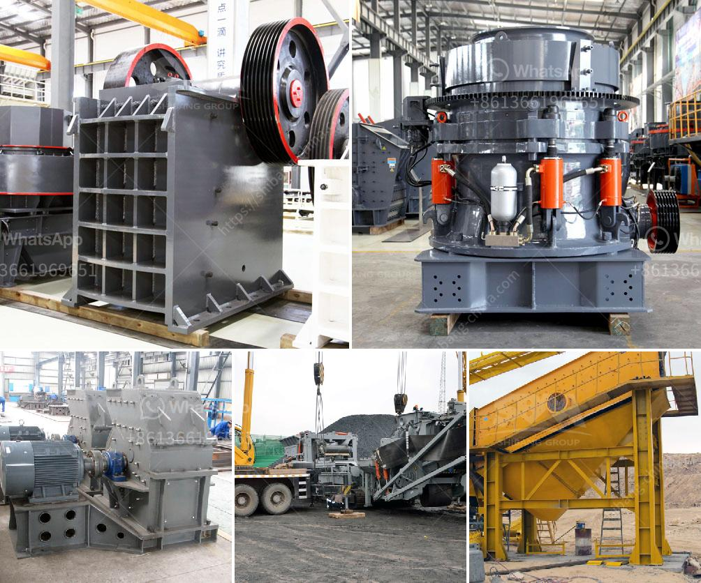

<h3>قائمة شركات كسارة المحاجر في نيجيريا</h3>
تعد صناعة المحاجر والكسارات من الصناعات الحيوية في نيجيريا حيث تلعب دورًا هامًا في توفير المواد الخام للاستخدام في البناء والبنية التحتية والصناعات الأخرى. وفيما يلي قائمة ببعض الشركات الرائدة في صناعة كسارة المحاجر في نيجيريا:

1. شركة Julius Berger Nigeria Plc: تأسست عام 1965 وتعتبر واحدة من أكبر الشركات المتخصصة في مجال البناء والهندسة المدنية في نيجيريا. تمتلك الشركة العديد من المحاجر والكسارات في مختلف أنحاء البلاد.

2. شركة Lafarge Africa Plc: تعتبر Lafarge Africa Plc من أكبر شركات البناء ومواد البناء في نيجيريا، وتملك الشركة أيضًا العديد من المحاجر والكسارات الموجودة في مناطق مختلفة من البلاد.

3. شركة Dangote Group: يعتبر Aliko Dangote، صاحب هذه الشركة، واحدًا من أغنى رجال الأعمال في أفريقيا. تعد Dangote Group أكبر شركة في نيجيريا وتمتلك العديد من المحاجر والكسارات وتعمل في مجالات عديدة بما في ذلك الإسمنت والسكر والبتروكيماويات والطاقة.

4. شركة Richbon Quarry Limited: شركة نيجيرية رائدة في مجال المحاجر والكسارات، توفر مجموعة واسعة من المواد الخام لصناعة البناء وتعمل على تقديم خدمات ذات جودة عالية لعملائها.

5. شركة Ashire Quarry: تعمل Ashire Quarry في مجال التعدين واستخراج المواد الخام من المحاجر. وهي شركة قائمة وموثوق بها في نيجيريا.

بالإضافة إلى هذه الشركات، هناك العديد من الشركات الأخرى التي تعمل في صناعة كسارة المحاجر في نيجيريا. تلعب هذه الشركات دورًا حاسمًا في تلبية الاحتياجات المتزايدة للمواد الخام في البناء والتطوير العمراني في البلاد.

إن وجود قائمة شركات كسارة المحاجر في نيجيريا يشير إلى النمو الاقتصادي والتطور المستدام في البلاد. بفضل هذه الشركات، تتاح فرص العمل للعديد من السكان المحليين وتساهم في تعزيز الاقتصاد المحلي وتنميته.
<h3>Contact us</h3><ul><li><strong>Whatsapp:&nbsp;<a href="https://wa.me/8613661969651">+8613661969651</a></strong></li><li><a href="https://swt.shibang-china.com/?git&amp;zhl&amp;قائمة شركات كسارة المحاجر في نيجيريا"><strong>Online Service(chat now)</strong></a></li></ul><h3>Related</h3><ul><li><a href='مطحنة أسطوانية عمودية للفحم.md'>مطحنة أسطوانية عمودية للفحم</a></li><li><a href='مطحنة أسطوانية ثنائية المرور.md'>مطحنة أسطوانية ثنائية المرور</a></li><li><a href='مطحنة فحم رولر.md'>مطحنة فحم رولر</a></li><li><a href='كم يكلف كسارة الحجر.md'>كم يكلف كسارة الحجر</a></li><li><a href='مطحنة الكرة لخام الذهب للبيع في زيمبابوي.md'>مطحنة الكرة لخام الذهب للبيع في زيمبابوي</a></li></ul>