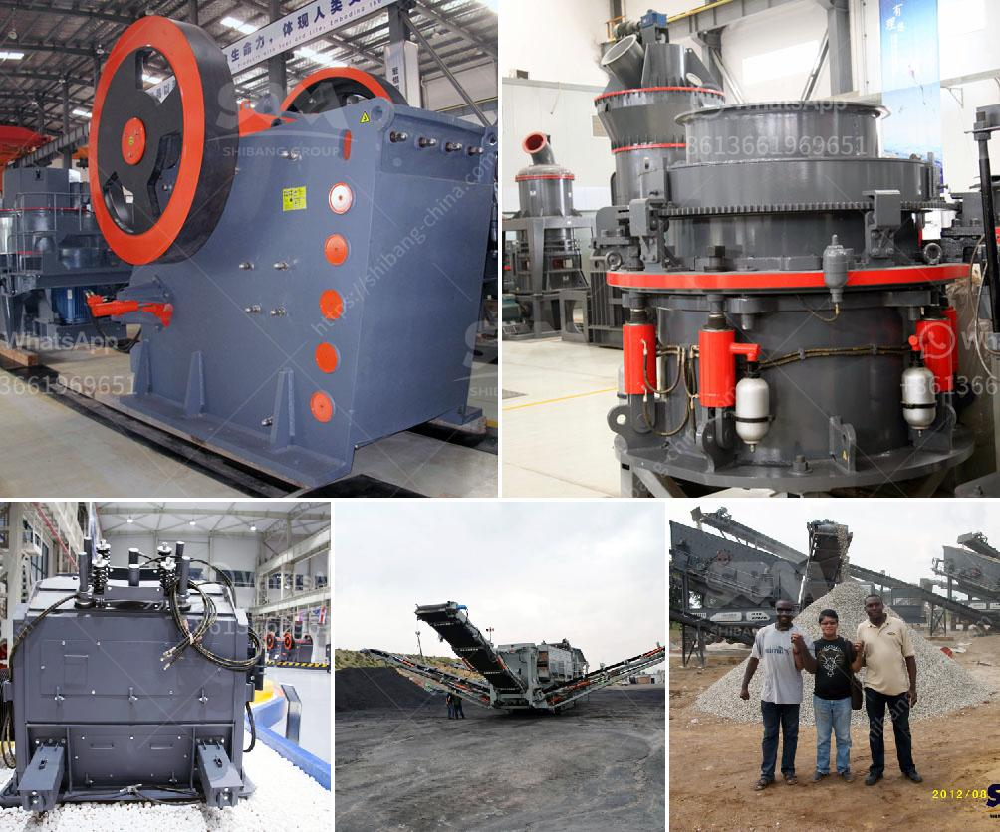

<h3>قائمة مصانع الأسمنت في نيبال</h3>
تعتبر صناعة الأسمنت من الصناعات الأساسية والحيوية في نيبال، حيث تساهم بشكل كبير في تحقيق التنمية الاقتصادية للبلاد. ولذلك، يوجد في نيبال العديد من مصانع الأسمنت التي توفر الكميات اللازمة من الأسمنت للسوق المحلية وأيضاً للتصدير إلى الأسواق العالمية.

تضم قائمة مصانع الأسمنت في نيبال العديد من الشركات الرائدة في هذا القطاع. وتشمل بعض هذه المصانع مصنع "جاي بي أسمنت" ومصنع "هوندا أسمنت" ومصنع "شوبات بي أسمنت" ومصنع "أرا تي آي بي أسمنت"، إلى جانب العديد من المصانع الأخرى.

من بين هذه المصانع، يتميز مصنع "جاي بي أسمنت" بأنه أكبر مصنع للأسمنت في نيبال، حيث ينتج حوالي 1650 طن من الأسمنت يومياً. هذا المصنع يستخدم أحدث التقنيات والمعدات لتصنيع الأسمنت بأعلى جودة وأمان.

مصنع "هوندا أسمنت" هو أيضاً مصنع مهم في نيبال، حيث يعتمد على طرق وتقنيات متطورة في عمليات تصنيع الأسمنت. يتميز هذا المصنع بتقديم منتجات ذات جودة عالية وكذلك خدمة ممتازة لعملائه.

من ناحية أخرى، يعد مصنع "شوبات بي أسمنت" واحداً من المصانع الرائدة في تصنيع الأسمنت في نيبال. يتمتع هذا المصنع بمنشآت حديثة وقدرات إنتاجية عالية، ويعمل بكفاءة عالية لتقديم الأسمنت بأعلى جودة للعملاء.

أما بالنسبة لمصنع "أرا تي آي بي أسمنت"، فيعتبر واحداً من أحدث المصانع في نيبال وقد بدأ العمل فيه مؤخراً. ويتميز هذا المصنع بتقديم تكنولوجيا متطورة ومجموعة واسعة من المنتجات والخدمات لتلبية احتياجات العملاء.

قائمة مصانع الأسمنت في نيبال تشير إلى التزام البلاد بتطوير قطاع البناء وتوفير المنتجات عالية الجودة. كما يعد هذا القطاع فرصة مهمة لجذب الاستثمارات وتوفير فرص العمل للسكان المحليين، وبالتالي تعزيز الاقتصاد الوطني وتحسين مستوى المعيشة.

باختصار، يتربع قائمة مصانع الأسمنت في نيبال على قمة أهم القطاعات الصناعية في البلاد. وتعتبر هذه المصانع مصدراً هاماً للأسمنت المحلي والتصدير، وتساهم في التنمية الاقتصادية والاجتماعية للبلاد.
<h3>Contact us</h3><ul><li><strong>Whatsapp:&nbsp;<a href="https://wa.me/8613661969651">+8613661969651</a></strong></li><li><a href="https://swt.shibang-china.com/?git&amp;zhl&amp;قائمة مصانع الأسمنت في نيبال"><strong>Online Service(chat now)</strong></a></li></ul><h3>Related</h3><ul><li><a href='آلات سحق الكرةست.md'>آلات سحق الكرةست</a></li><li><a href='آلة طحن الطين الصيني.md'>آلة طحن الطين الصيني</a></li><li><a href='مطاحن الكرة الفلسبار.md'>مطاحن الكرة الفلسبار</a></li><li><a href='آلة فرز للبيع في جنوب أفريقيا.md'>آلة فرز للبيع في جنوب أفريقيا</a></li><li><a href='عملية الحجر الجيري.md'>عملية الحجر الجيري</a></li></ul>