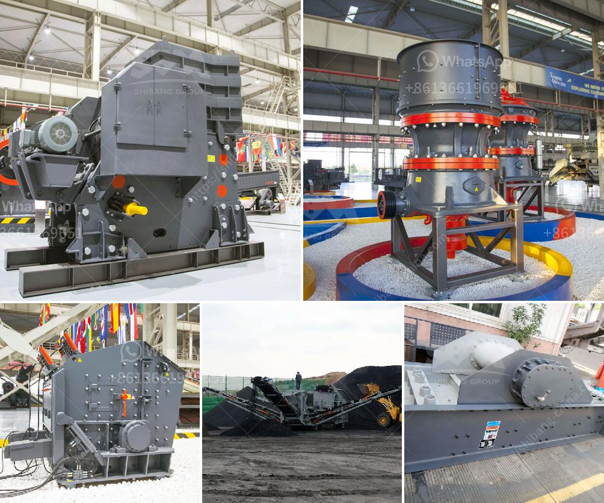

<h3>قائمة مصانع حبيبات خام الحديد في الهند</h3>
تعتبر الهند واحدة من أكبر منتجي خام الحديد في العالم، حيث تمتلك البلاد العديد من المصانع التي تنتج حبيبات خام الحديد بكميات كبيرة. فيما يلي سأذكر بعض المصانع الرئيسية لتصنيع حبيبات خام الحديد في الهند.

تأسست هذه المصنعة في عام 1966 وتعتبر اليوم أكبر شركة لإنتاج الزنك والحديد في الهند. تمتلك HZL عدة منشآت في ولاية راجستان، بما في ذلك منجم رامبور ومصنع ديبلورزو ومصنع فيشاخاباتينام، حيث يتم إنتاج حبيبات خام الحديد بتقنية عالية الجودة.

تعتبر JSW Steel واحدة من أكبر الشركات في الهند لإنتاج الفولاذ، وهي تمتلك أيضاً مصنعاً لإنتاج حبيبات الحديد في ولاية كارناتاكا. يتميز مصنع JSW Steel بتكنولوجيا متقدمة لتصنيع الحبيبات ويعتبر من أكثر المصانع فعالية من حيث استخدام الموارد وتكاليف الإنتاج.

تعتبر NMDC واحدة من أكبر المنتجين لحبيبات خام الحديد في الهند. تمتلك الشركة عدة مناجم في الهند، بما في ذلك منجم بايلاديلا في ولاية تشهاتيسجاره ومنجم كيراندول في ولاية كارناتاكا. تعتمد NMDC على تكنولوجيا حديثة لإنتاج حبيبات الحديد وتسعى لتحقيق الاستدامة في جميع عملياتها.

تعتبر Vedanta أكبر شركة لإنتاج الزنك في الهند، ولديها أيضاً مناجم لإنتاج حبيبات خام الحديد. تمتلك الشركة مصفاة حديد في ولاية جارخاند ومصنع فيداغاره في ولاية خارتاغاس.

يجب أن نأخذ في اعتبارنا أن هذه القائمة تشمل بعض المصانع الرئيسية في الهند فقط، حيث توجد العديد من المصانع الأخرى المنتشرة في البلاد. تلعب هذه المصانع دورًا حاسمًا في تلبية الطلب المحلي والعالمي على حبيبات خام الحديد، وتساهم بشكل كبير في تحقيق النمو الاقتصادي للهند وتوفير فرص العمل للعديد من المواطنين.

في النهاية، فإن الهند تعتبر واحدة من الدول الرائدة في إنتاج حبيبات خام الحديد، وتمتلك البلاد العديد من المصانع الرئيسية التي تعمل باستخدام تكنولوجيا حديثة وتلتزم بالاستدامة البيئية. تعزز هذه المصانع الاقتصاد الهندي وتسهم في تحقيق التنمية الشاملة في البلاد.
<h3>Contact us</h3><ul><li><strong>Whatsapp:&nbsp;<a href="https://wa.me/8613661969651">+8613661969651</a></strong></li><li><a href="https://swt.shibang-china.com/?git&amp;zhl&amp;قائمة مصانع حبيبات خام الحديد في الهند"><strong>Online Service(chat now)</strong></a></li></ul><h3>Related</h3><ul><li><a href='علامات الناقل والكسارات في إندونيسيا.md'>علامات الناقل والكسارات في إندونيسيا</a></li><li><a href='أسعار مصنع كسارة الحجر.md'>أسعار مصنع كسارة الحجر</a></li><li><a href='كسارة الإسمنت في تركيا.md'>كسارة الإسمنت في تركيا</a></li><li><a href='خطة عمل لإنتاج الطوب.md'>خطة عمل لإنتاج الطوب</a></li><li><a href='كسارات الجرانيت والطاحونات.md'>كسارات الجرانيت والطاحونات</a></li></ul>