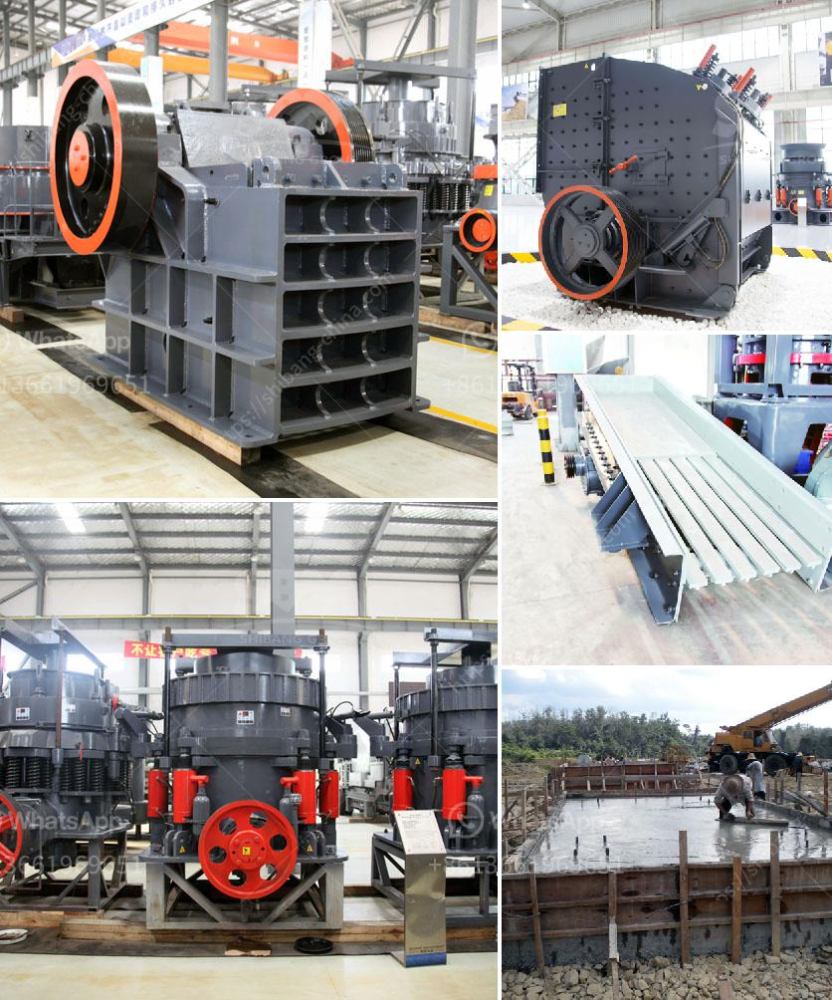

<h3>قائمة مصنع الكسارة</h3>
يتوجب على المصانع الكسارة أن توفر قائمة دقيقة تحتوي على العديد من العوامل والاعتبارات الهامة للعمل السلس والفعال. تعتبر القائمة من العناصر الضرورية التي يجب أن يتبعها المشرفون والعاملون في المصنع من أجل الحفاظ على جودة الإنتاج والسلامة والامتثال للقوانين واللوائح المحلية والدولية. سنقوم في هذه المقالة بسرد بعض العناصر التي يجب أن تتضمنها قائمة مصنع الكسارة.

أولاً وقبل كل شيء، يجب أن تتضمن القائمة تفاصيلاً حول مسؤوليات وواجبات كل من المشرفين والعمال في المصنع. يجب توضيح المهام المطلوبة من كل موظف والمعايير التي يجب أن يلتزم بها في أداء واجباته اليومية.

ثانياً، يجب أن يتم تضمين قائمة بالمعدات المستخدمة في المصنع. يجب توضيح أنواع المعدات وروابط التواصل للمشتريات والصيانة والدعم الفني. كما ينبغي تحديد شهادات الصلاحية المطلوبة للعمال الذين سيتعاملون مع تلك المعدات.

ثالثاً، يجب أن تتضمن القائمة سياسات السلامة المطبقة في المصنع. يجب توضيح الإجراءات الواجب اتباعها لضمان سلامة العمال وزوار المصنع وحماية البيئة. يجب تحديد المعدات الواجب استخدامها للأغراض الوقائية مثل الأقنعة والزي الواقي والخوذ الواجب ارتداؤها.

رابعاً، يجب أن يتم تضمين قائمة بالمواد الكيميائية المستخدمة في المصنع وطرق التخزين الآمنة لها وطرق التخلص منها بطرق سليمة وبيئية. يجب تحديد الإجراءات الواجب اتباعها للتعامل مع تلك المواد الكيميائية والأدوات المستخدمة في عملية التنظيف والصيانة.

خامساً، ينبغي أن تتضمن القائمة سياسات حماية البيانات والخصوصية. يجب توضيح الإجراءات التي تم تنفيذها للمحافظة على سرية المعلومات والوثائق الحساسة والتعامل الآمن معها.

أخيراً، يجب أن يتم تضمين قائمة يومية بالأعمال التي يجب القيام بها وجدولة الصيانة الدورية للمعدات والآلات المستخدمة. يجب تحديد جدول زمني للفحص والاختبارات لضمان الأداء الأمثل وتجنب التوقف غير المبرر.

باختصار، يجب أن تضم قائمة مصنع الكسارة عددًا من العناصر الهامة لضمان العمل السلس والفعال. يجب أن تشمل المهام والمعدات المطلوبة وسياسات السلامة والصحة المهنية وحماية البيانات وجدولة الصيانة الدورية. يعتبر توفير هذه القائمة أمرًا حاسمًا لنجاح مصانع الكسارة وتحقيق الأهداف المطلوبة.
<h3>Contact us</h3><ul><li><strong>Whatsapp:&nbsp;<a href="https://wa.me/8613661969651">+8613661969651</a></strong></li><li><a href="https://swt.shibang-china.com/?git&amp;zhl&amp;قائمة مصنع الكسارة"><strong>Online Service(chat now)</strong></a></li></ul><h3>Related</h3><ul><li><a href='سعر مطحنة ريموند الفائقة الدقة.md'>سعر مطحنة ريموند الفائقة الدقة</a></li><li><a href='مصنع استخراج النحاس الصغير.md'>مصنع استخراج النحاس الصغير</a></li><li><a href='كيف يعمل مطحنة الهامر.md'>كيف يعمل مطحنة الهامر</a></li><li><a href='كسارة الجرانيت المحمولة.md'>كسارة الجرانيت المحمولة</a></li><li><a href='عرض مصنع معالجة الجير.md'>عرض مصنع معالجة الجير</a></li></ul>