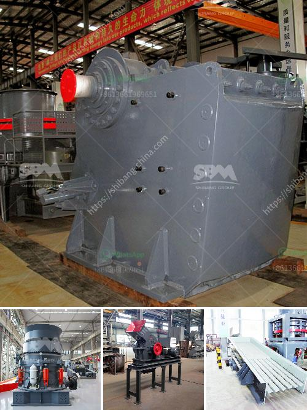

<h3>قائمة مصنع كسارة الحجر في بنجلاديش</h3>
تقع بنجلاديش في قلب جنوب آسيا وتعتبر واحدة من الدول النامية الأسرع نمواً في العالم. تحتاج بنجلاديش إلى العديد من الموارد والمواد الأساسية لتلبية احتياجاتها الاقتصادية والعمرانية المتنامية، ومن بين هذه الموارد تقع الكسارة الحجرية.

تمتلك بنجلاديش قائمة مصانع كسارة الحجر التي تزود البلاد بالمواد الأساسية للبنية التحتية والمشاريع العمرانية. يتم استخدام الحجارة التي تنتجها هذه المصانع في البناء والديكور والتشييد، وتعد هذه الكسارات حجر الأساس للتنمية الاقتصادية في بنجلاديش.

تعتبر كسارة الحجر في بنجلاديش صناعة مهمة ومزدهرة، حيث تعتبر الحجرة المستخرجة منها ذات جودة عالية ومطلوبة في السوق المحلية والخارجية. وتعتبر بنجلاديش واحدة من رواد صناعة الحجر في المنطقة، حيث تستورد منتجاتها إلى العديد من الدول الأخرى.

تتميز مصانع كسارة الحجر في بنجلاديش بالتكنولوجيا المتقدمة والمواد الخام عالية الجودة. كما تلتزم هذه المصانع بالمعايير البيئية والاستدامة للحفاظ على البيئة المحيطة. بالإضافة إلى ذلك، فإن هذه المصانع توفر العديد من فرص العمل للسكان المحليين وتساهم في تحسين مستوى المعيشة والتنمية الاجتماعية في المنطقة.

من الجدير بالذكر أن بنجلاديش تعاني من مشكلة نقص الحجارة الطبيعية، ولذلك تعتبر صناعة الحجر من الأنشطة الاقتصادية الرئيسية في البلاد. تعزز المصانع الحجرية المحلية توفر الموارد الأساسية وتخفض الاعتماد على الاستيراد.

وفي الختام، تعتبر مصانع كسارة الحجر في بنجلاديش عنصرًا حاسمًا في تحقيق التنمية الاقتصادية والاجتماعية للبلاد. تحتاج بنجلاديش إلى استثمارات مستدامة في هذه الصناعة لتعزيز إنتاجها وتوفير المزيد من فرص العمل وتلبية احتياجات البنية التحتية المتنامية. كما يجب أن تستغل بنجلاديش هذه الفرصة لتصدير المنتجات المحلية إلى الأسواق الخارجية وزيادة مشاركتها في التجارة العالمية.
<h3>Contact us</h3><ul><li><strong>Whatsapp:&nbsp;<a href="https://wa.me/8613661969651">+8613661969651</a></strong></li><li><a href="https://swt.shibang-china.com/?git&amp;zhl&amp;قائمة مصنع كسارة الحجر في بنجلاديش"><strong>Online Service(chat now)</strong></a></li></ul><h3>Related</h3><ul><li><a href='آلة غسيل الفحم طن.md'>آلة غسيل الفحم طن</a></li><li><a href='كسارة محمولة في المملكة العربية السعودية.md'>كسارة محمولة في المملكة العربية السعودية</a></li><li><a href='كسارة الحجر في الفلبين للبيع.md'>كسارة الحجر في الفلبين للبيع</a></li><li><a href='مصنع غسل الرمل المستعمل للبيع.md'>مصنع غسل الرمل المستعمل للبيع</a></li><li><a href='مطحنة مسحوق عالي الضغط في الهند.md'>مطحنة مسحوق عالي الضغط في الهند</a></li></ul>