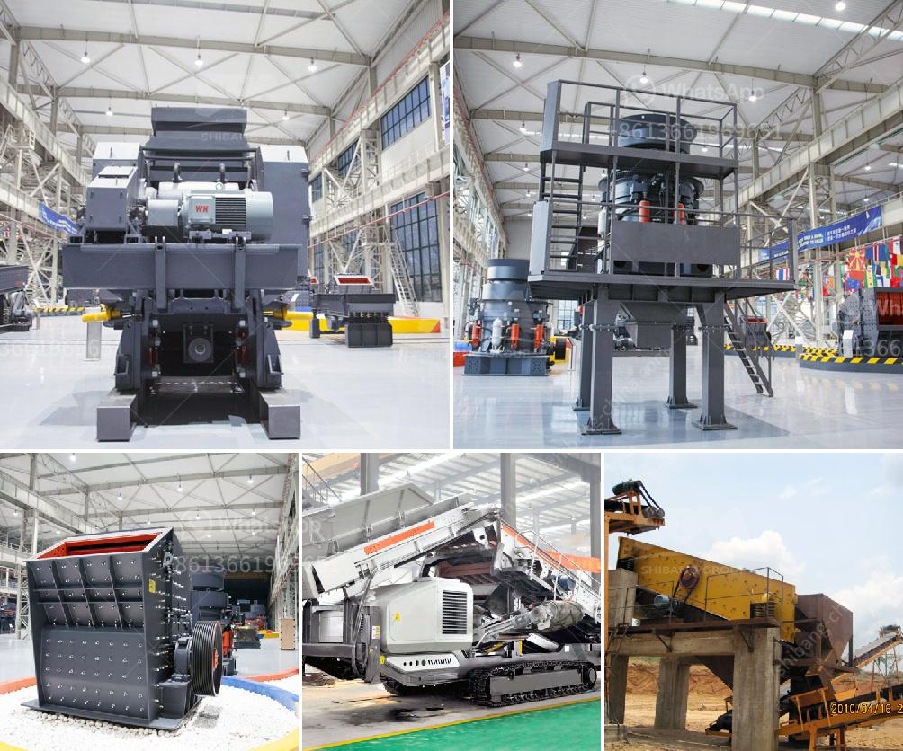

<h3>قائمة مصنعي آلات سحق اليابان</h3>
تعد اليابان واحدة من الدول الرائدة في صناعة الآلات الثقيلة، ومن بين هذه الآلات تأتي آلات سحق المواد. هناك العديد من الشركات المصنعة في اليابان التي تتخصص في تصنيع آلات سحق ذات جودة عالية وأداء ممتاز.

إحدى الشركات المصنعة الرائدة في هذا المجال هي شركة Kawasaki Heavy Industries Ltd. تأسست عام 1896، وتعد اليوم واحدة من أكبر الشركات اليابانية المصنعة للمعدات الثقيلة. تقوم شركة Kawasaki بتصنيع آلات سحق متنوعة تشمل الكسارات الفكية، الكسارات الصدمية، الكسارات المخروطية، وغيرها. تتمتع منتجاتها بتصميم مبتكر، وتكنولوجيا حديثة، وأداء ممتاز.

شركة Mitsubishi Heavy Industries Ltd. هي أيضاً شركة رائدة في مجال تصنيع آلات سحق اليابان. تأسست عام 1884، وتعتبر من أكبر شركات الهندسة الثقيلة في اليابان. تقدم Mitsubishi مجموعة واسعة من آلات السحق مثل الكسارات الصغيرة والمتوسطة الحجم، والكسارات المتنقلة، والكسارات المخروطية. تتميز منتجاتها بالجودة العالية والأداء الموثوق به.

شركة Komatsu Ltd. هي أيضاً من أبرز المصنعين لآلات سحق اليابان. تأسست عام 1921 وتقدم مجموعة واسعة من الكسارات والمطارق الهيدروليكية والغرابيل. تتميز منتجاتها بالتصميم المبتكر والأداء القوي.

علاوة على ذلك، يوجد عدد كبير من الشركات الصغيرة والمتوسطة التي تصنع آلات سحق عالية الجودة في اليابان. يتميز مصنعو الآلات اليابانيون بدمج التكنولوجيا المتقدمة والابتكار لتحسين أداء المعدات وتلبية احتياجات العملاء.

باختصار، تعد اليابان واحدة من الدول الرائدة في تصنيع آلات سحق عالية الجودة. تمتاز المصنعون اليابانيون بالتكنولوجيا المتقدمة والابتكار في تصميم وتصنيع المعدات، مما يساهم في تحقيق الأداء الممتاز ورضا العملاء.
<h3>Contact us</h3><ul><li><strong>Whatsapp:&nbsp;<a href="https://wa.me/8613661969651">+8613661969651</a></strong></li><li><a href="https://swt.shibang-china.com/?git&amp;zhl&amp;قائمة مصنعي آلات سحق اليابان"><strong>Online Service(chat now)</strong></a></li></ul><h3>Related</h3><ul><li><a href='كيفية صنع مسحوق التلك الصناعي.md'>كيفية صنع مسحوق التلك الصناعي</a></li><li><a href='كسارة صخرية صناعية.md'>كسارة صخرية صناعية</a></li><li><a href='نوع من مطحنة الكرة.md'>نوع من مطحنة الكرة</a></li><li><a href='سعر كسارة الحجر المحمولة في الفلبين.md'>سعر كسارة الحجر المحمولة في الفلبين</a></li><li><a href='كسارات الحجر في بوكارامانجا.md'>كسارات الحجر في بوكارامانجا</a></li></ul>