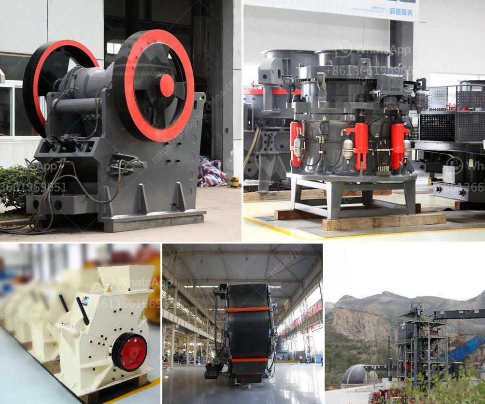

<h3>قائمة معدات تعدين الذهب</h3>
تعدين الذهب هو عملية استخراج الذهب من مناجم الأرض. تعد قائمة المعدات اللازمة لعملية تعدين الذهب طويلة ومتنوعة، حيث تتطلب استخدام العديد من الأدوات والمعدات المتخصصة. فيما يلي بعض المعدات الرئيسية التي يتم استخدامها في تعدين الذهب:

1- الحفارات والجرافات: تستخدم لحفر ونقل الصخور والتربة من منطقة التعدين، وتستخدم عادة لإنشاء الطرق والمنصات التي يتم تركيب المعدات عليها.

2- المحطات الكسارة: يستخدم هذا الجهاز لكسر الصخور والتربة وتحويلها إلى قطع صغيرة قبل عملية فصل الذهب عنها.

3- الشاشات الاهتزازية: تستخدم لفصل التربة المخروطة عن الذهب، حيث تضعف الأتربة عن طريق اهتزازها وتنقيةها.

4- آلات الغسيل: تستخدم لفصل الذهب عن الأوساخ والطمي في المياه. تعمل هذه الآلات عن طريق استخدام التدرج في الوزن النوعي للمواد المختلفة.

5- آلات الطحن: تستخدم لطحن الصخور الكبيرة إلى جسيمات صغيرة قابلة لتجهيزها.

6- الأفران والمجففات: تستخدم لتجفيف وتسخين المواد المعدنية من أجل تعزيز تجهيزها وفصلها عن الرواسب الأخرى.

7- آلات التركيز الجاذبية: تستخدم لفصل الذهب من الرواسب الصخرية الأخرى عن طريق استخدام قوة الجاذبية.

8- الآلات الكهربائية والمولدات: تستخدم لتوفير الطاقة اللازمة لتشغيل المعدات والأدوات الأخرى.

9- الصهارة والانصهار: تستخدم لتحويل الذهب إلى سائل قابل للتشكيل لإنتاج المجوهرات والمنتجات الأخرى.

هذه المعدات لها أدوار مهمة في عملية تعدين الذهب وتساهم في تسريع وتسهيل عملية استخراج الذهب من مناجم الأرض. كل معدة لها وظيفتها الخاصة ولها تأثير مباشر على كفاءة وجودة عملية التعدين وفصل الذهب عن المواد الأخرى. مع استخدام هذه المعدات الحديثة والتكنولوجيا المتقدمة، أصبح من الممكن استخراج الذهب بشكل أكثر كفاءة وأمنا.
<h3>Contact us</h3><ul><li><strong>Whatsapp:&nbsp;<a href="https://wa.me/8613661969651">+8613661969651</a></strong></li><li><a href="https://swt.shibang-china.com/?git&amp;zhl&amp;قائمة معدات تعدين الذهب"><strong>Online Service(chat now)</strong></a></li></ul><h3>Related</h3><ul><li><a href='شاشات الفحم المتنقلة.md'>شاشات الفحم المتنقلة</a></li><li><a href='مطاحن زيمبابوي.md'>مطاحن زيمبابوي</a></li><li><a href='آلات كسارة للبيع.md'>آلات كسارة للبيع</a></li><li><a href='مصنع لطحن الحجر الجيري والجبس للإسمنت.md'>مصنع لطحن الحجر الجيري والجبس للإسمنت</a></li><li><a href='كيفية بدء عمل في مجال صناعة الكتل الخرسانية.md'>كيفية بدء عمل في مجال صناعة الكتل الخرسانية</a></li></ul>