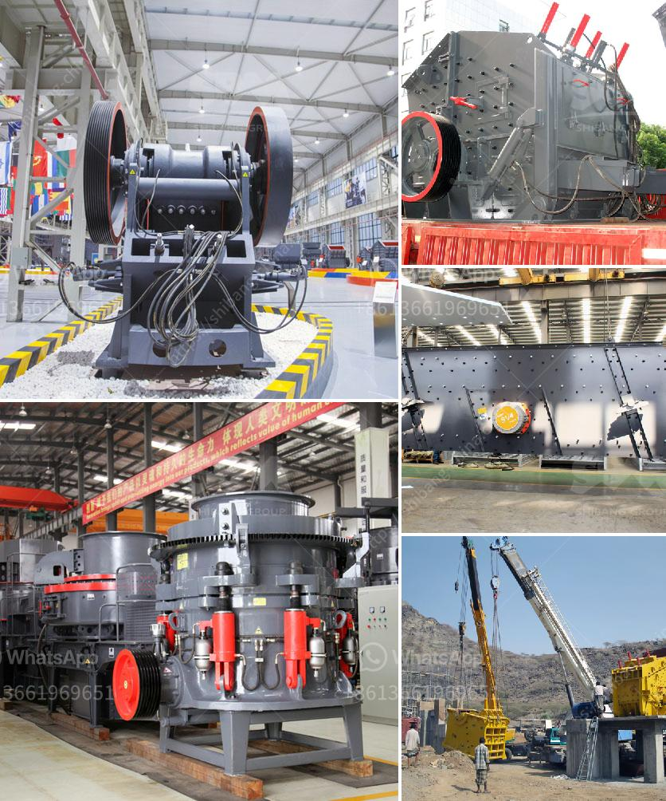

<h3>قائمة معدات مصنع الأسمنت</h3>
تعتبر صناعة الأسمنت من أهم الصناعات التي تساهم في تطور البنية التحتية للدول وتوفير فرص العمل للكثير من العمالة المحلية. ولكي يتم تصنيع الأسمنت بطريقة فعالة وذات جودة عالية، يتطلب ذلك وجود معدات خاصة وحديثة في مصنع الأسمنت.

تعد قائمة معدات مصنع الأسمنت من أبرز العناصر التي يتم استخدامها في عملية التصنيع، وتشمل مجموعة متنوعة من المعدات المهمة، مثل:

1. كسارات الحجر: تستخدم لكسر الحجارة الكبيرة إلى قطع صغيرة قابلة للتصنيع والاستخدام في عملية الإنتاج.

2. مطاحن الخام: تستخدم لطحن الحجارة المكسرة إلى مسحوق ناعم يعرف بالخام.

3. أفران الحرق: تستخدم لتحويل الخام إلى كلنكر، وهو المادة القاعدية الأساسية للأسمنت.

4. الكسارات النهائية: تستخدم لطحن الكلنكر وإضافة بعض المواد الخام الأخرى للحصول على الأسمنت النهائي.

5. المصافي: تستخدم لفحص وتنظيف الأسمنت النهائي وفصله عن الشوائب والشوائب.

6. الناقلات: تستخدم لنقل المواد الخام والمكونات الأخرى داخل المصنع، مثل الحجارة والكلنكر والأسمنت النهائي.

7. الخلاطات: تستخدم لخلط المواد الخام والمكونات الأخرى بدقة وتوزيعها بالتساوي في عملية تصنيع الأسمنت.

8. المطاحن الكروية: تستخدم لطحن الأسمنت النهائي إلى مسحوق ناعم جدًا وزيادة نسبة سطحه النشط.

9. أجهزة الفحص والتحكم: تستخدم لمراقبة جودة الأسمنت وضمان أنه يلبي المعايير والمواصفات المطلوبة.

10. معدات النقل والتعبئة: تستخدم لتعبئة الأسمنت النهائي في أكياس أو حاويات للتوزيع والتوريد إلى الأسواق.

باستخدام هذه المعدات الحديثة والمتطورة، يتمكن مصنع الأسمنت من تحقيق إنتاجية عالية وجودة ممتازة للأسمنت النهائي. هذه المعدات يجب أن تكون متاحة بشكل جيد وتحتفظ بأفضل حالاتها من حيث الصيانة والسلامة لضمان استمرارية العملية الإنتاجية وتقليل حدوث المشاكل والتوقفات غير المخطط لها.

في الختام، يعد مصنع الأسمنت من المنشآت الهامة التي تحتاج إلى قائمة معدات محددة لتشغيلها بفعالية. ومن المهم تخصيص الموارد المالية والبشرية اللازمة للحفاظ على الأجهزة والمعدات وتحديثها بناءً على التطورات التكنولوجية المستمرة في صناعة الأسمنت.
<h3>Contact us</h3><ul><li><strong>Whatsapp:&nbsp;<a href="https://wa.me/8613661969651">+8613661969651</a></strong></li><li><a href="https://swt.shibang-china.com/?git&amp;zhl&amp;قائمة معدات مصنع الأسمنت"><strong>Online Service(chat now)</strong></a></li></ul><h3>Related</h3><ul><li><a href='شاشات وكسارات الركام.md'>شاشات وكسارات الركام</a></li><li><a href='تكلفة وحدة طحن الأسمنت في الهند.md'>تكلفة وحدة طحن الأسمنت في الهند</a></li><li><a href='آلات الأسطوانة للطحن.md'>آلات الأسطوانة للطحن</a></li><li><a href='مصنع تكسير في ماليزيا.md'>مصنع تكسير في ماليزيا</a></li><li><a href='معدات تعدين الذهب الطبيعي في الصين.md'>معدات تعدين الذهب الطبيعي في الصين</a></li></ul>