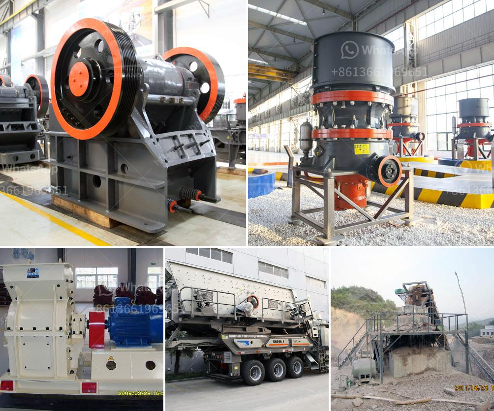

<h3>قائمة معدات وآلات التعدين عن الذهب</h3>
التعدين عن الذهب هو عملية استخراج الذهب من الأرض، وتتطلب هذه العملية استخدام العديد من المعدات والآلات المتخصصة. فيما يلي قائمة ببعض المعدات الرئيسية التي يستخدمها عمال التعدين عن الذهب:

1. الكسارات: تستخدم الكسارات لكسر الصخور الصلبة وتحويلها إلى قطع أصغر يمكن استخراج الذهب منها.

2. الشاحنات و المعدات الثقيلة: تعتمد التعدين عن الذهب على نقل كميات كبيرة من المواد الخام والتربة، وبالتالي تستخدم شاحنات ومعدات ثقيلة مثل حفارات وجرافات لهذا الغرض.

3. آلات الغسيل: بعد استخراج الصخور والتربة، يتم غسلها لفصل الذهب عن المواد الأخرى. تتطلب عملية الغسيل استخدام مضخات المياه وأنظمة التصفية وغيرها من الآلات المختصة.

4. الطاولات الاهتزازية: تستخدم هذه الطاولات لفصل الذهب عن الرمال والطمي الموجودين في المواد الخام، حيث يعتمد المبدأ على قوة الاهتزاز التي تسمح للجزيئات الأثقل بالاستقرار على الطاولة.

5. معدات التحليل والاختبار: تستخدم لفحص وتحليل العينات المأخوذة من مناجم الذهب لتحديد محتوى الذهب والمعادن الأخرى الموجودة.

6. آلات التجهيز والمعالجة: تستخدم لتحويل الذهب الخام إلى صورة نقية وقابلة للبيع. تشمل هذه المعدات آلات الطحن والتحريض والتعويم لاستخلاص الذهب من باقي المواد الصلبة.

7. الأدوات الصغيرة: تشمل المعدات الصغيرة مثل الأطواق والمطارق والمثاقب، وتستخدم لعمليات دقيقة مثل تحديد موقع الذهب واستخراج الصخور الصلبة.

يتم استخدام هذه المعدات والآلات في عمليات التعدين عن الذهب. وتختلف العمليات المستخدمة حسب نوع منجم الذهب وموقعه. يعتبر التعدين عن الذهب صناعة حيوية وضرورية لاقتصادات العديد من الدول، حيث يعتبر الذهب من الموارد الثمينة ويستخدم في صناعة الحلي والمجوهرات والصناعات الإلكترونية.
<h3>Contact us</h3><ul><li><strong>Whatsapp:&nbsp;<a href="https://wa.me/8613661969651">+8613661969651</a></strong></li><li><a href="https://swt.shibang-china.com/?git&amp;zhl&amp;قائمة معدات وآلات التعدين عن الذهب"><strong>Online Service(chat now)</strong></a></li></ul><h3>Related</h3><ul><li><a href='كيفية تصحيح كسارة مخروطية.md'>كيفية تصحيح كسارة مخروطية</a></li><li><a href='قائمة أسعار كسارة الفك.md'>قائمة أسعار كسارة الفك</a></li><li><a href='إنتاج خط الإنتاج لكسارة الطوب.md'>إنتاج خط الإنتاج لكسارة الطوب</a></li><li><a href='آلة طحن الكرة في الهند.md'>آلة طحن الكرة في الهند</a></li><li><a href='كم من الأرض مطلوبة لكسارة الحجر.md'>كم من الأرض مطلوبة لكسارة الحجر</a></li></ul>