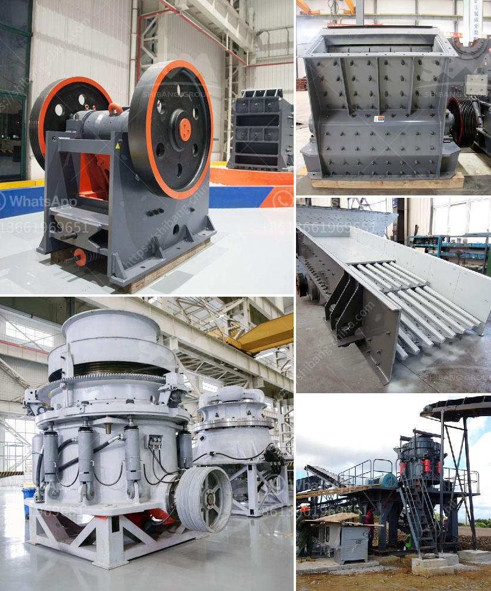

<h3>قائمة موردي الحجر الجيري</h3>
تُعتبر الحجر الجيري أحد المواد الطبيعية الهامة في مجال البناء والتشييد، حيث يستخدم لإنتاج الأسمنت والجص والطوب والبلاط والرخام والجرانيت وغيرها من المواد الأخرى. لذلك، يعتبر الحجر الجيري من المواد ذات الطلب الكبير في صناعة البناء ولتلبية هذا الطلب تُنتج كميات كبيرة من الحجر الجيري سنويًا.

وفي سبيل تلبية الحاجة المستمرة للحجر الجيري، يُعتبر اختيار الموردين المناسبين أمرًا هاماً ومحوريًا في صناعة المواد الداخلة في عملية البناء والتشييد. تحتاج شركات البناء والمقاولات إلى العثور على موردي حجر جيري موثوقين ومتخصصين في توفير منتجات ذات جودة عالية وبأسعار منافسة.

من أهم العوامل التي يجب النظر فيها عند اختيار موردي الحجر الجيري هي جودة المنتج. يجب أن يتم تزويد الشركات بمنتجات حجر جيري ذو جودة عالية ونقاء عالٍ، وذلك لضمان استخدام المواد في عمليات البناء دون أي مشاكل فنية أو تأثيرات سلبية على المنشآت.

بالإضافة إلى ذلك، يجب أيضًا مراعاة توافر المنتج بكميات كافية لتلبية الاحتياجات المطلوبة. يجب أن يكون المورد قادرًا على توفير الحجر الجيري بكميات كبيرة وفي الوقت المناسب لضمان استمرارية عملية البناء دون أي تأخير.

علاوة على ذلك، يجب النظر في سمعة المورد ومصداقيته. يفضل اختيار مزودي خدمات الحجر الجيري الذين لديهم خبرة وسمعة طيبة في الصناعة، حيث يعكس ذلك قدرتهم على تقديم الحلول المناسبة وتلبية متطلبات العملاء بشكل موثوق.

قائمة موردي الحجر الجيري تشمل عادة الشركات والمصانع المتخصصة في إنتاج وتصنيع الحجر الجيري. وتوجد قوائم ومواقع على الإنترنت تقدم معلومات حول هذه الشركات وتقييمها وتوفر تقييمات من العملاء السابقين، مما يُسهم في اتخاذ قرارٍ مدروس عند اختيار المورد المناسب.

في الختام، يجب أن يتم اختيار موردي الحجر الجيري بعناية وبناءً على العوامل المذكورة سابقًا، وذلك لأنه يتعلق بجزء هام من عملية البناء ويمكن أن يؤثر على جودة المنشآت النهائية.
<h3>Contact us</h3><ul><li><strong>Whatsapp:&nbsp;<a href="https://wa.me/8613661969651">+8613661969651</a></strong></li><li><a href="https://swt.shibang-china.com/?git&amp;zhl&amp;قائمة موردي الحجر الجيري"><strong>Online Service(chat now)</strong></a></li></ul><h3>Related</h3><ul><li><a href='آخر خط إنتاج مسحوق الجبس.md'>آخر خط إنتاج مسحوق الجبس</a></li><li><a href='الميزة الرئيسية لكسارة الصدم أو الفك.md'>الميزة الرئيسية لكسارة الصدم أو الفك</a></li><li><a href='موزعو معدات تكسير extec.md'>موزعو معدات تكسير extec</a></li><li><a href='مطاحن الطحن للبيع في باكستان.md'>مطاحن الطحن للبيع في باكستان</a></li><li><a href='آلة كسارة الحصى.md'>آلة كسارة الحصى</a></li></ul>