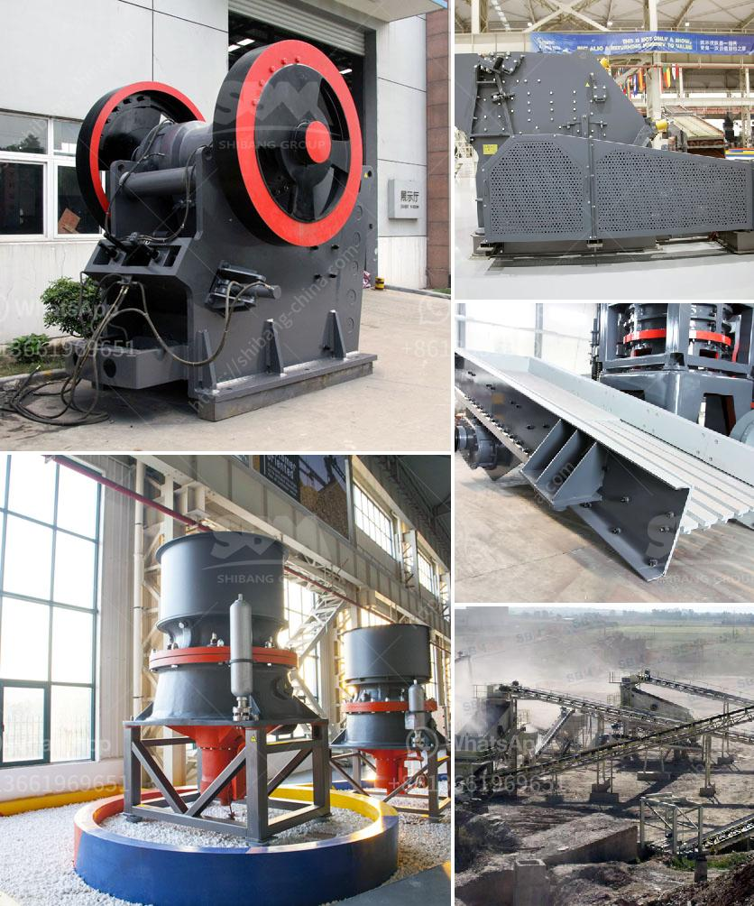

<h3>قشارة وكسارة متعددة الوظائف في الصين</h3>
تعد ماكينة القشارة والكسارة متعددة الوظائف من الأدوات الهامة في صناعة الزراعة والبناء في الصين. فهي تستخدم لتقشير الحبوب والقش وسحق الأحجار والمواد الصلبة الأخرى بكفاءة عالية وسهولة. وتعد الصين واحدة من أكبر الدول المصنعة لمثل هذه الآلات على مستوى العالم.

تتميز ماكينات القشارة والكسارة متعددة الوظائف في الصين بجودتها العالية وتقنيتها المتقدمة. فهي مصنوعة باستخدام أحدث التقنيات والمواد القوية والمتينة لضمان تحملها لظروف العمل الشاقة. تتوفر هذه الآلات بمختلف الأحجام والتصاميم والقدرات، مما يتيح اختيار الطراز المناسب حسب احتياجات المستخدم ونوع العمل الذي ستستخدم فيه.

وتستخدم القشارة والكسارة في مجموعة متنوعة من المجالات والصناعات. في صناعة الزراعة، تستخدم لقشر الحبوب والبذور من القش، مما يسهل عملية فصلها واستخدامها بعد ذلك في تصنيع الأغذية أو استخدامها كعلف للحيوانات. وفي صناعة البناء، تستخدم لسحق الأحجار والصخور الكبيرة إلى حجم صغير تستخدم في تصنيع الخرسانة والطوب والأعمال الأخرى. وتتوفر أيضًا بعض الموديلات المتخصصة لسحق الخشب والورق والبلاستيك وغيرها من المواد.

وتعتبر القشارة والكسارة متعددة الوظائف في الصين ميزانية واقتصادية للمستخدمين. فهي تساعدهم على توفير المال والوقت، حيث تسهل عليهم عملية إعداد المواد وتحضيرها للاستخدام النهائي. وبفضل آليتها القوية والمتينة، تعمل بشكل فعال لفترات طويلة من دون الحاجة إلى الكثير من الصيانة.

وتشتهر الشركات الصينية المصنعة بابتكارها وتطويرها المستمر لماكينات القشارة والكسارة، من أجل تلبية احتياجات العملاء المختلفة. وتقدم عروضًا تنافسية في السوق العالمية، مما يظهر تفوقها في الجودة والأداء. وتكون معظم الآلات مزودة بنظام تحكم ذكي يسهل على المشغل ضبط الإعدادات وتحسين الكفاءة.

في الختام، فإن القشارة والكسارة متعددة الوظائف في الصين تلعب دورًا مهمًا في تسهيل العديد من عمليات الزراعة والبناء. تتميز بقوة ودقة عالية، وتعمل بكفاءة لفترات طويلة. وبفضل ابتكار الشركات الصينية، يمكن الحصول على هذه الآلات بأسعار معقولة وجودة مضمونة، مما يسهم في تطوير الصناعة وتحسين الإنتاجية على مستوى العالم.
<h3>Contact us</h3><ul><li><strong>Whatsapp:&nbsp;<a href="https://wa.me/8613661969651">+8613661969651</a></strong></li><li><a href="https://swt.shibang-china.com/?git&amp;zhl&amp;قشارة وكسارة متعددة الوظائف في الصين"><strong>Online Service(chat now)</strong></a></li></ul><h3>Related</h3><ul><li><a href='مطحنة الكرة لكلنكر الإسمنت.md'>مطحنة الكرة لكلنكر الإسمنت</a></li><li><a href='بيع كسارة الفك في كينيا.md'>بيع كسارة الفك في كينيا</a></li><li><a href='عملية تعبئة الأسمنت.md'>عملية تعبئة الأسمنت</a></li><li><a href='كسارة الفحم 10 مم.md'>كسارة الفحم 10 مم</a></li><li><a href='مصنع تكسير الحجارة المستعمل للبيع في إسبانيا.md'>مصنع تكسير الحجارة المستعمل للبيع في إسبانيا</a></li></ul>